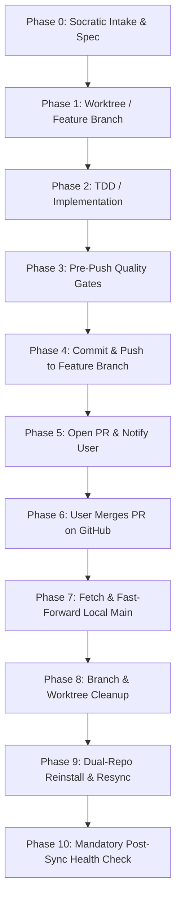

# Dual-Repo & Worktree Edit Lifecycle Protocol

## Purpose
This rule formalizes the end-to-end execution protocol when modifying plugins, skills, or platform code—whether upstream in `agent-plugins-skills` or downstream in consumer repositories like `InvestmentToolkit`.

It eliminates conversational friction and guessing by establishing an explicit, deterministic checklist: from branch creation to PR review, user merge, branch deletion, two-repo plugin reinstall, and final health check verification.

---

## The End-to-End Lifecycle Protocol



---

## 10-Phase Lifecycle Checklist

### Phase 0: Intake, Control Plane & Planning Gate
- [ ] Task registered in `context/control_plane.db` (`python3 scripts/agent_control.py init` or kernel event).
- [ ] Read-only discovery conducted; 1–3 Socratic scoping questions presented with `[Recommended]` answers.
- [ ] Implementation plan approved by the user before creating branches or modifying code.

### Phase 1: Worktree / Branch Creation
- [ ] In downstream repo (`InvestmentToolkit`), use a git worktree:
  ```bash
  git worktree add -b feat/<branch-name> ../InvestmentToolkit-<branch-name> main
  ```
- [ ] In upstream repo (`agent-plugins-skills`), checkout a dedicated feature branch:
  ```bash
  git checkout -b feat/<branch-name>
  ```
- [ ] Ensure gitignored files / dependencies required for tests are initialized or linked.

### Phase 2: TDD & Implementation
- [ ] Follow Test-Driven Development (failing test or verification contract first).
- [ ] Implement required changes; refactor at 50+ lines or 3+ nesting levels.
- [ ] Adhere to coding conventions and standard file headers.

### Phase 3: Pre-Push Quality & Regression Gates
- [ ] Run test suite:
  - Upstream (`agent-plugins-skills`): `pytest plugins/agent-agentic-os/tests/`
  - Downstream (`InvestmentToolkit`): `python3 run_tests.py`
- [ ] Run compliance & convention audits:
  ```bash
  python3 plugins/dev-utils/scripts/workspace_conventions_auditor.py  # if present
  python3 .agents/skills/symlink-manager/scripts/symlink_manager.py diagnose
  ```
- [ ] Confirm clean working state without stray diffs (`git status --short`).

### Phase 4: Commit & Push
- [ ] Stage required files explicitly (`git add <files>`).
- [ ] Commit with conventional commit message (`feat(...)`, `fix(...)`, `refactor(...)`).
- [ ] Push directly to remote feature branch:
  ```bash
  git push -u origin feat/<branch-name>
  ```

### Phase 5: Open PR & Hand Off to User (DO NOT AUTO-MERGE)
- [ ] Open Pull Request via GitHub CLI:
  ```bash
  gh pr create --repo <owner/repo> --title "feat: ..." --body "## Summary..."
  ```
- [ ] Report PR link and state to user ("Pushed to origin, PR link below, awaiting user merge").
- [ ] **STOP AND WAIT**: The user MUST review and merge the PR on GitHub. Never merge the PR autonomously.

### Phase 6: User Merge Signal
- [ ] The user reviews and merges the PR on GitHub, then informs the agent ("merged", "PR merged", etc.).

### Phase 7: Fetch & Fast-Forward Local Main
- [ ] Switch to root repository on `main`:
  ```bash
  git checkout main
  git fetch origin
  git pull origin main
  ```
- [ ] Verify the merge commit is an ancestor of `main`:
  ```bash
  git merge-base --is-ancestor <branch-tip> main
  ```

### Phase 8: Branch & Worktree Cleanup (Mandatory Loop Closure)
- [ ] In downstream repo (`InvestmentToolkit`), remove the merged worktree:
  ```bash
  git worktree remove ../InvestmentToolkit-<branch-name>
  ```
- [ ] Delete local feature branch:
  ```bash
  git branch -d feat/<branch-name>
  ```
- [ ] Delete remote feature branch:
  ```bash
  git push origin --delete feat/<branch-name>
  ```
- [ ] Confirm clean worktree list and branch list:
  ```bash
  git worktree list
  git branch --list
  ```

### Phase 9: Dual-Repo Reinstall & Resync
- [ ] **Step 9A: Upstream (`agent-plugins-skills`)**:
  - Re-run OS initialization/retrofit:
    ```bash
    python3 plugins/agent-agentic-os/scripts/init_agentic_os.py --target . --retrofit
    ```
  - Reinstall universal plugin copies:
    ```bash
    python3 plugins/plugin-manager/scripts/plugin_add.py --all -y
    ```
- [ ] **Step 9B: Downstream (`InvestmentToolkit`)**:
  - Resync plugins from inventory:
    ```bash
    python3 .agents/skills/plugin-syncer/scripts/sync_with_inventory.py
    ```
  - Re-run OS initialization/retrofit to align instruction mirrors (`CLAUDE.md`, `GEMINI.md`, `AGENTS.md`) and rules:
    ```bash
    python3 .agents/skills/os-init/scripts/init_agentic_os.py --target . --retrofit
    ```

### Phase 10: Mandatory Post-Sync Health Check
- [ ] Deterministically verify all OS substrates are active:
  ```bash
  test -f context/control_plane.db && echo "OK control_plane.db" || echo "MISSING control_plane.db"
  test -f .claude/hooks/hooks.json && echo "OK hooks.json" || echo "MISSING hooks.json"
  test -f .git/hooks/pre-commit-evolution-guard && echo "OK pre-commit-guard" || echo "MISSING pre-commit-guard"
  test -f .github/workflows/verify-evolution-integrity.yml && echo "OK verify-evolution-integrity.yml" || echo "MISSING verify-evolution-integrity.yml"
  ```
- [ ] Run canonical tests in downstream repo:
  ```bash
  python3 run_tests.py
  ```
- [ ] Verify symlink integrity:
  ```bash
  python3 .agents/skills/symlink-manager/scripts/symlink_manager.py diagnose
  ```
- [ ] Present final health check summary to user.
