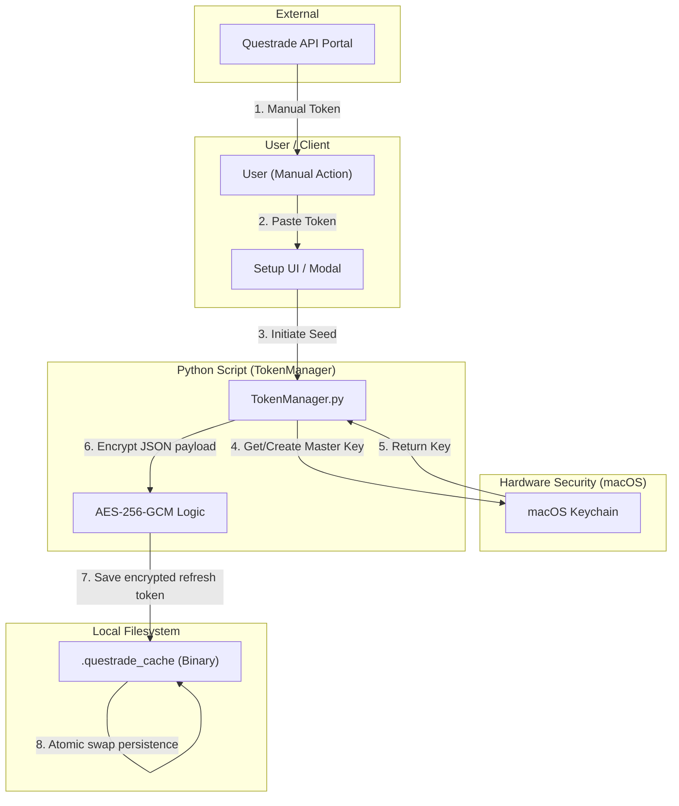

# Questrade Token Encryption Process (ADR 019)

This document outlines the secure storage and retrieval mechanism for Questrade OAuth2 tokens, ensuring hardware-backed protection on macOS.

## Broader Context: Initial Seeding

The security lifecycle begins with a manual "Seed" provided by the user. This ensures that the application never handles raw Questrade login credentials, only time-limited application tokens.

1. **User Action**: The user generates a "Manual Refresh Token" in the Questrade API Centre.
2. **Onboarding**: The user pastes this token into the InvestmentToolkit UI.
3. **Encryption**: The `TokenManager` receives the token, fetches/generates the **macOS Keychain** master key, and encrypts the token using **AES-256-GCM**.
4. **Persistence**: The **encrypted refresh token** is safely persisted to `.questrade_cache` via an **Atomic Swap**.

## Architecture & Data Flow (Mermaid)

## Key Verification Features
- **Integrity**: AES-GCM provides authenticated encryption, ensuring tokens haven't been tampered with.
- **Hardware Bound**: The encryption key never leaves the macOS Keychain, preventing "cold copy" attacks on the filesystem.
- **Resilience**: The Atomic Swap pattern (WP01-T002) ensures rotation never loses data due to crashes.
