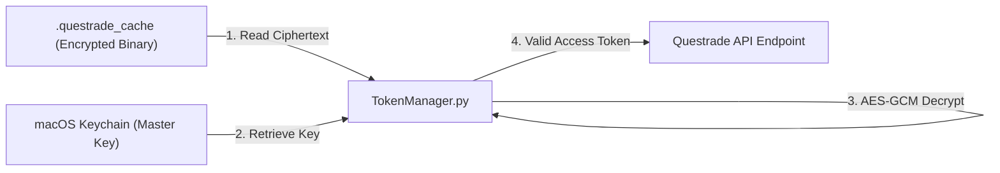

# Questrade Token Decryption & Usage Process

This document outlines how the application retrieves, decrypts, and utilizes the secure tokens stored in the `.questrade_cache`.

## Context of Use

Every time the **Questrade Data Engine** (WP02) needs to fetch current portfolio data, it follows this sequence to reconstruct the valid OAuth2 session.

1. **Load**: The `TokenManager` reads the binary blob from `.questrade_cache`.
2. **Key Retrieval**: It requests the hex-encoded master secret from the **macOS Keychain**.
3. **Decryption**: Using **AES-256-GCM**, the binary ciphertext is decrypted back into a JSON string.
4. **Usage**: The script extracts the `access_token` and `api_server` URL to make authenticated calls to the Questrade API.

## Logic Flow (Mermaid)

## Security Guarantees
- **In-Memory Only**: The plaintext `access_token` exists only in application memory and is never written back to disk in unencrypted form.
- **Validation**: If decryption fails (e.g. if the keychain is locked or the file is corrupted), the system gracefully fails back to the UI onboarding (ADR 015).
