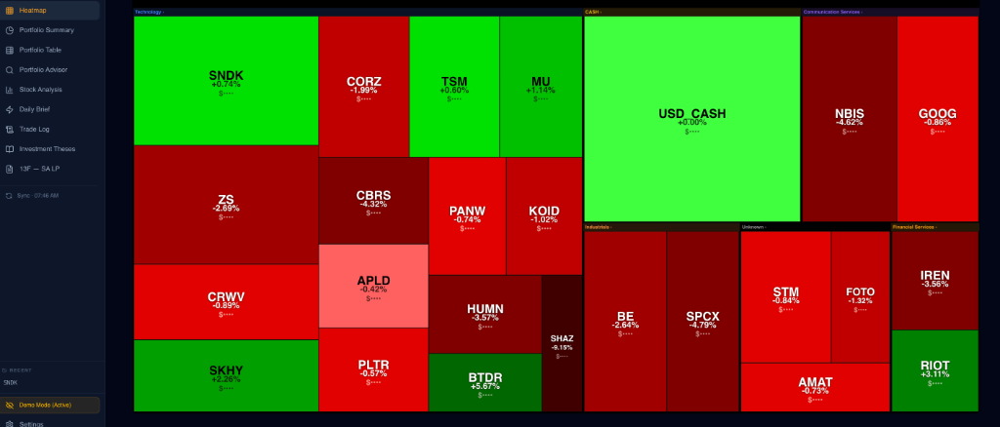
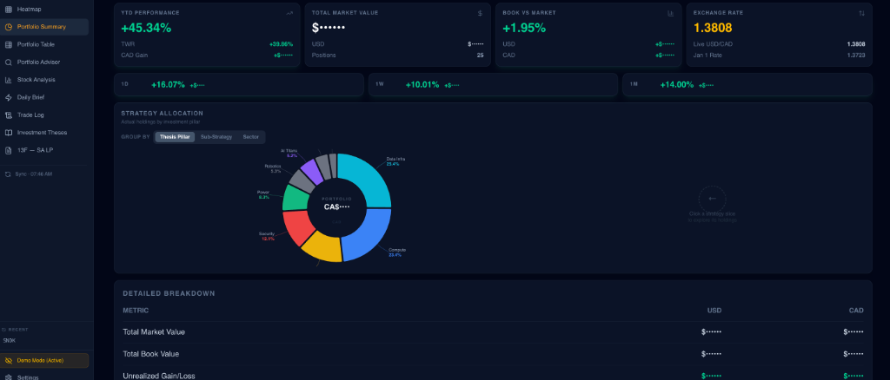
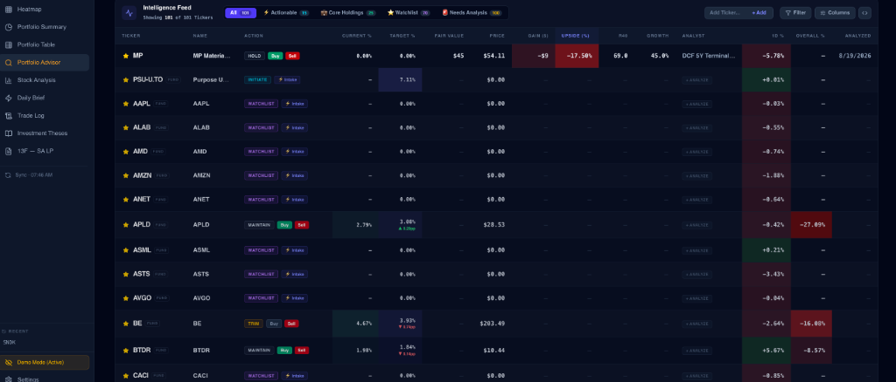
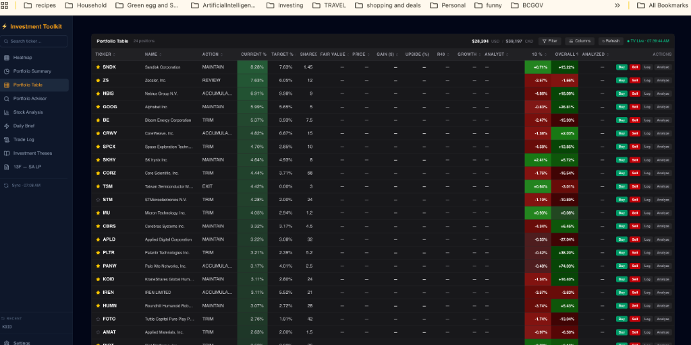
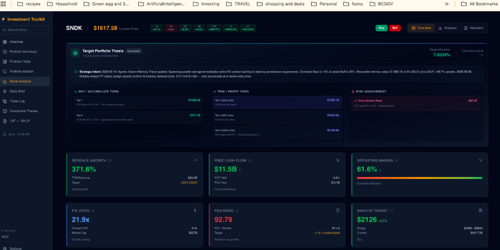
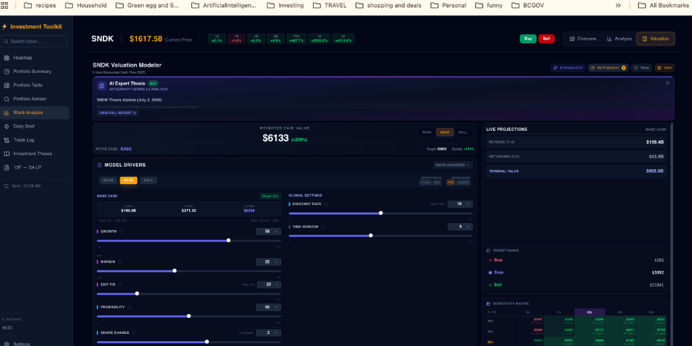
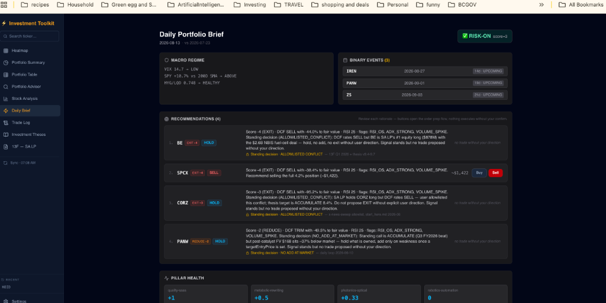
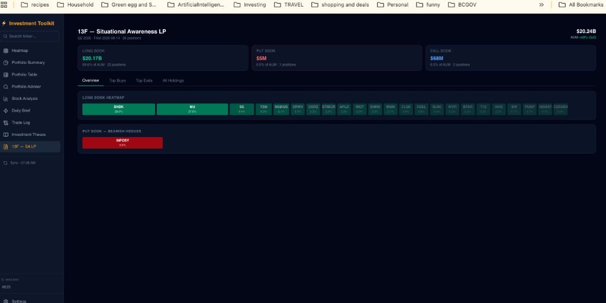

# InvestmentToolkit

An institutional-grade portfolio management and automated research suite built natively around the TradingView Desktop application. Designed for advanced power users, this toolkit combines **TradingView CDP visual/chart automation** with an **Agentic AI operating system**—enabling autonomous research, multi-scenario DCF valuation, adversarial portfolio audits, and human-supervised portfolio synchronization.

> [!TIP]
> ### ✅ 100% Fully Compliant: Human-in-the-Loop (HITL) Architecture
> **InvestmentToolkit is strictly an interactive decision-support system, NOT an unattended bot.**
> * **Active Human Review & Approval:** Every trade calculation (shares, limit price, sizing) is staged interactively on your screen (via `TradePrepModal` or the active TradingView Desktop GUI). **No order is ever placed without the human user reviewing, accepting, and confirming it.**
> * **Personal Display & Local Workstation:** All CDP automation runs on your local licensed workstation directly alongside your active TradingView Desktop display for personal portfolio tracking and visual analysis.
> * **No Unattended Auto-Trading:** Background AI agents and scripts are strictly forbidden from placing live orders autonomously while unattended. See [`.agent/rules/trade-execution-policy.md`](file:///.agent/rules/trade-execution-policy.md).

> [!WARNING]
> ### ⚠️ Notice Regarding TradingView Terms of Use (Prohibited Non-Display Usage)
> TradingView’s Terms of Use strictly prohibit **headless, unattended "black-box" algorithmic trading and third-party automated execution APIs** operating without direct human display interaction. InvestmentToolkit's architecture explicitly adheres to these terms by enforcing a 100% human-supervised workflow.

---

## 📸 Visual Tour & Application Suite

| **Live Stock Heatmap** | **Portfolio Summary & Allocation** |
| :---: | :---: |
|  |  |
| *Real-time performance treemap across technology, power, compute, and sovereign finance sectors.* | *Strategy allocation donut, time-weighted returns, and cross-account KPI rollups.* |

| **Portfolio Advisor & Intelligence Feed** | **Full 24-Position Portfolio Table** |
| :---: | :---: |
|  |  |
| *Dynamic status filter tabs (All 101, Actionable 15, Core Holdings 24, Watchlist 70, Needs Analysis 100) & intake.* | *Per-holding target vs actual weights, gain/loss metrics, and single-click staging.* |

| **Stock Analysis & Thesis Tiers (SNDK)** | **Interactive 5-Year DCF Modeler** |
| :---: | :---: |
|  |  |
| *AI Thesis Buy/Accumulate tiers, Trim targets, stop loss triggers, and financial scorecard.* | *Multi-scenario (Bear/Base/Bull) DCF projection modeler with real-time sensitivity matrix.* |

| **Daily Portfolio Brief & Morning Triage** | **Institutional 13F Filing Diff (SA LP)** |
| :---: | :---: |
|  |  |
| *Morning macro regime check, binary earnings events, and ranked urgency triage cards.* | *Institutional quarter-over-quarter 13F diff tracker (Q2 2026 Long/Put barbell analysis).* |

---

## 🚀 First Things First: Getting Started with Agents

The true power of this repository is not just the frontend UI—it is the **Agentic Operating System** behind it. Launch your CLI agent (Claude Code, Gemini CLI, or Copilot CLI) and use one of these triggers:

### 1. Master Setup (New Users — Start Here)

> **`/toolkit-onboarding`** or **"Help me set up the toolkit"**

Runs the **`toolkit-onboarding`** skill. This coordinator checks your dependencies, initializes private data templates, and guides you into the application.

### 2. TradingView Setup (Primary Data + Execution Layer)

> **`/tv-onboarding`** or **"Set up TradingView for me"**

Runs the **`tv-onboarding`** skill. This deep-dive guide covers:

1. TradingView Desktop install check
2. Subscription tier verification (Premium recommended for real-time data)
3. Broker panel connection inside TradingView (no separate API credentials needed)
4. CDP health check and remote debugging port 9222 verification
5. First `/tv-portfolio-sync` — pulls live positions from all accounts (TFSA + RRSP + Cash)

### 3. Returning Users Quick Start

```bash
python3 run_investment_toolkit.py
```

This automatically starts the backend, frontend, and TradingView Desktop with CDP debugging enabled.

Then, ask your agent to run: `/tv-portfolio-sync` or `/daily`

---

## 🧩 AI Agent Plugins & Skills

All agent tooling is organized as portable plugins inside the `plugins/` directory and loaded natively as on-demand skills in `.agents/skills/`.

### 1. Portfolio Advisor (`plugins/portfolio-advisor`)

An adversarial suite that acts as a hedge fund auditor. It challenges your bull cases, flags failing investment pillars, and proposes weight changes based on real-time drift.

* **Daily command**: `/daily` — one interactive loop: portfolio sync → morning brief (macro + TA + DCF + earnings) → ranked triage cards → trade execution → self-evolution log.
* **Intake & Audit**: `/stock-intake` (automated 5-in-1 discovery & intake), `/portfolio-coverage-audit` (audit analysis gaps across watchlist), `/data-quality-audit` (database integrity checks).
* **Research & Rebalancing**: `/review-portfolio`, `/strategic-review`, `/rebalance`, `/calibrate-targets`, `/update-portfolio-targets`, `/x-news-sweep`, `/weekly-review`, `/bundle-thesis-review`, `/13f-tracker`, `/13f-analyze`, `/norberts-gambit`, `/ytd-return`, `/run-advisor` (post-catalyst orchestrator).

### 2. Stock Valuation Analyst (`plugins/stock-valuation`)

An autonomous buy-side analyst. Fetches real-time financial data, builds Bear/Base/Bull DCF scenarios, and generates fair value recommendations.

* **Skills**: `/evaluate-stock`, `/research-stock`, `/forward-valuation-challenge`, `/valuation-math-validation`

### 3. ETF Analysis (`plugins/etf-analysis`)

Purpose-built for thematic, closed-end, and cash fund ETFs.

* **Skills**: `/analyze-etf`

### 4. TradingView Integration (`plugins/tradingview` + `tradingview-cdp/`)

TradingView Desktop is the primary layer for live prices, portfolio sync, order execution, Pine Script authoring, and deep technical analysis via CDP (Chrome DevTools Protocol) automation.

* **Skills**: `/setup-tradingview`, `/tv-onboarding`, `/tv-portfolio-sync`, `/tv-watchlist-sync`, `/place-order`, `/modify-order`, `/cancel-order`, `/get-orders`, `/tv-alert-sync`, `/tv-alert-reconcile`, `/tv-price-refresh`, `/tv-snapshot`, `/tv-thesis-overlay`, `/pine-inject`, `/author-pine`, `/tv-ta-deep`, `/ta-daily-sweep`
* **Agents**: `ta-guide` — interactive TA tutor and Pine Script architect; walks users through live chart analysis step-by-step and builds custom indicator views.

### 5. Toolkit Manager (`plugins/toolkit-manager`)

Orchestrator for managing server startup and onboarding.

* **Skills**: `/start-screener`, `/toolkit-onboarding`


---

## 💻 Core Application: Investment Screener

The `investment_screener/` app is the web-based financial analysis dashboard.

### Tech Stack

* **Frontend**: React 19, Vite, Tailwind CSS 4.0


* **Backend**: Node.js (Express), TypeScript, SQLite (WAL mode indexing via `better-sqlite3`)


* **Analytical Engine**: Python 3.11 Utility Layer (`py_services/`) leveraging standard `sqlite3` for local indexing and `yfinance` for math, validation, and historical financials.


### Key Features

* **Portfolio Summary & Table**: Live views synced from TV CDP.


* **Market Heatmap**: Real-time sector performance mapping.


* **Stock Analysis & Metrics**: Deep-dive AI Expert Thesis and 15+ fundamental metrics.


* **Valuation Modeler**: Interactive Bear/Base/Bull scenario modeling with automatic persistence to projection JSON files.


* **Trade Log**: Real-time mirror of the TradingView order panel via CDP.


### Querying the SQLite Databases

The backend is **SQLite-first** as of the Domain Data Model v3.2 migration program (Waves 0-5E,
closed by Wave 6, 2026-07-25 — see `docs/superpowers/status/wave6-program-closure-report.md` for
the full closure report, KPI rollup, and retained-JSON rationale). Two gitignored, self-creating
SQLite files under `investment_screener/backend/data/`:

| File | Domain | Key tables |
| --- | --- | --- |
| `domain_model.sqlite` | Investment/target/watchlist/pillars/price-levels/notes/alerts/projections/trade-log/orders/cash-flow/portfolio-policy (Waves 0-5E) | `account`, `strategy_pillar`, `sub_strategy`, `investment`, `investment_price`, `account_investment`, `price_level_set`, `price_level_tier`, `alert`, `investment_note`, `projection_version`, `projection_scenario`, `trade_log_entry`, `order_execution`, `cash_flow`, `cash_flow_baseline`, `portfolio_policy`, `broker_exchange_rate`, `broker_reported_total` (20 tables total) |
| `intelligence.sqlite` | Research/TA-sweep/prediction event ledger | `instrument`, `ledger_checkpoint`, `intelligence_event` (+ FTS5 virtual table), queried via `py_services/intelligence/` |

Both are **gitignored** — a fresh checkout won't have them. Rebuild `domain_model.sqlite` via:

```bash
cd investment_screener/backend/py_services
python3 -m domain_model.migrate_projections_to_sqlite --write
python3 -m domain_model.migrate_target_portfolio_to_sqlite --write

```

Common read-only inspection commands (never open a write transaction by hand — always go through the `py_services/domain_model/` repository layer for real writes):

```bash
# Open a shell against the domain model
sqlite3 investment_screener/backend/data/domain_model.sqlite

# List all tables
sqlite3 investment_screener/backend/data/domain_model.sqlite ".tables"

# Row counts across every table
sqlite3 investment_screener/backend/data/domain_model.sqlite \
  "SELECT 'investment', COUNT(*) FROM investment
   UNION ALL SELECT 'projection_version', COUNT(*) FROM projection_version
   UNION ALL SELECT 'alert', COUNT(*) FROM alert;"

# Look up one ticker's full row
sqlite3 -header -column investment_screener/backend/data/domain_model.sqlite \
  "SELECT * FROM investment WHERE symbol = 'NVDA';"

# Same pattern for the research/event ledger
sqlite3 investment_screener/backend/data/intelligence.sqlite ".tables"

```

`portfolio.json` and `theses/target-portfolio.json` (Waves 7/8) are fully retired — archived under
`ARCHIVE/investment_screener/backend/data/`, with `domain_model.sqlite` as the sole source of truth
for portfolio holdings, thesis targets, pillars, price levels, and standing decisions.

A small set of other JSON files remain intentionally retained, each with a documented Retained-JSON
Rationale Bar (not "out of scope" hand-waving): `thesis_breaker_state.json` (per-breaker evaluation
detail — `thesisBreakers` still has no SQLite schema), `projections/*.json`, `trade-log.json`,
`cash_flows.json`. See `docs/superpowers/status/wave6-program-closure-report.md` for the final
program-wide state, and each wave's own exit report under `docs/superpowers/status/` for what was
cut over vs. retained, with rationale.

---

## 🔌 How to Install Plugins

Plugins are self-contained. To link or reinstall them into your local agent environment:

**1. Install Project-Specific Plugins (Local):**

```bash
uvx --from git+https://github.com/richfrem/agent-plugins-skills plugin-add /Users/richardfremmerlid/Projects/InvestmentToolkit/plugins

```

**2. Install Core Library Plugins (Remote):**

```bash
uvx --from git+https://github.com/richfrem/agent-plugins-skills plugin-add richfrem/agent-plugins-skills

```

---

## 🔐 External Integrations & Fallbacks

### TradingView Premium (Primary Layer)

* **Required for real-time market data and live order execution.** The toolkit integrates directly with TradingView Desktop (running with `--remote-debugging-port=9222`).


* **Free/Essential Plans**: yfinance remains the fallback source for delayed data (15-20 min).


---

## 🛠 Architecture & Development Rules

> 📖 **Deep Dive**: For a comprehensive system map, context diagrams, and component interactions, read the **[Architecture Overview](https://www.google.com/search?q=docs/architecture/README.md)**.
> 
> 

### The Iron Law: Test-Driven Development (TDD)

```
NO PRODUCTION CODE WITHOUT A FAILING TEST FIRST.

```

* The primary test harnesses must shell out via subprocess to exactly mirror the execution paths of the AI plugins and the Node Express bridge.


* Mocking is strictly prohibited on critical runtime paths.


### Agent Calculation Policy

* Never perform financial calculations inline (bash/python snippets).


* Always use or create versioned `.py` scripts in `investment_screener/backend/py_services/`.


### Exploration Workflow

The project leverages the **Exploration Cycle** architecture to systematize AI agent workflows in 4 phases:

1. Discovery Planning
2. Visual Blueprinting
3. Prototyping
4. Handoff & Specs
*(Managed by the `exploration-workflow` skill and `exploration-dashboard.md` state file)*


---

---

## 🙏 Acknowledgements & Prior Art

### TradingView CDP Community

The TradingView CDP automation layer was informed by studying the following open-source projects:

| Project | GitHub | What It Does |
| --- | --- | --- |
| **tradingview-mcp** (tradesdontlie) | [https://github.com/tradesdontlie/tradingview-mcp](https://github.com/tradesdontlie/tradingview-mcp) | The most complete CDP-based TradingView automation library available. 5,000+ lines, 15+ command namespaces. Its `pine.js` uses **React fiber tree traversal** (`__reactFiber` prefix) to locate Monaco editor internals — more resilient than CSS selectors alone. No live broker order execution.

 |
| **tradingview-mcp** (atilaahmettaner) | [https://github.com/atilaahmettaner/tradingview-mcp](https://github.com/atilaahmettaner/tradingview-mcp) | TradingView screener/scanner using the `tradingview-screener` Python library (REST API). 30+ tools for market scanning and symbol filtering. No CDP, no live orders.

 |

**Our key architectural difference:** Both reference projects are chart analysis and research tools. InvestmentToolkit is a **live broker execution layer** — it navigates TradingView's built-in connected broker panel via CDP to place, modify, and cancel real orders, with 3-step HITL confirmation, safety gates (stale portfolio exit 4, size cap exit 3), multi-account support, `tvOrderId` tracking, and automatic portfolio sync after fills. Pine Script injection (via `/pine-inject`) uses the React fiber traversal technique from tradesdontlie's implementation to locate Monaco editor internals without relying on fragile CSS class selectors.

### AI Agent Infrastructure

* **[browser-use/browser-harness](https://github.com/browser-use/browser-harness)** — Inspired our approach to self-healing, self-evolving skills and direct CDP automation. By allowing the agent to write its own helpers and domain skills when it encounters issues or gaps, the system continuously improves itself during execution.


* **[orba/superpowers](https://www.google.com/search?q=https://github.com/orba/superpowers)** — The TDD (Iron Law: no production code without a failing test first), brainstorming, and sub-agent driven development skills used throughout this project come from the superpowers plugin library. These skills enforce rigorous Red-Green-Refactor discipline and orchestrate parallel multi-agent task execution.


* **[richfrem/agent-plugins-skills](https://github.com/richfrem/agent-plugins-skills)** — The Exploration Workflow (4-phase: Discovery Planning → Visual Blueprinting → Prototyping → Handoff & Specs) and all project-local AI agent plugins and skills are organized and distributed through this repository.


---

## ⚖️ Legal & Financial Disclaimer

> **IMPORTANT DISCLAIMER:**
> **InvestmentToolkit is strictly an analytical and educational suite.** It does **not** provide financial, investment, tax, or legal advice. 
> - All valuation models (DCF scenarios), technical indicators, and AI agent outputs are **informational and advisory only**.
> - Past performance and quantitative projections do not guarantee future returns.
> - The software is provided "as is", without warranty of any kind. You are solely responsible for your own investment decisions and any broker order executions.

---

## 📄 License

Distributed under the **MIT License**. See [`LICENSE`](LICENSE) for more information.

---

*Data and desktop integration from TradingView are subject to their Terms of Use: [https://www.tradingview.com/policies/](https://www.tradingview.com/policies/)*