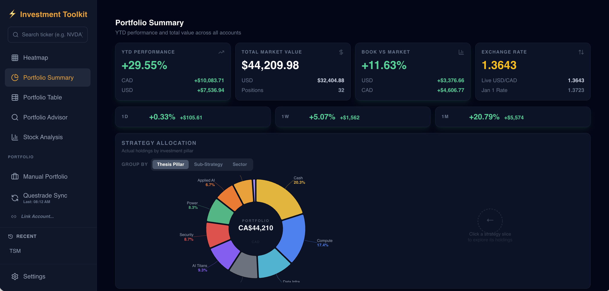
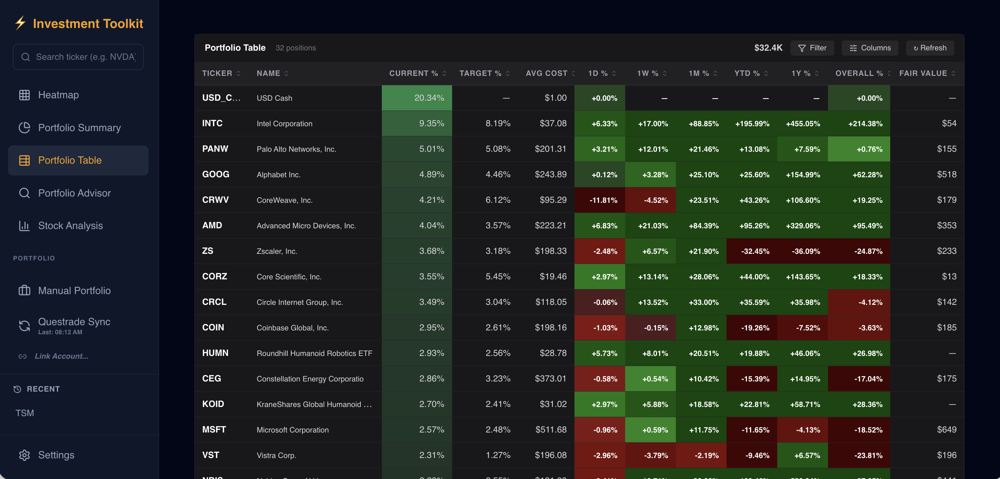
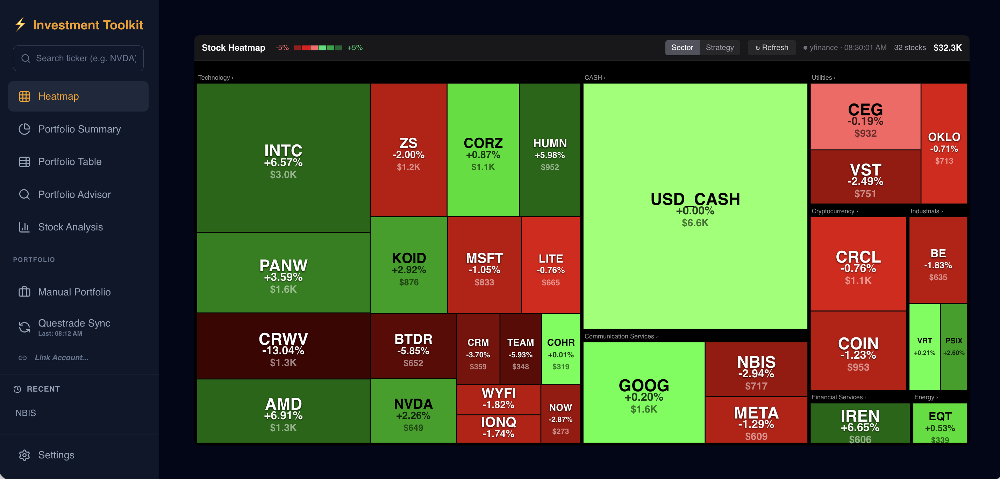
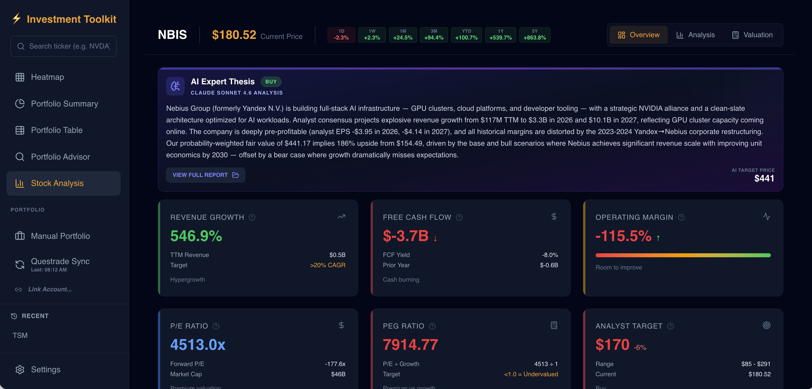
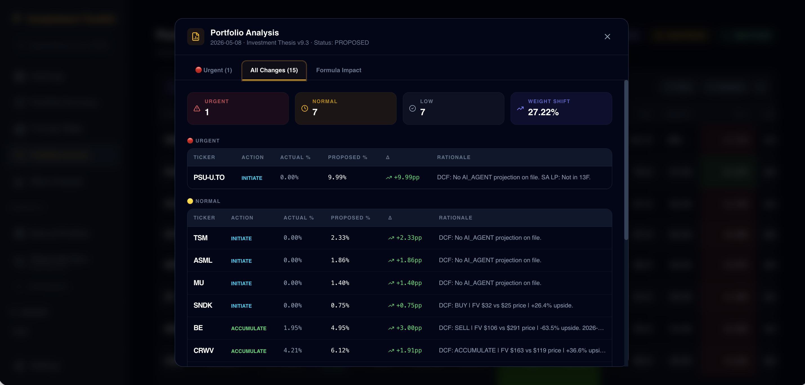
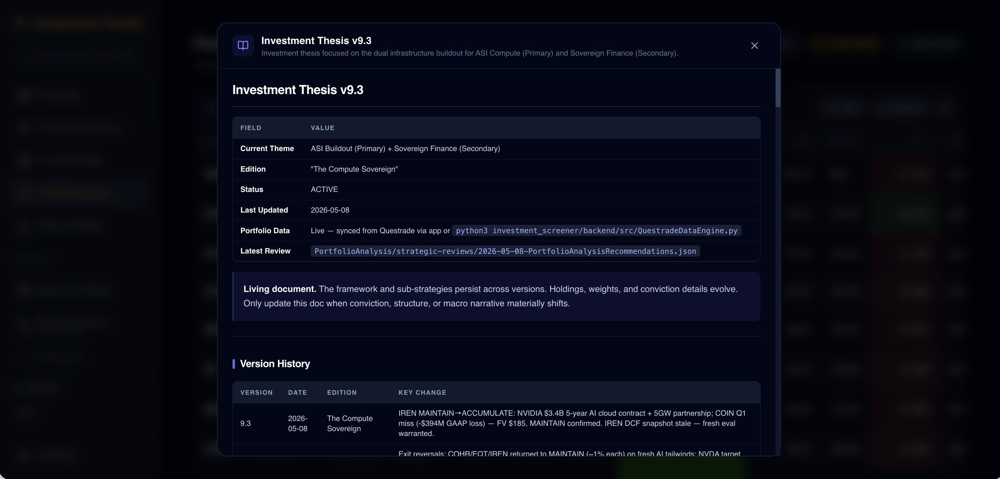
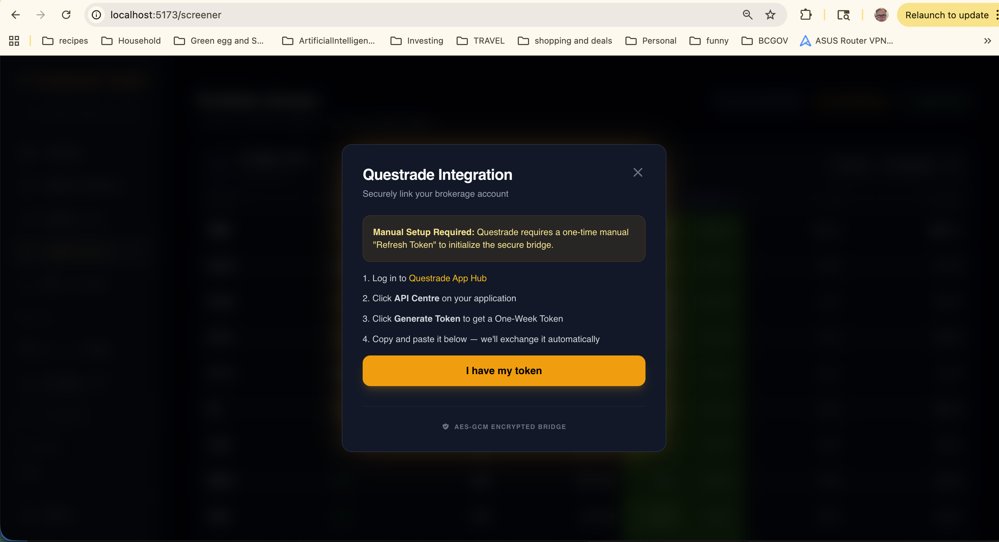

# InvestmentToolkit

A premium, "Luxury Dark Mode" investment analysis suite built for sophisticated retail investors. This toolkit provides deep fundamental analysis, DCF valuation modeling, real-time portfolio monitoring, and autonomous AI agents for research and thesis management — without the need for expensive terminal subscriptions.

---

## 🚀 Getting Started (Start Here)

The easiest way to set up and use this toolkit is to use the **Interactive Onboarding Agent**. 

Simply launch your CLI agent (Gemini CLI, Claude Code, or Copilot CLI) and type:

> **"Help me set up the toolkit"**

This will trigger the **Toolkit Onboarding Guide**, a dedicated AI concierge that will:
1.  **Check Dependencies**: Verify your Node.js and Python versions.
2.  **Link TradingView**: Connect TradingView Desktop for real-time prices, portfolio sync, and order execution (primary broker layer).
3.  **Sync Portfolio**: Run `/tv-portfolio-sync` to pull live positions from all accounts — no Questrade credentials needed. Questrade API link is optional for fallback sync.
4.  **First Run**: Guide you through your first `/evaluate-stock` or `/review-portfolio` command.

---

## 💎 The Core Value: An "Agentic OS" for Investors

Unlike traditional investment apps, **the true power of this repository is not the frontend UI—it is the Agentic Operating System behind it.** 

This repo is designed to be used interactively with **Pro-tier AI subscriptions** (Claude code, Gemini pro, github copilot pro or chatgpt pro) via **CLI agents** like `gemini-cli`, `claude-code`, or `copilot-cli`. 

### Why this matters:
- **Autonomous Deep Research**: Instead of reading PDFs, you command your CLI agent: `/research-stock NVDA`. The agent autonomously fetches financials, parses news, runs a DCF model, and writes a professional-grade research report to your `backend/data/research/` folder.
- **Adversarial Thesis Review**: The `portfolio-advisor` plugin acts as a cold-blooded hedge fund auditor. It challenges your "bull cases," flags failing investment pillars, and proposes formula-driven weight changes based on real-time drift and AI fair-value signals.
- **Real-Time Data Bridge**: CLI tools bridge your brokerage (Questrade) and charts (TradingView Premium) with your local investment thesis. You can ask: *"How does the NVDA earnings beat affect my Power pillar sizing?"* and get an answer rooted in your actual holdings and cost basis.

> [!IMPORTANT]
> **Subscription Prerequisite**: To use the sub-agents and execute specialized commands like `/strategic-review`, `/x-news-sweep`, and `/evaluate-stock`, you **must** have an active Pro-tier subscription for your chosen CLI environment (e.g., Claude Code, GitHub Copilot Pro, or Google Gemini Pro).

---

## External Account Requirements
... (rest of the file)
This toolkit integrates with two external services that require accounts:

### Questrade (brokerage)

**Optional — TradingView is the primary portfolio sync layer.** The toolkit can read your live positions and place orders via TradingView's Questrade broker panel (CDP automation) without direct API credentials. The Questrade REST API is read-only and is used as a fallback when TradingView Desktop is not running.

- Account: https://www.questrade.com/
- If you choose to enable direct API sync, the toolkit uses Questrade's OAuth2 API with AES-256-GCM encrypted token storage (macOS Keychain). Your credentials never leave your machine.
- See [Questrade Setup](#questrade-setup) below.

### TradingView Premium (real-time prices)

**Required for real-time market data.** The toolkit integrates with TradingView Desktop to pull live prices directly from your Premium feed.

- Desktop app: https://www.tradingview.com/desktop/
- Subscription plans (Premium or higher required): https://www.tradingview.com/pricing/
- Without a Premium subscription, current prices are delayed 15–20 minutes — identical to the yfinance fallback that is already in place. The integration adds no value below Premium tier.
- **Free and Essential plans:** yfinance remains the data source; TradingView integration is inactive.
- **Premium and above:** real-time prices, 1d change%, and DCF price alerts via the TradingView plugin.

> **Note:** yfinance is not replaced. It remains the source for historical OHLCV, financial fundamentals (revenue, margins, EPS, ratios), and all data when TradingView Desktop is not running.

---

## Core Components

### 1. Investment Screener (`investment_screener`)
A web-based financial analysis dashboard featuring:
- **Luxury Dark Mode**: Professional Black/Gold aesthetic.
- **Expert Metrics**: Instant access to PEG Ratio, Piotroski F-Score, and Insider Ownership.
- **Valuation Modeler**: Interactive Bear/Base/Bull scenario modeling to project 5-year price targets.
- **Comparative Analysis**: Side-by-side ticker comparison.

### 2. Portfolio Sync (TV-Primary, Questrade Fallback)
A multi-source portfolio sync engine with automatic source selection:
- **Primary — TradingView CDP**: Reads live positions and balances from all accounts (TFSA + RRSP + Cash) via the TradingView broker panel. No separate API credentials required — works wherever TradingView Desktop runs.
- **Fallback — Questrade API**: AES-256-GCM encrypted token storage (macOS Keychain). Used when TradingView Desktop is not running.
- **Source waterfall**: `POST /api/portfolio/sync` auto-selects TV → Questrade → cached data, returning a `dataSource` field so the UI can indicate freshness.
- **Metadata Enrichment**: `yfinance` fills in sector/industry for any holding the broker doesn't annotate.

### Portfolio Summary

*(Total market value, performance metrics, and strategy allocation)*

### Portfolio Table

*(Detailed positions view with real-time performance and fair value targets)*

### Market Heatmap

*(Real-time sector performance visualization and strategy mapping)*

### Stock Analysis & Metrics

*(Deep-dive AI Expert Thesis and 15+ Premium fundamental metrics)*

### Portfolio Advisor & Thesis Review

*(Autonomous advisor proposing rebalance actions based on thesis alignment)*

### Investment Thesis

*(Living document tracking version history and core investment pillars)*

---

## Tech Stack

| Layer | Technology |
|-------|-----------|
| Frontend | React 19, Vite, Tailwind CSS 4.0 |
| Orchestration | Node.js (Express), TypeScript Services |
| Analytical Engine | Python 3.11 Utility Layer (yfinance, pandas) |
| State Management | In-memory TypeScript Data Stores (Singletons) |
| Market Data | `yfinance` (historical + fundamentals) + TradingView Premium (real-time current price) |
| AI Agents | Modular Plugin Architecture + Exploration Cycle workflow |
| Documentation | AI-Native usage-focused headers (Standardized across Backend) |
| Schema | Zod validation — `lastActualPS` nullable-safe for pre-revenue stocks |

---

## AI Agent Plugins

All agent tooling is organized as portable plugins in `plugins/`. Each plugin contains commands, skills, scripts, and documentation.

### 1. Stock Valuation Analyst (`plugins/stock-valuation`)
An autonomous buy-side analyst. Fetches real-time financial data, builds Bear/Base/Bull DCF scenarios, and generates a fair value with BUY/HOLD/SELL recommendation.

- `/evaluate-stock {TICKER}` — Full DCF valuation with scenario analysis and persistence to the Valuation Modeler
- `/research-stock {TICKER}` — Qualitative sweep; classifies findings as Class A/B/C/D and gates re-valuation on confirmation

### 2. ETF Analysis (`plugins/etf-analysis`)
Purpose-built for thematic ETFs that don't fit a standard DCF model.

- `/analyze-etf {TICKER}` — Holdings alignment analysis against your investment thesis, expense ratio review, BUY/HOLD/AVOID action. Writes to `data/etf_analysis/` and co-writes a projection record to `data/projections/` so the AI Expert Thesis panel appears in the Dashboard automatically.

### 3. Strategic Thesis Suite (`plugins/portfolio-advisor`)
A multi-skill suite that monitors, challenges, and optimizes your portfolio against your investment thesis.

- `/review-portfolio` — Drift monitor + pillar conviction audit + thesis formula health score (0–100)
- `/strategic-review` — Adversarial thesis challenger; surfaces failing pillars and proposes formula improvements
- `/rebalance` — Valuation-gated trade optimizer; never buys a SELL-rated holding to restore drift
- `/x-news-sweep` — Daily Grok/X.com news sweep gated against DCF + 8 hard gates

### 4. TradingView Integration (`plugins/tradingview`)
TradingView Desktop is the **primary layer** for live prices, portfolio sync, and order execution.

**Requires:** TradingView Desktop + Premium subscription (see [above](#tradingview-premium-real-time-prices)).

**Auto-launch:** `run_investment_toolkit.py` automatically launches TradingView Desktop with `--remote-debugging-port=9222`. To relaunch independently: `python3 tools/launch_tradingview_with_debugport.py`.

**Two CDP surfaces:**
- **Active chart** — reads live price for the ticker currently displayed. Used in `/evaluate-stock`. Single-ticker only.
- **Broker panel** — reads all accounts (TFSA + RRSP + Cash), positions, and balances via the TradingView broker DOM. Used by `/tv-portfolio-sync` and `BrokerSyncService`. No Questrade API credentials required.

**Batch portfolio prices** (Heatmap, Table, Summary) always come from yfinance — not the active chart. All portfolio views show a "TV Live" / "yfinance" connection badge.

- `/tv-portfolio-sync` — Read all broker accounts via CDP, show diff (+ added, − removed, ✎ changed), write to `portfolio.json` on CONFIRM
- `/place-order {buy|sell} {N} {TICKER} in {ACCOUNT}` — Live order execution via CDP broker panel; 3-step HITL
- `/tv-alert-sync` — Create TradingView price alerts at DCF bear/base/bull targets for all holdings
- `/tv-snapshot CRWV` — Capture chart screenshot → `PortfolioAnalysis/screenshots/`

See [`plugins/tradingview/README.md`](plugins/tradingview/README.md) for full setup and usage.

### 5. Toolkit Manager (`plugins/toolkit-manager`)
Orchestrator for server startup and Questrade token management.

- `/start-screener` — Launch full suite (frontend + backend)
- `/setup-questrade` — Interactive Questrade token setup

---

## Getting Started

### Prerequisites

| Requirement | Notes |
|-------------|-------|
| Node.js 18+ | `node --version` |
| Python 3.11+ | `python3 --version` |
| Pro-tier AI | Required for CLI agents (Claude Code, Copilot Pro, or Gemini Pro) |
| Questrade account | https://www.questrade.com/ |
| TradingView Desktop | https://www.tradingview.com/desktop/ — optional but recommended |
| TradingView Premium | https://www.tradingview.com/pricing/ — required for real-time prices |
| browser-harness | https://github.com/richfrem/browser-harness — required for automated Grok sweeps (`/x-news-sweep`) |

### Quick Start

```bash
python3 run_investment_toolkit.py
```

This handles everything automatically:
- Creates Python venv and installs dependencies
- Installs Node dependencies and builds the backend
- **Launches TradingView Desktop** with CDP enabled (if installed)
- Starts the backend API (port 3001) and frontend dashboard (port 5173)

### Plugin Installation

**1. Install Project-Specific Plugins (Local):**
```bash
uvx --from git+https://github.com/richfrem/agent-plugins-skills plugin-add /Users/richardfremmerlid/Projects/InvestmentToolkit/plugins
```

**2. Install Core Library Plugins (Remote):**
```bash
uvx --from git+https://github.com/richfrem/agent-plugins-skills plugin-add richfrem/agent-plugins-skills
```

### Browser Harness Setup (one-time, required for automated Grok sweeps)

```bash
# Clone into a stable location
git clone https://github.com/richfrem/browser-harness ~/projects/browser-harness
cd ~/projects/browser-harness && uv sync

# Add to your .env (copy from .env.example)
BROWSER_HARNESS_DIR=~/projects/browser-harness
BROWSER_HARNESS_CDP_PORT=9223

# Launch debug Chrome (separate from TradingView's port 9222)
"/Applications/Google Chrome.app/Contents/MacOS/Google Chrome" \
  --remote-debugging-port=9223 \
  --user-data-dir="/tmp/chrome-bu-profile" &

# First-time only: navigate to grok.com in that Chrome window and authorize via X OAuth
# After that, login persists in /tmp/chrome-bu-profile for all future sessions
```

See [`~/projects/browser-harness/domain-skills/grok/post.md`](https://github.com/browser-use/browser-harness/tree/main/domain-skills) for the full grok.com interaction skill.

### TradingView Plugin Setup (one-time)

```bash
cd plugins/tradingview/node
npm install
cd ../../..

# Verify connection (run after TradingView Desktop is open)
python3 plugins/tradingview/scripts/tv_health_check.py
```

---

## Questrade Setup

Setting up Questrade is secure — your token is encrypted in a local cache (AES-256-GCM, macOS Keychain) and never leaves your machine.

**Easiest method (built-in UI):**
Use the "Questrade Integration" modal in the web app. It guides you through obtaining your one-week token and seeds it automatically.



**AI agent method:**
```
/setup-questrade
```

**Manual method (CLI):**
```bash
# 1. Redeem one-week app token from https://apphub.questrade.com/UI/UserApps.aspx
curl -s -X POST \
  "https://login.questrade.com/oauth2/token?grant_type=refresh_token&refresh_token=<ONE_WEEK_TOKEN>" \
  -d '' -H 'Content-Type: application/x-www-form-urlencoded'

# 2. Seed the returned refresh_token
python3 investment_screener/backend/src/QuestradeDataEngine.py \
  --seed "<refresh_token>" \
  --cache-dir investment_screener/backend/
```

---

## Running Services Separately

```bash
# Backend (port 3001)
npm --prefix investment_screener run dev -w backend

# Frontend (port 5173)
npm --prefix investment_screener run dev -w frontend
```

---

## AI Development Architecture

This project uses the **Exploration Cycle** architecture to systematize AI agent workflows, moving away from template-driven missions toward a modular, phase-gated development loop.

- **Orchestration**: Managed via the `exploration-workflow` skill.
- **Phases**: 4-phase loop (Discovery → Blueprinting → Prototyping → Handoff).
- **Dashboard**: `exploration/exploration-dashboard.md` (state management).
- **Plugins**: Modular AI logic housed in `plugins/`.
- **Reference**: See ADR [022-exploration-cycle-pivot.md](docs/adrs/022-exploration-cycle-pivot.md) for the design rationale.

---

## Acknowledgements

### browser-harness (Grok browser automation)
- **Upstream:** https://github.com/browser-use/browser-harness (MIT, browser-use)
- **Our fork:** https://github.com/richfrem/browser-harness — includes `domain-skills/grok/post.md` (grok.com interaction skill)
- **What it does:** Thin CDP harness (~600 lines) that gives an LLM direct browser control via Chrome DevTools Protocol. Used by `/x-news-sweep` to post prompts to grok.com and read responses automatically — eliminating the manual copy-paste step.
- **Our usage:** Runtime dependency — clone the fork to `~/projects/browser-harness`. Pull upstream improvements with `git pull origin main` then push to fork with `git push fork main`.

The TradingView Desktop integration in this project was informed by research into the following open-source projects. Our implementation (`plugins/tradingview/node/`) is an owned, minimal adaptation — not a dependency on either repo at runtime.

### tradingview-mcp (CDP bridge)
- **Repository:** https://github.com/tradesdontlie/tradingview-mcp (cloned to `temp/tradingview-mcp/`)
- **Author:** tradesdontlie
- **License:** MIT — Copyright (c) 2026 tradesdontlie
- **What it does:** 68-tool MCP server connecting to TradingView Desktop via Chrome DevTools Protocol (CDP). Full chart control, Pine Script editor, alerts, OHLCV, screenshots, replay, DOM-level interaction.
- **Our approach:** We extracted only the CDP connection, quote, alert, and screenshot logic (~360 lines) into `plugins/tradingview/node/`. No MCP server process required; Python calls Node directly via subprocess. This removes the need for a persistent background server and eliminates the external dependency at runtime.

### tradingview-mcp-server (REST aggregator)
- **Repository:** https://github.com/atilaahmettaner/tradingview-mcp (cloned to `temp/atilaahmettaner-tradingview-mcp/`)
- **Author:** Ahmet Taner Atila
- **License:** MIT — Copyright (c) 2025 Ahmet Taner Atila
- **What it does:** Python MCP server using TradingView public REST APIs (`tradingview-screener`, `tradingview-ta`). Supports screener scans, multi-exchange sentiment, technical analysis signals, and walk-forward backtesting — no TradingView Desktop required.
- **Why we prefer the CDP approach:** The REST APIs used by this repo aggregate public/delayed data and cannot access your Premium real-time feed. CDP connects directly to your authenticated TradingView session — real-time prices, your watchlists, your alerts, your charts. For a personal portfolio tool where Premium data is the point, CDP is the right layer.

Both projects are MIT licensed. Their licenses apply to their respective source code only and do not grant any rights to TradingView Inc.'s software, data, or intellectual property.

---

*Personal use only. Data from TradingView is subject to their Terms of Use: https://www.tradingview.com/policies/*
