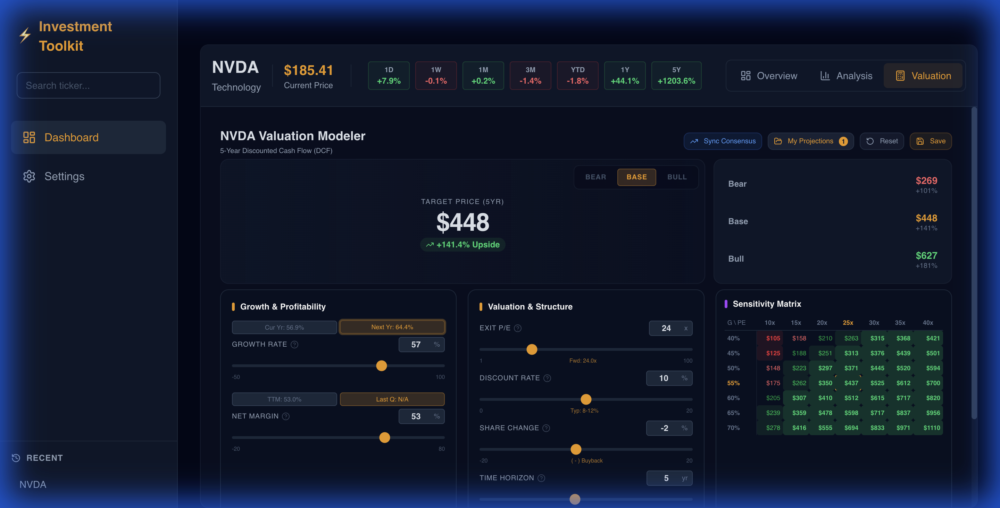

# InvestmentToolkit

A premium, "Luxury Dark Mode" investment analysis suite built for sophisticated retail investors. This toolkit provides deep fundamental analysis, valuation modeling, and comparative screening without the need for expensive terminal subscriptions.

## 🌟 Core Components

### 1. Investment Screener (`tools/investment-screener`)
A web-based financial analysis dashboard featuring:
-   **Luxury Dark Mode**: Professional Black/Gold aesthetic.
-   **Expert Metrics**: Instant access to PEG Ratio, Piotroski F-Score, and Insider Ownership.
-   **Valuation Modeler**: Interactive Bear/Base/Bull scenario modeling to project 5-year price targets.
-   **Comparative Analysis**: Side-by-side ticker comparison.



## 🛠️ Tech Stack
-   **Frontend**: React 19, Vite, Tailwind CSS.
-   **Backend**: Node.js (Express), Python 3.11 (Bridge to `yfinance`).
-   **Data**: `yfinance` (Primary), Questrade API (Optional Real-time).

## 🚀 Getting Started

### Prerequisites
-   Node.js 18+
-   Python 3.11+
-   Access to this repository

### Quick Start
The project includes a managed startup script for the entire suite:

```bash
python3 tools/manage_servers.py
```

This will automatically handle port conflicts, launch the backend API, and start the frontend dashboard.

## 🤖 AI Development Framework
This project utilizes the **Spec Kitty** framework to systematize AI agent workflows.
-   **Specs**: Located in `kitty-specs/`.
-   **Agents**: Supports Gemini, Copilot, and Claude via the `tools/bridge/speckit_system_bridge.py` sync tool.