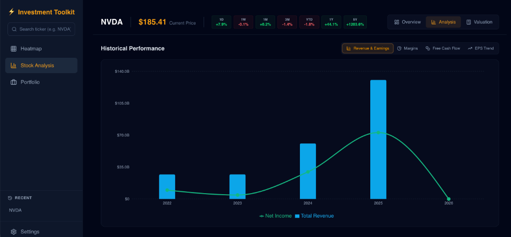
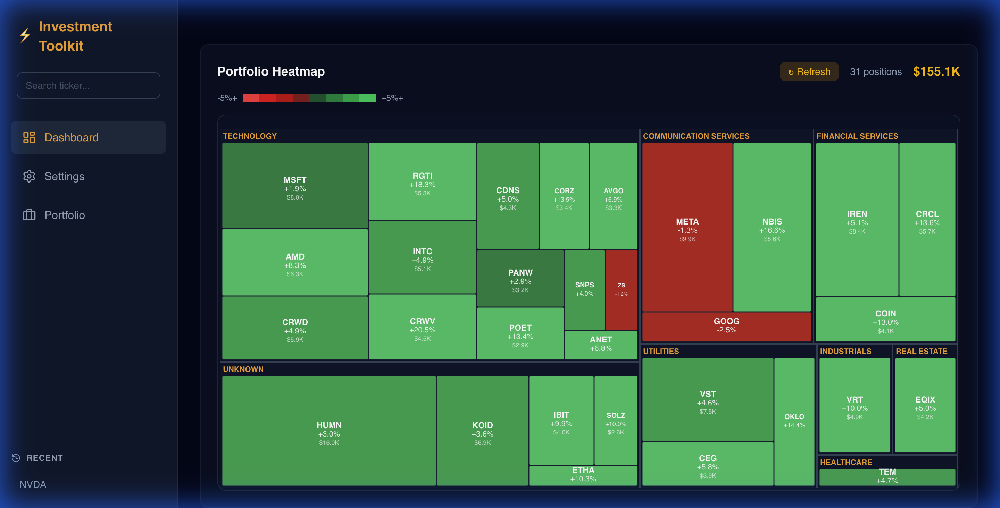

# InvestmentToolkit

A premium, "Luxury Dark Mode" investment analysis suite built for sophisticated retail investors. This toolkit provides deep fundamental analysis, valuation modeling, and comparative screening without the need for expensive terminal subscriptions.

## 🌟 Core Components

### 1. Investment Screener (`tools/investment-screener`)
A web-based financial analysis dashboard featuring:
-   **Luxury Dark Mode**: Professional Black/Gold aesthetic.
-   **Expert Metrics**: Instant access to PEG Ratio, Piotroski F-Score, and Insider Ownership.
-   **Valuation Modeler**: Interactive Bear/Base/Bull scenario modeling to project 5-year price targets.
-   **Comparative Analysis**: Side-by-side ticker comparison.

### 2. Questrade Portfolio Integration
A professional-grade brokerage sync engine featuring:
-   **Dynamic Sync**: Real-time retrieval of account positions and balances.
-   **Secure Token Bridge**: AES-256-GCM encryption with hardware-backed master keys (macOS Keychain).
-   **Metadata Enrichment**: Intelligent fallback to `yfinance` for sector/industry categorization of broker holdings.
-   **Onboarding Flow**: Guided UI for secure account linking and rotation management.

### Stock Analysis & Metrics

*(15+ Premium metrics including Rule of 40, Piotroski F-Score, and Analyst Targets)*

### Historical Performance


### Valuation Modeler

*(Interactive DCF modeling with sensitivity matrices)*

### Market Heatmap

*(Real-time sector performance visualization)*

## 🛠️ Tech Stack
-   **Frontend**: React 19, Vite, Tailwind CSS.
-   **Backend**: Node.js (Express), Python 3.11 (Bridge to `yfinance`).
-   **Data**: `yfinance` & Questrade API (Dynamic Aggregation).

## 🧠 AI Capabilities (Powered by Spec Kitty)

New powerful AI agents allow you to perform autonomous valuation and strategic portfolio review.

### 1. Stock Valuation Analyst (Tool A)
An autonomous agent that acts as a buy-side analyst. It fetches real-time financial data, performs cognitive analysis, and generates a 3-scenario valuation model (Bear/Base/Bull) with a final "Buy/Sell/Hold" recommendation.

-   **Trigger**: `/perform-stock-valuation {TICKER}`
-   **Example**: `/perform-stock-valuation NVDA`
-   **Capabilities**:
    -   Fetches live financials via `yfinance`.
    -   Projects 5-year revenue, margins, and PE ratios.
    -   Calculates fair value and upside/downside.
    -   Persists results to the Valuation Modeler.
-   **Architecture**: [Stock Valuation Architecture](docs/architecture/stock-valuation/valuation-persistence.md)

### 2. Strategic Thesis Balancer (Tool B)
A "Strategic Advisor" agent that monitors your portfolio's alignment with your core investment thesis. It detects drift, checks "Thesis Breakers" (e.g., price drops, news events), and recommends rebalancing trades.

-   **Trigger**: `/review-portfolio`
-   **Capabilities**:
    -   **Drift Analysis**: Calculates deviation from target weights (Pillar & Holding level).
    -   **Strategic Review**: Qualitative analysis of "Deployment Conflicts" and "Thesis Breakers" using LLM intelligence.
    -   **Auto-Rebalancing**: Generates atomic trade instructions to restore alignment.
-   **Architecture**: [Thesis Alignment & Portfolio Valuation](docs/architecture/thesis-alignment-and-portfolio-valuation/tool_b_implementation_brief.md)

## 🚀 Getting Started

### Prerequisites
-   Node.js 18+
-   Python 3.11+
-   Access to this repository

### Quick Start
The project includes a managed startup script for the entire suite:

```bash
python3 tools/manage_servers.py
```

This will automatically handle port conflicts, launch the backend API, and start the frontend dashboard.

## 🤖 AI Development Framework
This project utilizes the **Spec Kitty** framework to systematize AI agent workflows.
-   **Specs**: Located in `kitty-specs/`.
-   **Agents**: Supports Gemini, Copilot, and Claude via the `tools/bridge/speckit_system_bridge.py` sync tool.