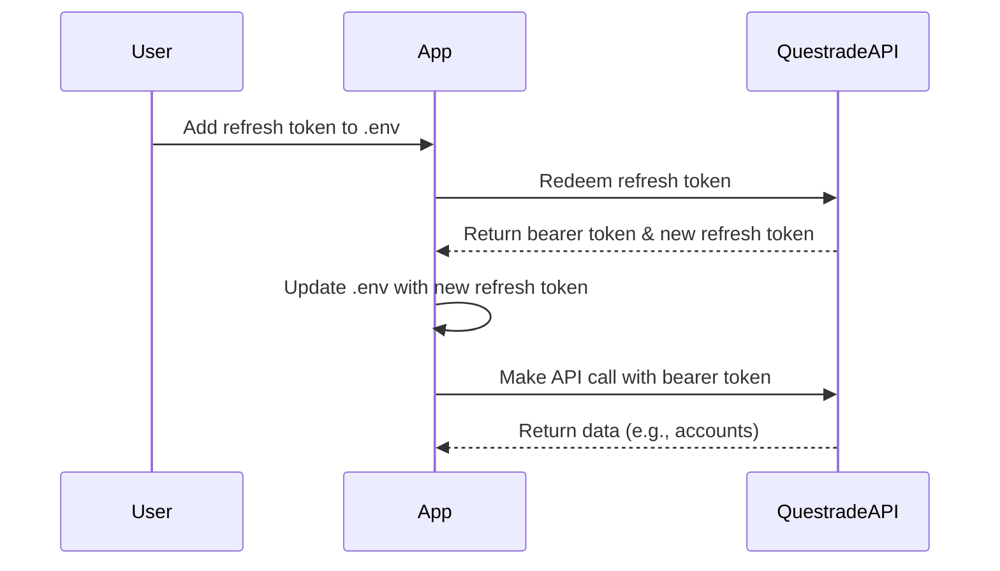

# Questrade API Token Flow

This document explains how the refresh token and bearer token process works in the Questrade integration, including a simple Mermaid sequence diagram.

## Overview

- The Questrade API uses OAuth2 tokens for authentication.
- You start with a single-use refresh token, which you obtain from the Questrade Developer Portal.
- The app uses this refresh token to request a bearer (access) token and a new refresh token.
- After each successful token exchange, the app automatically updates the `.env` file with the new refresh token.
- The bearer token is used for authorized API calls (e.g., fetching accounts).
- The process repeats: each API call uses the latest bearer token, and the refresh token is updated as needed.

## Step-by-Step Process

1. **Obtain a refresh token** from Questrade and place it in `.env` as `QUESTRADE_REFRESH_TOKEN`.
2. **Run the app or script**. The code:
    - Reads the refresh token from `.env`.
    - Redeems it for a bearer token and a new refresh token.
    - Updates `.env` with the new refresh token.
    - Uses the bearer token for API calls.
3. **Repeat**: Each time you run the app, it uses the latest refresh token and bearer token.

## Mermaid Sequence Diagram

## Notes
- The refresh token is single-use: after redemption, only the new token is valid.
- The `.env` file is automatically updated after each successful token exchange.
- You only need to manually update `.env` if the token is revoked or you reset your app.

---

For troubleshooting or more details, see the code in `backend/src/services/questradeService.ts`.
