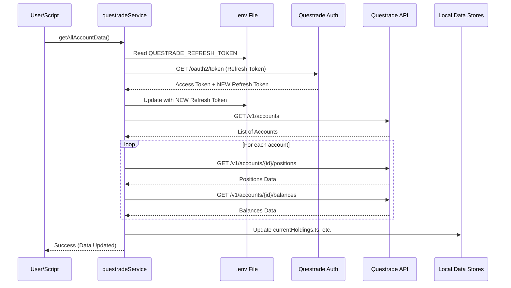

# Questrade Integration Architecture Report

This report documents the design and implementation of the Questrade broker integration found in the older version of the InvestmentToolkit (`temp/temp_older_toolkit`).

## 1. Overview
The integration provides a mechanism to fetch and export all account-related data (balances, positions, orders) from Questrade. It is a local-first, script-based approach that manages security through manual OAuth2 token rotation.

## 2. Authentication & Token Management
The authentication follows a **Manual Authorization Flow** as defined in `ADR 001`.

- **Initial Setup**: The user manually generates a refresh token in the Questrade API Centre.
- **Token Rotation**: 
    - The `getBearerToken` function (in `questradeService.ts`) reads the `QUESTRADE_REFRESH_TOKEN` from the `.env` file.
    - It sends a GET request to `https://login.questrade.com/oauth2/token?grant_type=refresh_token&refresh_token=...`.
    - Upon success, Questrade returns a new `access_token` and a **new** `refresh_token`.
    - The script automatically updates the local `.env` file with the new refresh token, ensuring the next run can succeed without manual intervention.
- **Security**: No passwords are stored. Secrets are kept in `.env` (ignored by git) and a pre-commit hook (`Husky`) scans for leaks (`ADR 003`).

## 3. Data Retrieval Process
The core logic resides in `backend/src/services/questradeService.ts`.

1. **`getAllAccountData()`**:
    - Calls `getAccounts()` to list all sub-accounts (TFSA, RRSP, etc.).
    - For each account, it fetches:
        - **Positions**: Current stock/ETF holdings via `/v1/accounts/{id}/positions`.
        - **Balances**: Cash and equity totals via `/v1/accounts/{id}/balances`.
2. **`getBearerToken()`**: Ensures all subsequent API calls are authorized.

## 4. Data Storage & Persistence
Following `ADR 002`, the system uses a tiered approach:
- **V1 (Current)**: Data is stored in local TypeScript files (e.g., `backend/src/data/currentHoldings.ts`). These files act as simple in-memory stores that are updated whenever the fetch scripts are run.
- **V2 (Planned)**: The ADR notes a planned migration to a local SQLite database for more complex queries.

## 5. Export Logic
`ADR 007` defines the export strategy for AI analysis.
- The script `fetchAndExportAllData.ts` aggregates all data from the local stores (accounts, positions, balances, orders).
- It writes the entire dataset to a single `exportedData.json` file in the backend directory.
- This JSON format is designed to be easily consumed by LLMs or spreadsheet software.

## 6. Sequence Diagram
The following diagram illustrates the token refresh and data fetching flow.

