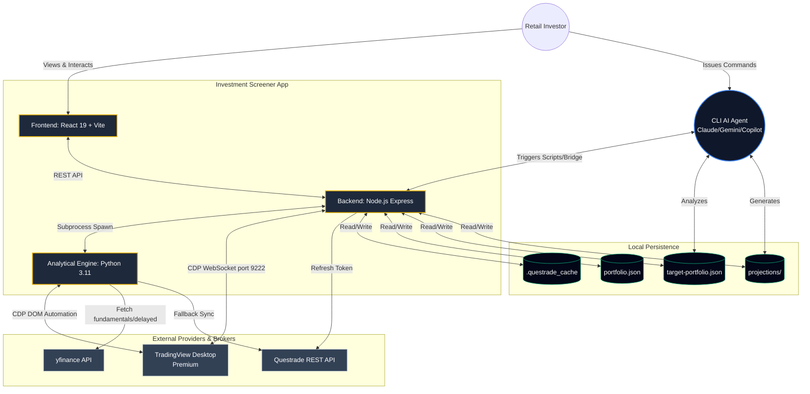

# InvestmentToolkit Architecture Overview

This document provides a high-level architectural overview of the **InvestmentToolkit** project. It serves as a map to understand how the web application, real-time data sources, and autonomous AI agents interact.

## 1. System Components

The architecture is divided into three primary layers:

### A. The Core Application (`investment_screener/`)
The web-based financial analysis dashboard.
- **Frontend**: React 19, Vite, Tailwind CSS 4.0. Displays portfolio summaries, market heatmaps, and valuation modeling interfaces in a "Luxury Dark Mode" aesthetic.
- **Backend**: Node.js (Express) with TypeScript. Manages state, coordinates data syncing, and serves API endpoints.
- **Analytical Engine**: Python 3.11 scripts (`py_services/`) spawned as subprocesses by the Node backend. Handles complex financial math (e.g., `dcf_scenarios.py`) and data fetching (`yfinance`). 
  > **Rule**: All math is fixed in these canonical scripts; AI agents never compute inline.
  > **The Canonical Mirror**: To ensure UI responsiveness without logic drift, the Frontend implements a line-for-line mirror of the Python math in `valuationMath.ts`.
  > **Math Parity Gate**: A cross-language parity test (`tests/test_math_parity.py`) enforces that both Python and TypeScript engines return identical results within $0.01 tolerance.

### B. The Data & Execution Layer
- **TradingView Desktop (Primary)**: Connected via Chrome DevTools Protocol (CDP) on port 9222. Used for real-time prices (Premium), portfolio sync, and live order execution directly through the TV DOM.
- **yfinance (Fundamentals & Fallback)**: Provides historical data, ratios, and fallback pricing when TradingView is disconnected.
- **Questrade API (Fallback)**: A direct REST API connection using AES-256-GCM encrypted tokens, used for portfolio syncing if TradingView Desktop is not running.

### C. The Agentic OS (`plugins/` & `.agents/`)
A modular ecosystem of AI agents that operate alongside the user via CLI tools (Claude Code, Gemini CLI, Copilot CLI). Agents perform autonomous research, adversarial thesis review, and data fetching.

### System Context Diagram
*See the full diagram source: [`system_context.mmd`](system_context.mmd)*


---

## 2. TradingView CDP Integration
Rather than relying entirely on broker APIs, the toolkit uses TradingView Desktop as the primary data and execution environment.
- **How it works**: A Node.js CDP engine (`tradingview-cdp/` at repo root) connects to TradingView Desktop via Chrome DevTools Protocol (CDP). Python skills communicate with it via `tv_client.py` which calls `tradingview-cdp/cli.js`. Install once with `cd tradingview-cdp && npm ci`.
- **Capabilities**:
  - **Portfolio Sync**: Scrapes the broker panel DOM for positions and balances across all accounts.
  - **Order Execution**: Fills the order dialog, captures a screenshot for human-in-the-loop (HITL) confirmation, and clicks submit.
  - **Data Fetching**: Reads the active chart's live quote.
  - **Pine Script Injection** (`/pine-inject`): Generates a Pine Script v6 indicator from a description, validates structure, injects via Monaco `executeEdits` (fires TV's compile listener), and clicks "Add to chart". Uses React fiber tree traversal to locate Monaco editor internals robustly across TV deployments.
- **Architecture**: ADR-024 "Thin Skill + Thick Engine" — CDP engine extracted from the legacy plugins directory to `tradingview-cdp/` as a shared standalone runtime. Skills remain thin Python wrappers.
- **See**: `plugins/tradingview/` (skills + scripts), `tradingview-cdp/` (shared Node.js CDP engine)

---

## 3. Plugin & Agent Architecture
The project extends the standard capabilities of AI coding assistants using a localized marketplace and plugin system.
- **Plugins**: Self-contained directories containing scripts, prompts, and `plugin.json` manifests.
- **Skills**: Granular capabilities (e.g., `/evaluate-stock`, `/rebalance`) documented in `SKILL.md` files that guide agent behavior.
- **Exploration Workflow**: A formal 4-phase loop (Discovery → Blueprinting → Prototyping → Handoff) managed by the `exploration-workflow` orchestrator to guide the development of new features.

### Agentic OS & Plugin Diagram
*See the full diagram source: [`agentic_os.mmd`](agentic_os.mmd)*
```mermaid
graph LR
    %% CLI Environments
    subgraph "CLI Environments"
        Claude[Claude Code]
        Gemini[Gemini CLI]
        Copilot[Copilot CLI]
    end

    %% Universal Marketplace
    Marketplace[[.claude-plugin/marketplace.json]]
    
    %% Exploration Workflow
    Orchestrator((Exploration Workflow\nOrchestrator))
    Dashboard[(exploration-dashboard.md)]

    %% Plugins Layer
    subgraph "Plugin Ecosystem (plugins/)"
        StockValuation[stock-valuation\n- /evaluate-stock\n- /research-stock]
        PortfolioAdvisor[portfolio-advisor\n- /strategic-review\n- /rebalance\n- /x-news-sweep]
        TradingViewBridge[tradingview\n- /tv-portfolio-sync\n- /place-order]
        ETFAnalysis[etf-analysis\n- /analyze-etf]
        ToolkitManager[toolkit-manager\n- /setup-questrade\n- /start-screener]
    end

    %% File System
    SKILL_MD[SKILL.md / agents.md\n(Instructions & Triggers)]
    PyScripts[Canonical .py Scripts\n(Execution Logic)]

    %% Connections
    Claude --> Marketplace
    Gemini --> Marketplace
    Copilot --> Marketplace

    Marketplace --> StockValuation
    Marketplace --> PortfolioAdvisor
    Marketplace --> TradingViewBridge
    Marketplace --> ETFAnalysis
    Marketplace --> ToolkitManager

    %% Internal Plugin Structure
    StockValuation -.-> SKILL_MD
    StockValuation -.-> PyScripts

    %% Exploration Workflow routing
    Claude --> Orchestrator
    Gemini --> Orchestrator
    Orchestrator <--> Dashboard
    Orchestrator -->|Delegates Tasks| PortfolioAdvisor
    Orchestrator -->|Delegates Tasks| StockValuation

    classDef cli fill:#1e1b4b,stroke:#6366f1,stroke-width:2px,color:#fff;
    classDef plugin fill:#0f172a,stroke:#10b981,stroke-width:2px,color:#fff;
    classDef orchestrator fill:#312e81,stroke:#a855f7,stroke-width:2px,color:#fff;

    class Claude,Gemini,Copilot cli;
    class StockValuation,PortfolioAdvisor,TradingViewBridge,ETFAnalysis,ToolkitManager plugin;
    class Orchestrator orchestrator;
```

---

## 4. Testing Architecture (The Iron Law)
The project enforces strict Test-Driven Development (TDD) rules.
> **The Iron Law**: NO PRODUCTION CODE WITHOUT A FAILING TEST FIRST.

The test harness is designed around **Subprocess-First** execution to mirror exactly how the Express backend and AI agents invoke Python scripts. Direct function imports are discouraged for integration paths.

**Test Tiers:**
- **T0**: Build/Syntax Gate (TypeScript compile, Python syntax).
- **T1**: TV CDP Harness (Live TradingView DOM interactions and broker testing).
- **T2**: Backend API Suite (Express HTTP endpoints).
- **T3**: Python Service Suite (`py_services` scripts).
- **T4**: Plugin/Skill Contracts (Structural safety checks).
- **T5**: Frontend Smoke Tests (Playwright UI checks).

---

## 5. Deep-Dive References

For detailed design decisions and component-specific architecture, refer to the following documents:

*   **Architecture Decision Records (ADRs)**: [ADRs/](../../ADRs/) - Immutable records of significant design choices (e.g., `020-robust-valuation-persistence.md`).
*   **Stock Valuation**: [plugins/stock-valuation/references/](../../plugins/stock-valuation/references/) - Details on DCF calculation methodology, persistence, and the AI analyst interaction flow.
*   **Questrade Authentication**: [plugins/toolkit-manager/references/Questrade/](../../plugins/toolkit-manager/references/Questrade/) - Details the AES-256-GCM encryption and stateful token rotation process.
*   **Agent Guidelines**: [AGENTS.md](../../AGENTS.md) - Operating rules for AI agents.
*   **Test Suite Vision**: `docs/superpowers/specs/2026-05-17-test-suite-vision-design.md` - The comprehensive roadmap for the TDD harness.