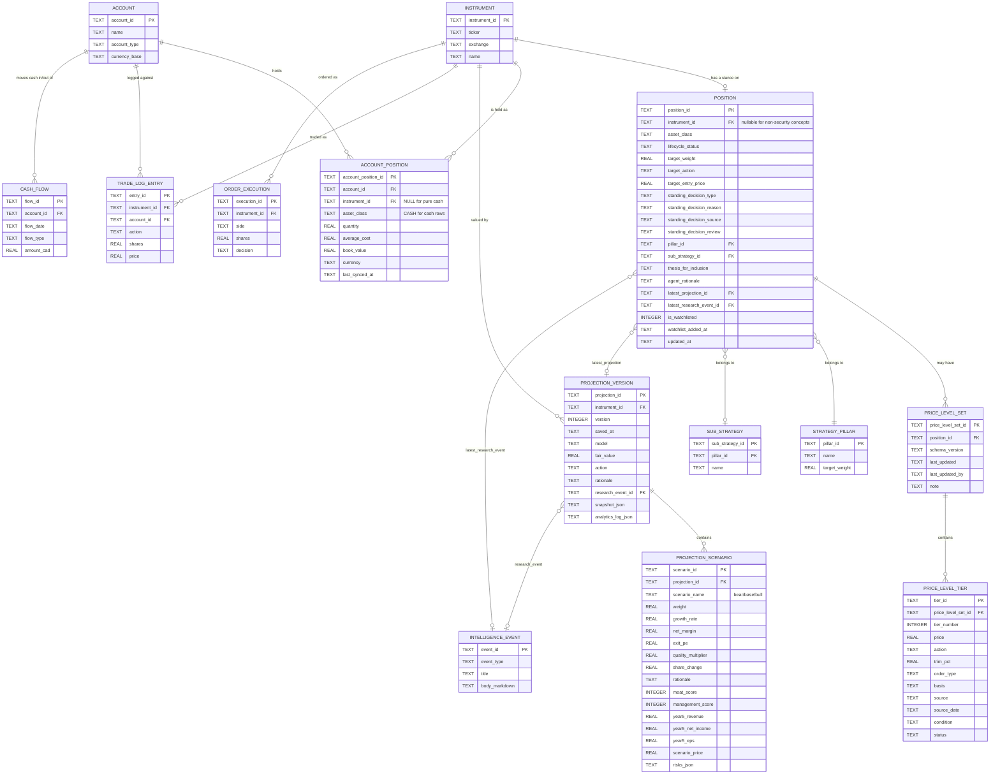

# Corrected Persistence Domain Data Model — v2

**Status: design correction pass only. No code, tables, repositories, schemas, or archival have
been implemented as a result of this document. Per explicit instruction: no implementation
begins until this data model, a spec derived from it, and a plan derived from that spec have all
been separately reviewed and approved.**

Supersedes `docs/architecture/persistence-domain-data-model.md` and
`docs/architecture/big-domain-migration-design.md` for the domains covered here
(`portfolio.json`, `target-portfolio.json`, `watchlist.json`, `projections/*.json`). Those
documents are not assumed correct — every claim below was re-derived by directly parsing real
files in this repository, not by trusting the prior documents' summaries.

---

## 1. Why the Previous Model Was Insufficient

The prior version modeled these files by their **JSON file boundaries** (one table per file:
`holdings`, `target_portfolio_entry`, `watchlist_entry`) rather than by the **business concept**
they jointly describe. Concretely, it missed or flattened real structure found in this pass:

- `standingDecision` is not a string — it's a structured object (`type`, `reason`, `source`,
  `review`), found on real holdings (e.g. `VST`'s `SA_LP_EXIT_OVERRIDE`). The prior model's
  `standing_decision TEXT` column would have lost three of those four fields.
- `priceLevels` is a rich nested structure (`schemaVersion`, `lastUpdated`, `lastUpdatedBy`,
  `note`, `buyTiers[]` — each tier with `price`, `action`, `trimPct`, `orderType`, `basis`,
  `source`, `sourceDate`, `condition`, `status`) — not mentioned anywhere in the prior model.
- DCF `scenarios` (`bear`/`base`/`bull`, 14 fields each including `rationale`, `moatScore`,
  `managementScore`, `risks[]`) were collapsed into a single opaque `scenarios_json` blob in the
  prior `projection_version` design — the corrective instruction explicitly requires these be a
  first-class `PROJECTION_SCENARIO` entity, and real data shows why: they're structured,
  bounded-shape (always exactly 3 scenarios, always the same ~14 fields), not the kind of
  variable-shape data that justifies staying JSON.
- **47 of 75 holdings in `target-portfolio.json` have `shares: 0`** — target/watchlist-only
  entries are the *majority* case, not an edge case. A model requiring an account or a nonzero
  quantity to represent a position is wrong on the evidence.
- **`portfolio.json`'s holdings carry no account field at all** — `{symbol, shares, book_price,
  market_value, price, last_updated}`. The prior model's assumption that "holdings" data is
  naturally account-scoped is not supported by what the app actually persists today. Account
  granularity only exists in `trade_log_entry`.
- The prior model split `holdings` / `target_portfolio_entry` / `watchlist_entry` as three root
  tables — correctly identified as wrong in the prior document's own text, but the fix (a single
  `investment_position` table) still didn't resolve the account/cash gap above, and had not yet
  been checked against the real field data in `target-portfolio.json`'s `priceLevels`/
  `standingDecision`/`scenarios` structures.

---

## 2. Field Inventory Summary (real files parsed, not grep counts)

### `target-portfolio.json` (1 file, 75 holdings, 13 pillars)

Top level: `id`, `name`, `schemaVersion`, `version`, `createdAt`, `updatedAt`, `description`,
`pillars[]`, `holdings[]`, `globalSettings{rebalanceFrequency, portfolioValueUSD}`, `changeLog[]`.

Pillar shape: `id`, `name`, `targetWeight`.

Holdings — union of all fields actually used across all 75 entries (not just the first one):
`ticker`, `name`, `pillarId`, `targetWeight`, `role`, `subStrategyId`, `thesisForInclusion`,
`agentRationale`, `shares`, `action`, `standingDecision{type, reason, source, review}` (present on
a minority of holdings — active override cases), `targetEntryPrice`, `priceLevels{schemaVersion,
lastUpdated, lastUpdatedBy, note, buyTiers[{tier, price, action, trimPct, orderType, basis,
source, sourceDate, condition, status}]}` (present on a minority — auto-derived from DCF runs).

Authoritative: everything except `priceLevels` (auto-derived, regenerable from DCF re-runs —
functions more like a cached recommendation than a decision).

### `portfolio.json` (1 file, gitignored, broker-synced)

Top level: `holdings[]`, `totals{holdingsUSD, cashUSD, totalUSD, totalCAD, exchangeRate,
timestamp, totalSource}`, `tvSnapshot`.

Holding shape: `symbol`, `shares`, `book_price`, `market_value`, `price`, `last_updated`. No
account field — confirmed by direct inspection of the live file, not assumed from the prior
document.

Authoritative for `shares`/`book_price` (broker is upstream authority, this is the local mirror).
`market_value`/`price` are derived (live price × shares) and should not be treated as stored
fact — same reasoning the prior document already applied correctly to `totals`.

### `projections/*.json` (144 files, one array per ticker; AAPL and OKLO both inspected —
identical top-level key set, confirming shape consistency across tickers)

Per version entry: `ticker`, `id`, `source`, `schemaVersion`, `version`, `savedAt`, `updatedAt`,
`name`, `rationale`, `snapshot{price, currency, shares, revenue, lastActualPS, fiscalPeriod,
analystGrowthEstimate, analystMarginEstimate}`, `dataPreferences{growthBasis, marginBasis}`,
`scenarios{bear, base, bull}` (each: `weight`, `growthRate`, `netMargin`, `exitPE`,
`qualityMultiplier`, `shareChange`, `rationale`, `moatScore`, `managementScore`, `year5Revenue`,
`year5NetIncome`, `year5EPS`, `scenarioPrice`, `risks[]`), `aiThesis{model, rationale, fairValue,
action, analyzedAt, researchReport}`, `globalSettings{discountRate, timeHorizon}`,
`analyticsLog{shareCountMethod, marginAnchor, growthDerivation, sectorBenchmarkRow,
dataQualityFlags[], analystInputs{y1RevEstimate, y2RevEstimate, y1GrowthPct, y2GrowthPct,
blendedConsensusPct, analystTargetMean, analystCount}, historicalRevenue[], historicalNetMargins[],
historicalEPS[], confidenceBreakdown}`.

Authoritative: `aiThesis.fairValue`/`action`/`rationale`, `scenarios.*`, `snapshot.*` (point-in-time
input capture). `researchReport` is the field responsible for this whole effort's original bug —
redesigned below same as the prior document's fix.

### Pipeline intermediates: `temp/evaluations/*_raw.json`, `*_dcf_result.json`, `*_scenarios.json`,
`*_projection.json` (and `temp/*_raw.json`)

Real files inspected (`AAPL_dcf_result.json` and others). Shape: `ticker`, `baseRevenue`,
`baseShares`, `discountRate`, `horizon`, `discountDivisor`, `currentPrice`, `weightedFairValue`,
`upsidePct`, `action`, `scenarios{bear, base, bull}` (same per-scenario fields as the final
projection, minus `rationale`/`risks`), `validation{weightSum, weightSumOk, growthOrdering,
pvOrdering, errors[], warnings[], valid}`.

**These are not a persistence domain.** They live in `temp/` (CLAUDE.md's explicit scratch-space
convention), are produced and consumed within a single DCF pipeline run
(`fetch_financials.py` → `dcf_scenarios.py` → final write to `data/projections/{TICKER}.json`),
and are overwritten on every re-run. Recommendation: `UNKNOWN_BLOCKER` is the wrong
classification for these — they're not blocked, they're **out of scope by design**, same
reasoning as any other `temp/` artifact. No table needed. The `validation{}` block is worth
noting as a candidate audit field on `PROJECTION_VERSION` if validation results are ever wanted
post-hoc, but nothing in the real data suggests that's currently used downstream.

### `watchlist.json` (1 file, 80 entries)

Entry shape: `{ticker, addedAt}`. That's the entire shape — minimal, membership + timestamp only.
No notes field currently exists in the real data despite the corrective instruction's hypothesis
of "watchlist notes" — flagging this as a gap between hypothesis and evidence, not silently
adding a field nothing currently populates.

### `cash_flows.json` (1 file, 3 entries — already documented accurately in the prior pass)

`{starting_balance_cad, starting_date, cash_flows: [{date, type, amount_cad,
portfolio_value_before_flow_cad, account}]}`. Note: this file **does** carry an `account` field
per flow entry — the only one of the position-adjacent files that does.

### `trade-log.json`, `orders_executed.jsonl`, `predictions.jsonl`, `observations.jsonl`,
`ta-sweep-results.json`, `daily-briefs/*.json`

Unchanged from the prior pass's inspection (already verified against real files, not re-derived
here): `trade-log.json` carries `account` per entry; `orders_executed.jsonl` does not (order
object has no account field either — same gap as `portfolio.json`); the rest are unchanged in
shape and classification from `docs/architecture/persistence-domain-data-model.md`.

### Raw market-data cache (`data/cache/fundamentals_*.json`, `ohlcv_*.json`)

`fundamentals_LLY.json`: `{cashAndEquivalents, netIncome, revenue, totalDebt, dataQuality}`. Small,
re-fetchable from yfinance at any time, already classified `ALLOWED_GENERATED_CACHE_JSON` in the
original audit — re-confirmed correct by this inspection, not changed here.

---

## 3. Corrected Conceptual Model

Two findings from the real data drove a change from the corrective instruction's own starting
hypothesis, stated explicitly rather than silently substituted:

1. **`POSITION` cannot require a non-null `account_id`.** 47 of 75 target-portfolio holdings and
   all 80 watchlist entries represent a stance on a security with no account involved at all —
   this is the majority case. Forcing every row through an account would mean either fabricating
   a fake account for target/watchlist-only securities, or storing target/watchlist data
   somewhere else — recreating the exact fragmentation this correction is meant to fix.
2. **Neither `portfolio.json` nor `orders_executed.jsonl` currently carries account data.** Only
   `trade-log.json` and `cash_flows.json` do. Account-level truth in this codebase today is
   thinner than the corrective instruction's hypothesis assumed.

**Resolution:** split what the instruction called `POSITION` into two related entities instead
of one:

- **`POSITION`** — one row per security (or per pure-cash concept), portfolio-universe scoped,
  `account_id`-free. Represents "our stance on this security": lifecycle status, target
  weight/action/entry price, standing decision, strategy/thesis links, latest projection/research
  links, price levels, watchlist flag. This is what most of `target-portfolio.json` and all of
  `watchlist.json` actually describe.
- **`ACCOUNT_POSITION`** — one row per (account, security) pair actually held. Represents "what
  do we actually hold, where": quantity, book value, currency, last-synced timestamp. This is
  what `portfolio.json` actually describes (once `ACCOUNT` is added — see below) and what
  `trade-log.json`/`orders_executed.jsonl` accumulate history against.

A `POSITION` with zero `ACCOUNT_POSITION` rows is a pure target/watchlist entry — the normal
case, not a null-handling edge case. This directly satisfies requirement #9 (a position can be
currently-held, target-only, watchlist-only, or exited) without forcing a fake account onto the
47/75 holdings that don't have one, and satisfies "accounts are first-class" (requirement #3) by
giving `ACCOUNT` its own real table and FK relationship, rather than a column that's usually
NULL.

**Correction to an earlier claim, and the real `role` distribution:** the exited-security role
value is `exit`, not `exited` as an earlier draft of this analysis said — confirmed directly
against the live file: `{accumulate: 24, avoid: 6, watchlist: 33, trim: 1, initiate: 8, exit:
3}`. `avoid` was missing from this document's `lifecycle_status`/`target_action` discussion
entirely — a sixth value alongside the CLAUDE.md pitfall #6 enum
(`INITIATE|ACCUMULATE|MAINTAIN|TRIM|EXIT|WATCHLIST`), not currently accounted for and needs
adding to whichever column ends up holding it.

**Why `instrument` stays a separate table from `position` (not merged into one, larger table):**
checked empirically rather than argued abstractly. `intelligence_event` (research) currently
covers 72 tickers; the position-universe (`portfolio.json` ∪ `target-portfolio.json` ∪
`watchlist.json`, deduplicated) covers 96. **One ticker, `BITF`, has research history but zero
presence anywhere in the position universe.** That's real, if small (1 of 72), evidence that
research can exist before or independent of any portfolio stance — `intelligence_event.
instrument_id` needs somewhere to point that doesn't require a `position` row to exist yet.
Merging `instrument` into `position` would also require redefining what the already-live
`intelligence_event` table's foreign key references — a schema change on a table already holding
real data, in exchange for saving one join in the common case. Not recommended, but a narrow
tradeoff, not a hard architectural wall — reconsider if you weigh the join cost differently.

Cash is modeled as an `ACCOUNT_POSITION` row with `instrument_id NULL`, `asset_class = 'CASH'`,
per the corrective instruction's own suggested resolution to design question 6 — confirmed as the
right call, since `cash_flows.json` already treats cash movements as account-scoped events with
no security identity, consistent with this shape.

`SECURITY` is not a new table — the existing, live `instrument` table (ADR-026/027/028,
currently holding 72 real tickers) already serves this role. Creating a second, parallel
`SECURITY` table would immediately violate ADR-028's anti-duplication intent. `POSITION.
instrument_id` and `ACCOUNT_POSITION.instrument_id` both reference the existing `instrument`
table.

---

## 4. Corrected Mermaid ER Diagram



No `HOLDINGS`, `TARGET_PORTFOLIO_ENTRY`, or `WATCHLIST_ENTRY` root entities remain — resolved
into `POSITION` (portfolio-universe stance) + `ACCOUNT_POSITION` (actual per-account holdings),
per the account/cash evidence in §3.

---

## 5. Proposed SQLite Schema (column level)

```sql
CREATE TABLE account (
    account_id      TEXT PRIMARY KEY,
    name            TEXT NOT NULL,          -- 'TFSA', 'RRSP'
    account_type    TEXT,
    currency_base   TEXT NOT NULL DEFAULT 'CAD'
);

CREATE TABLE strategy_pillar (
    pillar_id       TEXT PRIMARY KEY,
    name            TEXT NOT NULL,
    target_weight   REAL
);

CREATE TABLE sub_strategy (
    sub_strategy_id TEXT PRIMARY KEY,
    pillar_id       TEXT REFERENCES strategy_pillar(pillar_id),
    name            TEXT NOT NULL
);

CREATE TABLE position (
    position_id                TEXT PRIMARY KEY,             -- generated: instrument_id, or a synthetic id for non-security concepts
    instrument_id               TEXT REFERENCES instrument(instrument_id),
    asset_class                  TEXT NOT NULL,               -- EQUITY, ETF, CASH_EQUIVALENT, etc.
    lifecycle_status              TEXT,                        -- INITIATE|ACCUMULATE|MAINTAIN|TRIM|EXIT|WATCHLIST
    target_weight                  REAL,
    target_action                   TEXT,
    target_entry_price               REAL,
    standing_decision_type            TEXT,                    -- flattened from real standingDecision{type,reason,source,review}
    standing_decision_reason           TEXT,
    standing_decision_source            TEXT,
    standing_decision_review             TEXT,
    pillar_id                             TEXT REFERENCES strategy_pillar(pillar_id),
    sub_strategy_id                        TEXT REFERENCES sub_strategy(sub_strategy_id),
    thesis_for_inclusion                    TEXT,
    agent_rationale                          TEXT,
    latest_projection_id                      TEXT REFERENCES projection_version(projection_id),
    latest_research_event_id                   TEXT REFERENCES intelligence_event(event_id),
    thesis_breaker_status                       TEXT,     -- from thesis_breaker_state.json, §9a — table currently empty in real data, column vs. child table undetermined
    is_watchlisted                              INTEGER NOT NULL DEFAULT 0,
    watchlist_added_at                           TEXT,
    updated_at                                    TEXT NOT NULL,
    UNIQUE(instrument_id)
    -- target_action / lifecycle_status real values confirmed against live data: accumulate,
    -- avoid, watchlist, trim, initiate, exit (CLAUDE.md pitfall #6's enum plus 'avoid', which
    -- that enum doesn't list — both columns need the real 6-value set, not the enum as first drafted)
);

CREATE TABLE instrument_price (
    instrument_id   TEXT PRIMARY KEY REFERENCES instrument(instrument_id),
    price            REAL NOT NULL,
    currency          TEXT NOT NULL DEFAULT 'USD',
    fetched_at         TEXT NOT NULL
);

CREATE TABLE price_level_set (
    price_level_set_id  TEXT PRIMARY KEY,
    position_id           TEXT NOT NULL REFERENCES position(position_id),
    schema_version         TEXT,
    last_updated            TEXT,
    last_updated_by          TEXT,
    note                      TEXT
);

CREATE TABLE price_level_tier (
    tier_id               TEXT PRIMARY KEY,
    price_level_set_id      TEXT NOT NULL REFERENCES price_level_set(price_level_set_id),
    tier_number               INTEGER NOT NULL,
    price                      REAL,
    action                      TEXT,
    trim_pct                     REAL,
    order_type                    TEXT,
    basis                          TEXT,
    source                          TEXT,
    source_date                      TEXT,
    condition                         TEXT,
    status                             TEXT
);

CREATE TABLE account_position (
    account_position_id   TEXT PRIMARY KEY,        -- generated: account_id || ':' || COALESCE(instrument_id, 'CASH_' || currency)
    account_id              TEXT NOT NULL REFERENCES account(account_id),
    instrument_id             TEXT REFERENCES instrument(instrument_id),  -- NULL for pure cash
    asset_class                TEXT NOT NULL,        -- 'CASH' when instrument_id is NULL
    quantity                     REAL NOT NULL DEFAULT 0,
    average_cost                  REAL,
    book_value                     REAL,
    currency                        TEXT NOT NULL DEFAULT 'USD',
    last_synced_at                   TEXT NOT NULL,
    UNIQUE(account_id, instrument_id, asset_class)
);

CREATE INDEX idx_position_pillar ON position(pillar_id);
CREATE INDEX idx_position_lifecycle ON position(lifecycle_status);
CREATE INDEX idx_account_position_account ON account_position(account_id);
CREATE INDEX idx_account_position_instrument ON account_position(instrument_id);

CREATE TABLE projection_version (
    projection_id         TEXT PRIMARY KEY,
    instrument_id           TEXT NOT NULL REFERENCES instrument(instrument_id),
    version                  INTEGER NOT NULL,
    saved_at                  TEXT NOT NULL,
    analyzed_at                TEXT,
    model                       TEXT,
    fair_value                   REAL,
    action                        TEXT,
    rationale                      TEXT,
    research_event_id               TEXT REFERENCES intelligence_event(event_id),
    snapshot_json                     TEXT,           -- price/currency/shares/revenue/lastActualPS/fiscalPeriod/analyst estimates at analysis time — small, fixed-shape, but low query value beyond point-in-time display, kept as JSON
    analytics_log_json                 TEXT,          -- shareCountMethod/marginAnchor/growthDerivation/historicalRevenue etc — genuinely variable/free-text heavy, kept as JSON
    UNIQUE(instrument_id, version)
);

CREATE TABLE projection_scenario (
    scenario_id       TEXT PRIMARY KEY,      -- generated: projection_id || ':' || scenario_name
    projection_id       TEXT NOT NULL REFERENCES projection_version(projection_id),
    scenario_name         TEXT NOT NULL,      -- bear/base/bull — fixed set of 3, confirmed by real data
    weight                 REAL,
    growth_rate              REAL,
    net_margin                REAL,
    exit_pe                    REAL,
    quality_multiplier          REAL,
    share_change                  REAL,
    rationale                      TEXT,
    moat_score                      INTEGER,
    management_score                 INTEGER,
    year5_revenue                     REAL,
    year5_net_income                    REAL,
    year5_eps                            REAL,
    scenario_price                        REAL,
    risks_json                             TEXT,      -- small string array, kept as JSON rather than a child table — no evidence of independent querying need
    UNIQUE(projection_id, scenario_name)
);

CREATE INDEX idx_projection_instrument ON projection_version(instrument_id);
CREATE INDEX idx_projection_scenario_projection ON projection_scenario(projection_id);

-- Unchanged from the prior design (trade_log_entry, order_execution, cash_flow,
-- cash_flow_baseline) — per explicit instruction to keep these as-is.
```

---

## 6. Calculated Views

```sql
CREATE VIEW account_total_value AS
SELECT
    ap.account_id,
    SUM(CASE WHEN ap.asset_class = 'CASH' THEN ap.quantity ELSE ap.quantity * ip.market_price END) AS total_value,
    SUM(CASE WHEN ap.asset_class = 'CASH' THEN ap.quantity ELSE 0 END) AS cash_value
FROM account_position ap
LEFT JOIN instrument_price ip ON ip.instrument_id = ap.instrument_id  -- see note below
GROUP BY ap.account_id;

CREATE VIEW portfolio_total_value AS
SELECT SUM(total_value) AS total_value FROM account_total_value;

CREATE VIEW position_valuation AS
SELECT
    p.position_id,
    p.instrument_id,
    COALESCE(SUM(ap.quantity), 0) AS current_quantity,
    ip.market_price,
    COALESCE(SUM(ap.quantity), 0) * ip.market_price AS market_value,
    COALESCE(SUM(ap.book_value), 0) AS book_value,
    (COALESCE(SUM(ap.quantity), 0) * ip.market_price) - COALESCE(SUM(ap.book_value), 0) AS unrealized_gain_loss,
    p.target_weight,
    CASE WHEN pv.total_value > 0
         THEN (COALESCE(SUM(ap.quantity), 0) * ip.market_price) / pv.total_value
         ELSE NULL END AS current_weight,
    p.target_weight * pv.total_value AS target_value,
    CASE WHEN ip.market_price > 0
         THEN (p.target_weight * pv.total_value) / ip.market_price
         ELSE NULL END AS target_quantity,
    (p.target_weight * pv.total_value) - (COALESCE(SUM(ap.quantity), 0) * ip.market_price) AS rebalance_amount,
    CASE WHEN pv.total_value > 0
         THEN ((p.target_weight * pv.total_value) / ip.market_price) - COALESCE(SUM(ap.quantity), 0)
         ELSE NULL END AS weight_gap_shares
FROM position p
LEFT JOIN account_position ap ON ap.instrument_id = p.instrument_id
LEFT JOIN instrument_price ip ON ip.instrument_id = p.instrument_id
CROSS JOIN portfolio_total_value pv
GROUP BY p.position_id;

CREATE VIEW cash_weight AS
SELECT
    (SELECT SUM(quantity) FROM account_position WHERE asset_class = 'CASH')
    / (SELECT total_value FROM portfolio_total_value) AS cash_weight_pct;
```

**`instrument_price` dependency — recommended resolution, not yet implemented:** the small cache
table added to §5's schema (`instrument_price`: `instrument_id`, `price`, `currency`,
`fetched_at`) resolves the joins above.

Kept fresh by whichever existing flow already fetches live prices for a ticker
(`fetch_quotes.py`, `ta_sweep_batch.py`'s TV pull, `BrokerSyncService.ts`'s sync) — an upsert on
this table, not a new fetch path. This keeps the views in §6 as real SQL rather than pushing
valuation logic into the application layer. Recommended over option (b) from the earlier draft
of this document, but not yet built — a decision to confirm before implementation, not something
this document unilaterally settles.

**Portfolio account-assignment dependency — resolved, not a hard problem.** The earlier draft of
this document treated "how do current `portfolio.json` holdings map to accounts" as an open
inference problem. It isn't. Checked directly against `fetch_broker_data.py` and
`BrokerSyncService.ts`: **the TradingView CDP sync already receives per-account data**
(`accountType`/`accountId` per position, confirmed in both files) — `write_snapshot()` in
`fetch_broker_data.py` explicitly aggregates it away: `agg[sym]["quantity"] += qty` sums across
accounts by symbol alone before anything is written to `portfolio.json`, and the function's own
docstring says so directly: *"merges RRSP+TFSA positions."* The account split isn't missing from
the source of truth — it's discarded by existing code on the way to disk. Resolution: when
`account_position` is built, `write_snapshot()`'s merge step is removed (or redirected to write
one `account_position` row per `accountType` instead of one aggregated `portfolio.json` holding
per symbol) — not an approximation or a reconstruction from `trade_log_entry`, a straightforward
stop-discarding-data fix.

---

## 7. Snapshot / Materialization Policy

`account_position` itself **is** the materialized, reconciliation-grade snapshot of what the
broker reports — updated on every `BrokerSyncService`/`fetch_broker_data.py` sync, not
recomputed from `trade_log_entry` (broker is the authority on current quantity/book_value, trades
are the historical audit trail explaining how it got there, per requirement #15 — reconstructed
*from* broker sync, not the other way around). No separate `portfolio_snapshot` table is needed
beyond `account_position` itself, since it already carries `last_synced_at` and is the single
current-state table per account+instrument. If historical (not just current) reconciliation
snapshots are wanted — e.g. "what did we hold on July 1st" — that would be a genuinely new,
append-only `account_position_history` table, not designed here since no requirement or evidence
calls for it yet.

---

## 8. JSON Fields Mapped to Target Entities

| JSON field | Source file | Target entity.column |
|---|---|---|
| `holdings[].ticker` | target-portfolio.json | `position.instrument_id` (resolved via `instrument`) |
| `holdings[].targetWeight` | target-portfolio.json | `position.target_weight` |
| `holdings[].role` | target-portfolio.json | `position.lifecycle_status` (needs reconciliation with `action` field — see DQ list) |
| `holdings[].action` | target-portfolio.json | `position.target_action` |
| `holdings[].pillarId` | target-portfolio.json | `position.pillar_id` |
| `holdings[].subStrategyId` | target-portfolio.json | `position.sub_strategy_id` |
| `holdings[].thesisForInclusion` | target-portfolio.json | `position.thesis_for_inclusion` |
| `holdings[].agentRationale` | target-portfolio.json | `position.agent_rationale` |
| `holdings[].shares` | target-portfolio.json | **not stored on `position`** — this is a target-time snapshot of shares, superseded by real-time `account_position.quantity`; kept only as historical context in `changeLog`/audit if needed |
| `holdings[].standingDecision.*` | target-portfolio.json | `position.standing_decision_{type,reason,source,review}` |
| `holdings[].targetEntryPrice` | target-portfolio.json | `position.target_entry_price` |
| `holdings[].priceLevels` | target-portfolio.json | `price_level_set` + `price_level_tier` |
| `pillars[]` | target-portfolio.json | `strategy_pillar` |
| `globalSettings` | target-portfolio.json | stays JSON, small config, no consumer needs row-level query |
| `changeLog[]` | target-portfolio.json | candidate for a future `position_change_log` event table — not designed here, no current evidence of a consumer needing it queried |
| `portfolio.json holdings[].symbol/shares/book_price` | portfolio.json | `account_position.instrument_id/quantity/average_cost` (requires deciding which account — see DQ2) |
| `portfolio.json totals.*` | portfolio.json | `account_total_value`/`portfolio_total_value` views, not stored |
| `watchlist.json entries[].ticker/addedAt` | watchlist.json | `position.is_watchlisted = 1`, `position.watchlist_added_at` |
| `projections[].scenarios.*` | projections/*.json | `projection_scenario` (one row per bear/base/bull) |
| `projections[].aiThesis.researchReport` | projections/*.json | `projection_version.research_event_id` (FK, not filename) |
| `projections[].snapshot`, `.analyticsLog` | projections/*.json | `projection_version.snapshot_json`/`analytics_log_json` (variable/free-text heavy, stays JSON) |

---

## 9. Data That Should Remain JSON (explicit rationale)

- **`account_policy.json`** — static configuration, never mutated by the app, no per-row query
  need. Unchanged from the prior audit.
- **`snapshot_json`/`analytics_log_json` on `projection_version`** — genuinely variable-shape
  free text (`shareCountMethod`, `marginAnchor`, `growthDerivation` are prose explanations, not
  structured data), no evidence any consumer queries into these fields individually rather than
  displaying the whole blob.
- **`globalSettings` on `position`-adjacent config** — small, rarely touched, whole-document
  read pattern.
- **`data/cache/fundamentals_*.json`, `ohlcv_*.json`** — external market-data cache,
  re-fetchable from yfinance at any time, already correctly classified
  `ALLOWED_GENERATED_CACHE_JSON`.
- **`temp/evaluations/*_raw.json`, `*_dcf_result.json`, `*_scenarios.json`, `*_projection.json`**
  — pipeline intermediates, `temp/` scoped by design, overwritten every run, never meant to
  persist. Not a migration candidate at all.
- **`tradingview_alerts_actual.json`** (203 entries, checked directly) — confirmed a pure
  TradingView-synced mirror (`alert_id`, `symbol`, `condition`, `created`, `last_fired`). Same
  `RETAIN_AS_EXTERNAL_CACHE` reasoning as `portfolio.json`'s price data — TradingView is
  authoritative, this is a local read cache of alert state, not portfolio/position domain data.
- **`ytd_performance_report.json`** (checked directly: `starting_balance_cad`,
  `ending_balance_cad`, deposits/withdrawals, `simple_return_pct`, `time_weighted_return_pct`,
  `sub_periods`) — a computed report. Per standing instruction on record for this project, YTD
  return reports are explicitly not wanted generated. This file should stay exactly as-is (or be
  retired outright, a product decision, not an engineering one) — not pulled into the position
  model.

## 9a. `thesis_breaker_state.json` — genuinely relevant, not previously covered

Checked directly: `{generatedAt, holdings: {}}` — currently empty in this repo, but its shape
(a per-holding breaker status, keyed by ticker, written by `thesis_breakers.py`) belongs in the
position model, not left out. Recommendation: `position.thesis_breaker_status` (or a small child
table if a holding can have multiple simultaneous breakers — undetermined from the current empty
file; `thesis_breakers.py`'s actual write shape should be checked before finalizing this as a
column vs. a table).

---

## 10. Data That Should Migrate to SQLite

`position` (from `target-portfolio.json` + `watchlist.json`), `account_position` (from
`portfolio.json`), `account` (new, first-class per this correction), `strategy_pillar`/
`sub_strategy` (from `target-portfolio.json`'s `pillars[]`), `price_level_set`/`price_level_tier`
(from `priceLevels`), `projection_version`/`projection_scenario` (from `projections/*.json`,
scenarios now a real child table, not a JSON blob). `trade_log_entry`, `order_execution`,
`cash_flow`, `cash_flow_baseline` unchanged from the prior design, per explicit instruction.

## 11. Data That Should Become JSON Payload Columns (variable shape)

`projection_version.snapshot_json`, `projection_version.analytics_log_json`,
`projection_scenario.risks_json` (small string array, no independent query need identified),
`order_execution.gate_result_json` (unchanged from prior design — variable-shape audit detail).

---

## 12. Producer/Consumer Implications

Not re-derived from scratch in this pass — the real producer/consumer inventories gathered in
`docs/architecture/big-domain-migration-design.md` (21 producers / ~33 consumers for the
`portfolio.json`+`target-portfolio.json`+`watchlist.json` union) still apply to the underlying
*files*; what changes is which table each write/read now targets (`position` vs.
`account_position` instead of a single `investment_position`). Re-confirming exact per-file
read/write targets against the corrected two-table split is real work for the spec/plan phase,
not repeated here to avoid duplicating effort before the model itself is approved.

---

## 13. Retirement Criteria

Unchanged rule from `docs/architecture/persistence-domain-data-model.md`, preserved exactly as
required: **a domain is not migrated because a table exists, a repository exists, or data was
copied. It is migrated only when the producer writes SQLite, every real consumer reads SQLite,
and the old JSON/JSONL file is moved to `ARCHIVE/` via `git mv`.** Applies per source file —
`portfolio.json`, `target-portfolio.json`, and `watchlist.json` all archive together in one
commit only once every producer/consumer of all three has moved, since they now share the
`position`/`account_position` tables and a partial archive would split one concept's data
provenance across a SQLite table and a leftover JSON file.

---

## 14. Explicit Non-Goals

- Not designing `changeLog`'s eventual SQLite shape — no current consumer evidence justifies it.
- Not designing historical `account_position` snapshots (point-in-time reconstruction) — no
  requirement or evidence calls for it yet.
- Not resolving the `instrument_price` gap (§6) — flagged as an open dependency, not solved here.
- Not touching `evolution_events.py` — out of scope per every prior instruction this session.
- Not writing migration code, creating tables, creating repositories, or archiving any file —
  per the explicit instruction governing this entire document.

---

## Answers to the 16 Specific Design Questions

1. **Should POSITION be keyed by account_id + symbol instead of only instrument?** No — evidence
   (47/75 target holdings and all 80 watchlist entries have no account) argues for `POSITION`
   keyed by `instrument_id` alone, with a separate `ACCOUNT_POSITION` keyed by
   `(account_id, instrument_id)` for the subset actually held. See §3.
2. **How should account-level holdings roll up into portfolio-level target weights?** Via the
   `position_valuation` view (§6) — `current_weight` sums `account_position.quantity` across all
   accounts for an instrument, divided by `portfolio_total_value`.
3. **Can a target/watchlist position exist without an account?** Yes — confirmed the majority
   case by real data, not a hypothetical.
4. **Account-scoped rows / portfolio-universe rows / nullable account_id?** Two related tables
   (`position` account-free, `account_position` account-scoped), not a single table with a
   nullable column — cleaner FK integrity than a nullable `account_id` on one shared table.
5. **How should cash be represented?** `account_position` row, `instrument_id NULL`,
   `asset_class = 'CASH'`.
6. **CASH_CAD/CASH_USD as pseudo-securities or `asset_class = 'CASH'` with `instrument_id`
   NULL?** The latter — confirmed consistent with `cash_flows.json`'s existing shape (account +
   currency-scoped, no security identity).
7. **Where does book value live?** `account_position.book_value` — it's an actual-holding fact,
   not a target/thesis fact.
8. **Where does current market value live?** Nowhere stored — `position_valuation` view, per
   requirement #11/#12.
9. **Where do standingDecision and priceLevels live?** `position.standing_decision_*` (flattened,
   fixed 4-field shape) and `price_level_set`/`price_level_tier` (child tables, variable tier
   count).
10. **Where do strategy/pillar/sub-strategy live?** `strategy_pillar`/`sub_strategy` tables,
    referenced from `position`.
11. **Where do thesisForInclusion and agentRationale live?** `position.thesis_for_inclusion`/
    `position.agent_rationale` — real text fields, confirmed present in real data.
12. **Where do DCF scenario assumptions live?** `projection_scenario`, one row per bear/base/bull
    per projection version — real child table, not a JSON blob, per explicit instruction and
    confirmed-fixed-shape evidence.
13. **Where do raw market/financial snapshots live?** Stay as JSON file cache
    (`data/cache/fundamentals_*.json`) — re-fetchable, not authoritative, no query-by-field
    evidence found. See §9.
14. **Which values are authoritative vs. derived?** Authoritative: everything in `position` and
    `account_position` except `market_value`/valuation fields. Derived: everything in §6's views.
15. **Which values are reconstructed from broker sync?** `account_position.quantity`/
    `book_value` — broker is upstream authority, trade log is the audit trail explaining history,
    not the source of current state.
16. **Which old JSON files can disappear if this model is implemented?** `portfolio.json`,
    `target-portfolio.json`, `watchlist.json` — all three, together, in one archive step (§13).
    `projections/*.json` separately, once `projection_version`/`projection_scenario` are proven
    (unchanged recommendation from the prior document — still the suggested starting domain,
    since it has the fewest real producers).
