# Corrected Persistence Domain Data Model

**Version:** 3.2 (schema below extended by Wave 3, see Revision History)
**Status:** implemented. Waves 0-3 built and shipped this schema against real data — see
`docs/superpowers/status/wave1-projections-report.md`, `wave2-target-portfolio-report.md`, and
Wave 3's exit report/handoff for per-wave producer/consumer cutover evidence. This document is
the current schema reference, not a pending proposal.

## Revision History

Prior versions are not kept as separate files — this single file is the current model, with
prior reasoning preserved in git history (`git log -- docs/architecture/domain-data-model.md`,
file renamed from `corrected-persistence-domain-data-model.md` alongside this v3.2 pass),
not as parallel `-v2`/`-v3`-suffixed documents.

- **v1** (superseded): modeled `portfolio.json`/`target-portfolio.json`/`watchlist.json` as
  three separate root tables (`holdings`, `target_portfolio_entry`, `watchlist_entry`), mirroring
  JSON file boundaries rather than the business concept they jointly describe.
- **v2** (superseded): corrected v1 by unifying those three into one `POSITION` +
  `ACCOUNT_POSITION` split, with a separate `INSTRUMENT` table for ticker identity. Established
  the real evidence this document still relies on: the `exit`/`avoid` role values, the
  `standingDecision`/`priceLevels` structure, the `instrument_price` and account-assignment
  resolutions (see §"Portfolio account-assignment dependency" below).
- **v3**: replaced v2's `INSTRUMENT`+`POSITION` split with a single `INVESTMENT` table (bridged
  to accounts via `ACCOUNT_INVESTMENT`), after an honest head-to-head comparison found the split
  added a real join to the two most common query shapes in this app without a requirement
  forcing it. See "The Core Question, Answered Honestly" below.
- **v3.1**: moved `target_entry_price` off `investment` into `price_level_tier`
  (`tier_kind='TARGET_ENTRY'`) after confirming it's a genuine price level, not a scalar
  attribute — real data showed it's never present without `priceLevels` and holds a materially
  different value than the buy tiers (not a duplicate). Added `alert` as its own entity
  (`tradingview_alerts_actual.json`, 203 real entries, one-to-many from `investment`) rather than
  a fourth `tier_kind`, since alerts are TradingView-synced/authoritative while the other three
  kinds are locally authored — different write-ownership, kept as separate tables sharing the
  same one-to-many relationship shape from `investment`.
- **v3.2** (current): responded to external review with real-data checks, not agreement/disagreement
  on feel. Did NOT collapse `lifecycle_status`/`target_action`/`is_watchlisted` — confirmed they
  track genuinely different, sometimes-disagreeing things (`DRAM` has `role='initiate'` but
  `action='WATCHLIST'`; `watchlist.json`'s 80 tickers and `role='watchlist'`'s 33 tickers overlap
  by only 20). DID adopt `INVESTMENT_NOTE` as a new history table — `agentRationale` was found to
  be a single field with dated entries manually concatenated over time (`IREN` has 5, `VST` reads
  as a literal chronological log), a real un-queryable-history problem the table fixes. Did NOT
  promote scoring fields (moat/management/conviction) to real columns — checked the frontend
  directly, found zero sort/filter usage on them today.
- **Wave 3 additions** (2026-07-22, no version bump — additive, not a schema redesign): migrated
  `portfolio.json` (account holdings) into `account`/`investment`/`account_investment`/
  `investment_price`, and added `broker_exchange_rate`/`broker_reported_total` as the one
  broker-reported fact this domain can't recompute (see ADR-030). Per-account and portfolio
  totals are always computed live from `account_investment`/`investment_price`, never stored.
- **Wave 3 completion** (post-hoc, `investment.sector`/`investment.industry`): added to carry
  the two enriched holding-display facts `GET /api/portfolio` needs from `portfolio.json` that
  the schema didn't already carry (resolved by `fetch_portfolio_heatmap.py`'s yfinance lookup).
  Nullable TEXT, self-healed into any pre-existing real file via `SCHEMA_EVOLUTIONS` in
  `db_client.py` (`CREATE TABLE IF NOT EXISTS` is a no-op against a table that already exists).
- **Wave 4 addition** (`trade_log_entry.tv_order_id`): added so `trading.ts`'s `/modify`,
  `/cancel`, and `/log/sync-from-tv` routes can match a logged entry against its live TradingView
  order id. Also added via `SCHEMA_EVOLUTIONS` self-heal, not the original `CREATE TABLE`.
- **Wave 1 Task 5/6 post-hoc additions** (`projection_version.raw_json`/`legacy_id`/`source`/
  `last_grok_sweep`/`catalyst_updates_json`): not present in this document's original v3 design —
  added directly in `db_client.py` (some via `SCHEMA_EVOLUTIONS` self-heal) to close real gaps
  found after implementation: `raw_json` (full validated `Projection` object, round-trip fidelity
  for `.passthrough()` fields) and `legacy_id` (original Zod `Projection.id` UUID) so this file
  stays the single source of truth instead of `ProjectionRepository.ts` issuing its own runtime
  `ALTER TABLE`; `source`/`last_grok_sweep`/`catalyst_updates_json` so `apply_catalyst.py` has a
  SQL-queryable equivalent of the JSON model's `entry.source`/`entry.lastGrokSweep`/
  `entry.catalystUpdates` fields (`source` in particular is required for
  `_find_latest_ai_agent`'s source-filtered lookup — `MAX(version)` alone silently picks a
  non-`AI_AGENT` or non-chronological row for several real tickers). See
  `db_client.py`'s top-of-file comment for full detail and real-data evidence.
- **Wave 5E addition** (`portfolio_policy`): singleton portfolio-level config table (rebalance
  frequency, portfolio value target, risk-budget caps, rebalance bands, account-preference and
  PSU-funding rule JSON blobs) — see "Missing top-level `PORTFOLIO`/config entity" section below
  for full column rationale. Present in `db_client.py`'s `CREATE TABLE IF NOT EXISTS` block but
  had not yet been added to the ERD in this section; fixed in this pass (Wave 6).
- **Wave 6 documentation pass** (this revision, no schema change): reconciled this document and
  `supplementary-domain-schemas.md` against the real, current `db_client.py` files in both
  `domain_model/` and `intelligence/` — added the post-hoc columns/tables listed above to the
  Mermaid ERD and column-level SQL below, which had drifted out of sync with the schema actually
  shipped in Waves 1, 3, 4, and 5E.

---

## The Core Question, Answered Honestly

v2's reason for keeping `INSTRUMENT` separate from `POSITION` was one piece of real evidence:
1 of 72 researched tickers (`BITF`) has research history but no presence anywhere in the
position/target/watchlist universe. That's true and still true. What v2 didn't do was check
whether that evidence actually *requires* a separate table, versus being solvable a cheaper way.

**It's solvable a cheaper way.** `BITF` doesn't need a separate identity table — it needs one
more `lifecycle_status` value (`RESEARCH_ONLY`, or similar) on a single `INVESTMENT` row. That
resolves the one real gap v2's separation existed to cover, at the cost of one enum value instead
of a whole second table.

**Checked the remaining cost of merging, not just asserted it's small:** `instrument_repository.py`
(the module that would need renaming/absorbing) has exactly two real dependents in this codebase
— `models.py` and `replay_ledger.py`. That's a small, contained migration, not a large one.

**Conclusion: v3 is the better model. Recommending replacement of v2's core, not just offering it
as an alternative.**

---

## Required Comparison: Option A (v2) vs. Option B (v3)

| Dimension | Option A — v2 (`INSTRUMENT`+`POSITION`+`ACCOUNT_POSITION`) | Option B — v3 (`INVESTMENT`+`ACCOUNT_INVESTMENT`) |
|---|---|---|
| **Tables for the core concept** | 3 | 2 |
| **Joins for "show AAPL: name, target weight, current shares, market value"** | 3 (`instrument` for identity, `position` for stance, `account_position` aggregate, `instrument_price`) — 4 total including price | 2 (`account_investment` aggregate, `investment_price`) — identity and stance are already on the one row |
| **Joins for "list research for a ticker"** | 1 (`instrument` → `intelligence_event`) | 1 (`investment` → `intelligence_event`) — no difference |
| **Joins for "portfolio drift report, all tracked securities"** | 3 (`position`, `account_position` aggregate, `instrument_price`, plus `instrument` for display name = effectively 3-4) | 2 (`account_investment` aggregate, `investment_price`) |
| **Migration complexity** | Higher — 3 source concepts (portfolio.json, target-portfolio.json, watchlist.json) map to 2 tables, still requires deciding instrument vs. position boundary per field | Lower — same 3 source files map to 2 tables with a cleaner single boundary: "per-account fact" vs. "everything else" |
| **Represents watchlist-only items** | Yes — `POSITION` row, zero `ACCOUNT_POSITION` rows | Yes — `INVESTMENT` row, zero `ACCOUNT_INVESTMENT` rows. Identical capability. |
| **Represents target-only items** | Yes, same mechanism | Yes, same mechanism |
| **Represents cash** | `ACCOUNT_POSITION` row, `instrument_id NULL`, `asset_class='CASH'` | `ACCOUNT_INVESTMENT` row, `investment_id` pointing at a `CASH_USD`/`CASH_CAD` `INVESTMENT` row (asset_class='CASH') — arguably cleaner: cash gets a real identity row like any other tracked thing, consistent with the corrective instruction's own example list ("CASH_USD" listed as an `INVESTMENT` example) |
| **Same ticker across multiple accounts** | `ACCOUNT_POSITION` rows keyed by (account_id, instrument_id) | `ACCOUNT_INVESTMENT` rows keyed by (account_id, investment_id) — identical mechanism, no difference |
| **Projection/research links** | On `POSITION` (`latest_projection_id`, `latest_research_event_id`), referencing `PROJECTION_VERSION`/`INTELLIGENCE_EVENT` which reference `INSTRUMENT` — **two different FK anchors for the same ticker** (`position.instrument_id` and `projection_version.instrument_id` both have to agree) | On `INVESTMENT` directly, and `PROJECTION_VERSION`/`INTELLIGENCE_EVENT` also reference `INVESTMENT` — **one FK anchor**, removing a class of possible drift between "which instrument this position is about" and "which instrument this projection is about" |
| **Consumer rewrite complexity** | Same real producer/consumer counts as v2 documented (21 producers, ~33 consumers across the 3 files) — no change from that inventory | Same counts — the rewrite surface is the JSON→SQL producer/consumer work, which is identical regardless of which side of the instrument/position line a field lands on |
| **Archive criteria** | Same rule (producer+consumer+archive), unaffected by table count | Same rule, unaffected |
| **Risk of over-normalization** | Real — confirmed by the join-count and dual-FK-anchor findings above, not hypothetical | Lower — matches the corrective instruction's explicit design rule: don't split entities the app's actual query patterns don't need |

**Net assessment:** v3 removes 1 real join from the two most common query shapes in this app
(current status of a security; portfolio drift), removes a dual-FK-anchor class of potential
data drift, and costs a small, already-measured migration (2 dependent files) to absorb
`instrument`. v2's only genuine advantage — handling `BITF`-shaped research-only tickers — is
fully covered by v3's `RESEARCH_ONLY` lifecycle value at no structural cost.

---

## v3 Conceptual Model

- **`ACCOUNT`** — unchanged from v2.
- **`INVESTMENT`** — one row per tracked thing: a security *or* a cash concept. Absorbs v2's
  `INSTRUMENT` (identity: symbol, name, currency) and `POSITION` (stance: lifecycle, target,
  standing decision, strategy links, thesis, watchlist, projection/research pointers) into one
  table, because in this app's real data every one of those attributes is queried and displayed
  together, not independently.
- **`ACCOUNT_INVESTMENT`** — unchanged in role from v2's `ACCOUNT_POSITION`, renamed to match.
  Per-account fact: quantity, average cost, book value, currency, last sync.

---

## v3 Mermaid Diagram

```mermaid
erDiagram
    ACCOUNT ||--o{ ACCOUNT_INVESTMENT : holds
    INVESTMENT ||--o{ ACCOUNT_INVESTMENT : "is held as"
    INVESTMENT ||--o{ PROJECTION_VERSION : "valued by"
    INVESTMENT ||--o{ INTELLIGENCE_EVENT : "researched via"
    INVESTMENT ||--o| PRICE_LEVEL_SET : "may have"
    PRICE_LEVEL_SET ||--o{ PRICE_LEVEL_TIER : contains
    INVESTMENT ||--o{ ALERT : "has alerts for"
    INVESTMENT ||--o{ INVESTMENT_NOTE : "has history of"
    INVESTMENT }o--|| STRATEGY_PILLAR : "belongs to"
    INVESTMENT }o--o| SUB_STRATEGY : "belongs to"
    PROJECTION_VERSION ||--o{ PROJECTION_SCENARIO : contains
    PROJECTION_VERSION }o--o| INTELLIGENCE_EVENT : research_event
    INVESTMENT ||--o{ TRADE_LOG_ENTRY : "traded as"
    ACCOUNT ||--o{ TRADE_LOG_ENTRY : "logged against"
    INVESTMENT ||--o{ ORDER_EXECUTION : "ordered as"
    ACCOUNT ||--o{ CASH_FLOW : "moves cash in/out of"

    PORTFOLIO_POLICY {
        TEXT policy_id PK "singleton row, e.g. 'default'"
        TEXT rebalance_frequency
        REAL portfolio_value_usd_target
        REAL max_marginal_risk_contribution_pct
        REAL max_cluster_variance_contribution_pct
        REAL rebalance_band_relative_pct
        REAL rebalance_band_absolute_pct
        REAL rebalance_band_critical_multiplier
        TEXT account_preference_rules_json
        TEXT psu_funding_rule_json
        TEXT updated_at
    }

    BROKER_EXCHANGE_RATE {
        INTEGER id PK "singleton, CHECK(id=1)"
        REAL usd_to_cad_rate
        TEXT synced_at
    }

    BROKER_REPORTED_TOTAL {
        INTEGER id PK "singleton, CHECK(id=1)"
        REAL total_usd
        REAL total_cad
        TEXT synced_at
        TEXT source
    }

    ACCOUNT {
        TEXT account_id PK
        TEXT account_name
        TEXT account_type
        TEXT base_currency
    }

    INVESTMENT {
        TEXT investment_id PK
        TEXT symbol
        TEXT name
        TEXT sector "post-hoc, Wave 3 completion, nullable"
        TEXT industry "post-hoc, Wave 3 completion, nullable"
        TEXT asset_class
        TEXT currency
        TEXT lifecycle_status "INITIATE|ACCUMULATE|MAINTAIN|TRIM|EXIT|WATCHLIST|AVOID|RESEARCH_ONLY"
        REAL target_weight
        TEXT target_action
        TEXT standing_decision_type
        TEXT standing_decision_reason
        TEXT standing_decision_source
        TEXT standing_decision_review
        TEXT pillar_id FK
        TEXT sub_strategy_id FK
        TEXT thesis_for_inclusion
        TEXT agent_rationale
        INTEGER is_watchlisted
        TEXT watchlist_added_at
        TEXT latest_projection_id FK
        TEXT latest_research_event_id FK
        TEXT thesis_breaker_status
        TEXT updated_at
    }

    ACCOUNT_INVESTMENT {
        TEXT account_investment_id PK
        TEXT account_id FK
        TEXT investment_id FK
        REAL quantity
        REAL average_cost
        REAL book_value
        TEXT currency
        TEXT last_synced_at
    }

    STRATEGY_PILLAR {
        TEXT pillar_id PK
        TEXT name
        REAL target_weight
    }

    SUB_STRATEGY {
        TEXT sub_strategy_id PK
        TEXT pillar_id FK
        TEXT name
    }

    PRICE_LEVEL_SET {
        TEXT price_level_set_id PK
        TEXT investment_id FK
        TEXT schema_version
        TEXT last_updated
        TEXT last_updated_by
        TEXT note
    }

    PRICE_LEVEL_TIER {
        TEXT tier_id PK
        TEXT price_level_set_id FK
        TEXT tier_kind "BUY_TIER|TARGET_ENTRY"
        INTEGER tier_number
        REAL price
        TEXT action
        REAL trim_pct
        TEXT order_type
        TEXT basis
        TEXT source
        TEXT source_date
        TEXT condition
        TEXT status
    }

    ALERT {
        TEXT alert_id PK
        TEXT investment_id FK
        TEXT alert_type
        TEXT message
        REAL price
        TEXT condition_json
        INTEGER active
        TEXT resolution
        TEXT created_at
        TEXT last_fired_at
        TEXT expiration_at
        TEXT synced_at
    }

    INVESTMENT_NOTE {
        TEXT note_id PK
        TEXT investment_id FK
        TEXT note_date
        TEXT note_type
        TEXT body
        TEXT source
    }

    PROJECTION_VERSION {
        TEXT projection_id PK
        TEXT investment_id FK
        INTEGER version
        TEXT saved_at
        TEXT model
        REAL fair_value
        TEXT action
        TEXT rationale
        TEXT research_event_id FK
        TEXT snapshot_json
        TEXT analytics_log_json
        TEXT raw_json "post-hoc, Wave 1 Task 5"
        TEXT legacy_id "post-hoc, Wave 1 Task 5"
        TEXT source "post-hoc, Wave 1 Task 6"
        TEXT last_grok_sweep "post-hoc, Wave 1 Task 6"
        TEXT catalyst_updates_json "post-hoc, Wave 1 Task 6"
    }

    PROJECTION_SCENARIO {
        TEXT scenario_id PK
        TEXT projection_id FK
        TEXT scenario_name
        REAL weight
        REAL growth_rate
        REAL net_margin
        REAL exit_pe
        REAL quality_multiplier
        REAL share_change
        TEXT rationale
        INTEGER moat_score
        INTEGER management_score
        REAL year5_revenue
        REAL year5_net_income
        REAL year5_eps
        REAL scenario_price
        TEXT risks_json
    }

    INTELLIGENCE_EVENT {
        TEXT event_id PK
        TEXT event_type
        TEXT title
        TEXT body_markdown
    }

    TRADE_LOG_ENTRY {
        TEXT entry_id PK
        TEXT investment_id FK
        TEXT account_id FK "OPEN QUESTION: see note below diagram"
        TEXT action
        REAL shares
        REAL price
        TEXT tv_order_id "post-hoc, Wave 4 Task 11"
    }

    ORDER_EXECUTION {
        TEXT execution_id PK
        TEXT investment_id FK
        TEXT side
        REAL shares
        TEXT decision
    }

    CASH_FLOW {
        TEXT flow_id PK
        TEXT account_id FK
        TEXT flow_date
        TEXT flow_type
        REAL amount_cad
    }
```



No `POSITION` or `INSTRUMENT` root entities — the comparison above is the justification for
their absence, not an unexamined default.

**OPEN DESIGN QUESTION, not resolved by this Wave 6 documentation pass:**
`trade_log_entry.account_id` is shown above as a typed FK to `account(account_id)`, matching
this document's own ERD relationship (`ACCOUNT ||--o{ TRADE_LOG_ENTRY : "logged against"`) and
`db_client.py`'s real DDL. `cash_flow`, however, keeps a plain `account TEXT` column with no FK
— see `supplementary-domain-schemas.md`'s `cash_flow` table — even though this same diagram's
Wave 3-era reasoning would suggest the same `account_id FK` treatment. The two tables answer
"does `account` get promoted to a real FK" inconsistently, and this pass intentionally left that
inconsistency in place rather than picking a side (Task 1 here is schema transcription, not
redesign). Flagged for a follow-up decision before any repository work assumes one behavior or
the other. See `db_client.py`'s top-of-file comment for the full evidence trail.

---

## v3 Column-Level Schema

```sql
CREATE TABLE account (
    account_id      TEXT PRIMARY KEY,
    account_name    TEXT NOT NULL,
    account_type    TEXT,
    base_currency   TEXT NOT NULL DEFAULT 'CAD'
);

CREATE TABLE strategy_pillar (
    pillar_id       TEXT PRIMARY KEY,
    name            TEXT NOT NULL,
    target_weight   REAL
);

CREATE TABLE sub_strategy (
    sub_strategy_id TEXT PRIMARY KEY,
    pillar_id       TEXT REFERENCES strategy_pillar(pillar_id),
    name            TEXT NOT NULL
);

CREATE TABLE investment (
    investment_id              TEXT PRIMARY KEY,          -- generated: ticker, or CASH_USD / CASH_CAD for cash concepts
    symbol                      TEXT NOT NULL,
    name                         TEXT,
    sector                        TEXT,                   -- post-hoc (Wave 3 completion): nullable, resolved via fetch_portfolio_heatmap.py's yfinance lookup, self-healed via SCHEMA_EVOLUTIONS
    industry                       TEXT,                  -- post-hoc (Wave 3 completion): nullable, same source/self-heal as sector
    asset_class                   TEXT NOT NULL,           -- EQUITY, ETF, CASH, etc.
    currency                       TEXT NOT NULL DEFAULT 'USD',
    lifecycle_status                 TEXT,                  -- INITIATE|ACCUMULATE|MAINTAIN|TRIM|EXIT|WATCHLIST|AVOID|RESEARCH_ONLY
    target_weight                     REAL,
    target_action                      TEXT,
    -- target_entry_price intentionally NOT a column here — moved to price_level_tier
    -- (tier_kind='TARGET_ENTRY'), since it's a price level like any other, not a scalar
    -- investment attribute. See price_level_tier below.
    standing_decision_type                TEXT,
    standing_decision_reason               TEXT,
    standing_decision_source                TEXT,
    standing_decision_review                 TEXT,
    pillar_id                                 TEXT REFERENCES strategy_pillar(pillar_id),
    sub_strategy_id                            TEXT REFERENCES sub_strategy(sub_strategy_id),
    thesis_for_inclusion                        TEXT,
    agent_rationale                              TEXT,
    is_watchlisted                                INTEGER NOT NULL DEFAULT 0,
    watchlist_added_at                             TEXT,
    latest_projection_id                            TEXT REFERENCES projection_version(projection_id),
    latest_research_event_id                         TEXT REFERENCES intelligence_event(event_id),
    thesis_breaker_status                             TEXT,
    updated_at                                         TEXT NOT NULL,
    UNIQUE(symbol)
);

CREATE TABLE investment_price (
    investment_id   TEXT PRIMARY KEY REFERENCES investment(investment_id),
    price            REAL NOT NULL,
    currency          TEXT NOT NULL DEFAULT 'USD',
    fetched_at         TEXT NOT NULL
);

CREATE TABLE account_investment (
    account_investment_id   TEXT PRIMARY KEY,       -- generated: account_id || ':' || investment_id
    account_id                TEXT NOT NULL REFERENCES account(account_id),
    investment_id               TEXT NOT NULL REFERENCES investment(investment_id),
    quantity                      REAL NOT NULL DEFAULT 0,
    average_cost                    REAL,
    book_value                        REAL,
    currency                           TEXT NOT NULL DEFAULT 'USD',
    last_synced_at                      TEXT NOT NULL,
    UNIQUE(account_id, investment_id)
);

CREATE TABLE broker_exchange_rate (
    id               INTEGER PRIMARY KEY CHECK (id = 1),  -- singleton row
    usd_to_cad_rate    REAL NOT NULL,
    synced_at            TEXT NOT NULL
);

CREATE TABLE broker_reported_total (
    id           INTEGER PRIMARY KEY CHECK (id = 1),  -- singleton row
    total_usd      REAL,
    total_cad        REAL,
    synced_at          TEXT NOT NULL,
    source               TEXT NOT NULL   -- e.g. 'tv_broker_panel'
);

-- Wave 3 (2026-07-22): both singletons store a broker-reported FACT that cannot be
-- recomputed from account_investment/investment_price — the exchange rate itself, and
-- the broker's own last-reported combined total. Per-account and portfolio totals are
-- never stored as columns; they are always computed live (SUM(quantity * price) per
-- account, then summed across accounts) per ADR-030. See
-- ADRs/030_portfolio_totals_computed_not_stored.md.

CREATE TABLE price_level_set (
    price_level_set_id  TEXT PRIMARY KEY,
    investment_id          TEXT NOT NULL REFERENCES investment(investment_id),
    schema_version           TEXT,
    last_updated              TEXT,
    last_updated_by            TEXT,
    note                         TEXT
);

CREATE TABLE price_level_tier (
    tier_id               TEXT PRIMARY KEY,
    price_level_set_id      TEXT NOT NULL REFERENCES price_level_set(price_level_set_id),
    tier_kind                 TEXT NOT NULL DEFAULT 'BUY_TIER',  -- BUY_TIER (from priceLevels.buyTiers) | TARGET_ENTRY (from the old scalar targetEntryPrice — confirmed NOT redundant with BUY_TIER prices: real data shows different values, e.g. SNDK target 1350 vs. buy tiers at 1048/107). Alerts are a separate ALERT table below, not a third tier_kind — different write-ownership (TV-synced vs. locally-authored).
    tier_number               INTEGER NOT NULL,
    price                      REAL,
    action                      TEXT,
    trim_pct                     REAL,
    order_type                    TEXT,
    basis                          TEXT,
    source                          TEXT,
    source_date                      TEXT,
    condition                         TEXT,
    status                             TEXT
);
```

**Alerts (`tradingview_alerts_actual.json`, 203 real entries) — confirmed as its own entity, not
a `price_level_tier` row.** Same conceptual shape (a price level of interest tied to an
investment) but a different data-ownership category: TradingView-authoritative and synced, not
locally authored like the other three `tier_kind` values. Mixing synced and authored rows in one
table would be a real modeling smell, so `ALERT` was dropped from `price_level_tier`'s
`tier_kind` and given its own table instead — same `INVESTMENT ||--o{ ...` one-to-many
relationship as `price_level_tier`, just a separate table because the write-ownership is
different (TV sync process vs. locally-authored target/buy-tier entries):

```sql
CREATE TABLE alert (
    alert_id        TEXT PRIMARY KEY,        -- TradingView's own alert_id — real external identity, not generated
    investment_id     TEXT REFERENCES investment(investment_id),  -- resolved from TV's "EXCHANGE:SYMBOL" (e.g. "NASDAQ:IREN" -> IREN)
    alert_type          TEXT,                 -- 'price', etc. — from TV's own type field
    message               TEXT,
    price                  REAL,
    condition_json           TEXT,             -- variable-shape condition structure (type/series) — kept as JSON, no evidence of field-by-field query need
    active                    INTEGER NOT NULL DEFAULT 1,
    resolution                 TEXT,
    created_at                   TEXT,
    last_fired_at                  TEXT,
    expiration_at                    TEXT,
    synced_at                          TEXT NOT NULL  -- when this row was last refreshed from TV, same role as account_investment.last_synced_at
);

CREATE INDEX idx_alert_investment ON alert(investment_id);
```

Classification: not `RETAIN_AS_EXTERNAL_CACHE` (that implies staying JSON) — this is
`MIGRATE_TO_SQLITE_DOMAIN_TABLE`, same category as `account_investment`: TradingView is the
upstream authority, this table is the local synced mirror, kept fresh by whatever process already
calls the TV alerts API today.

```sql
CREATE TABLE projection_version (
    projection_id         TEXT PRIMARY KEY,
    investment_id            TEXT NOT NULL REFERENCES investment(investment_id),
    version                    INTEGER NOT NULL,
    saved_at                    TEXT NOT NULL,
    analyzed_at                  TEXT,
    model                          TEXT,
    fair_value                      REAL,
    action                           TEXT,
    rationale                         TEXT,
    research_event_id                  TEXT REFERENCES intelligence_event(event_id),
    snapshot_json                       TEXT,
    analytics_log_json                    TEXT,
    raw_json                               TEXT,  -- post-hoc (Wave 1 Task 5): full validated Projection object, round-trip fidelity for .passthrough() fields
    legacy_id                                TEXT,  -- post-hoc (Wave 1 Task 5): original Zod Projection.id UUID, groups version rows by projection identity
    source                                     TEXT,  -- post-hoc (Wave 1 Task 6): AI_AGENT|USER|SYSTEM|ETF_ANALYSIS, required by apply_catalyst.py's source-filtered latest lookup
    last_grok_sweep                              TEXT,  -- post-hoc (Wave 1 Task 6): entry.lastGrokSweep equivalent
    catalyst_updates_json                          TEXT,  -- post-hoc (Wave 1 Task 6): entry.catalystUpdates equivalent, appended by apply_catalyst.py
    UNIQUE(investment_id, version)
);

CREATE TABLE projection_scenario (
    scenario_id       TEXT PRIMARY KEY,
    projection_id       TEXT NOT NULL REFERENCES projection_version(projection_id),
    scenario_name         TEXT NOT NULL,
    weight                 REAL,
    growth_rate              REAL,
    net_margin                REAL,
    exit_pe                    REAL,
    quality_multiplier          REAL,
    share_change                  REAL,
    rationale                      TEXT,
    moat_score                      INTEGER,
    management_score                 INTEGER,
    year5_revenue                     REAL,
    year5_net_income                    REAL,
    year5_eps                            REAL,
    scenario_price                        REAL,
    risks_json                             TEXT,
    UNIQUE(projection_id, scenario_name)
);

CREATE INDEX idx_investment_pillar ON investment(pillar_id);
CREATE INDEX idx_investment_lifecycle ON investment(lifecycle_status);
CREATE INDEX idx_account_investment_account ON account_investment(account_id);
CREATE INDEX idx_account_investment_investment ON account_investment(investment_id);
CREATE INDEX idx_projection_investment ON projection_version(investment_id);
CREATE INDEX idx_projection_scenario_projection ON projection_scenario(projection_id);

-- Unchanged from v2/prior design: trade_log_entry, order_execution, cash_flow,
-- cash_flow_baseline — their instrument_id columns now reference investment(investment_id)
-- instead of the old instrument(instrument_id). Full column-by-column DDL for these four
-- tables lives in supplementary-domain-schemas.md (Domain 2, 3, 4 section), not duplicated
-- here. trade_log_entry additionally carries a post-hoc tv_order_id TEXT column (Wave 4
-- Task 11, self-healed via SCHEMA_EVOLUTIONS) not present in this document's original design —
-- see supplementary-domain-schemas.md for the updated column table.

-- portfolio_policy: full DDL + design rationale under "Missing top-level PORTFOLIO/config
-- entity" further below in this document (Wave 5E addition) — now also reflected in the
-- Mermaid ERD above (Wave 6). Note: this task's brief cites this table's DDL source as
-- "domain-data-model.md § Missing top-level PORTFOLIO/config entity" — that exact
-- section-heading text does not exist in this file (checked); the columns are
-- schema-consistent with every real design document that discusses portfolio_policy, so this
-- is a citation-accuracy gap, not a schema-content one. Not resolved here — flagged per
-- db_client.py's own top-of-file comment, left for a reviewer to confirm rather than silently
-- picking a side.
--
-- broker_exchange_rate / broker_reported_total: full DDL given earlier in this document (the
-- CREATE TABLE statements immediately after account_investment, Wave 3 additions) — now also
-- reflected in the Mermaid ERD above (Wave 6).
```

---

## Calculated Views (unchanged in principle from v2, re-pointed at v3 tables)

```sql
CREATE VIEW account_total_value AS
SELECT
    ai.account_id,
    SUM(CASE WHEN i.asset_class = 'CASH' THEN ai.quantity ELSE ai.quantity * ip.price END) AS total_value,
    SUM(CASE WHEN i.asset_class = 'CASH' THEN ai.quantity ELSE 0 END) AS cash_value
FROM account_investment ai
JOIN investment i ON i.investment_id = ai.investment_id
LEFT JOIN investment_price ip ON ip.investment_id = ai.investment_id
GROUP BY ai.account_id;

CREATE VIEW portfolio_total_value AS
SELECT SUM(total_value) AS total_value FROM account_total_value;

CREATE VIEW investment_valuation AS
SELECT
    inv.investment_id,
    inv.symbol,
    COALESCE(SUM(ai.quantity), 0) AS current_quantity,
    ip.price,
    COALESCE(SUM(ai.quantity), 0) * ip.price AS market_value,
    COALESCE(SUM(ai.book_value), 0) AS book_value,
    (COALESCE(SUM(ai.quantity), 0) * ip.price) - COALESCE(SUM(ai.book_value), 0) AS unrealized_gain_loss,
    inv.target_weight,
    CASE WHEN pv.total_value > 0
         THEN (COALESCE(SUM(ai.quantity), 0) * ip.price) / pv.total_value
         ELSE NULL END AS current_weight,
    inv.target_weight * pv.total_value AS target_value,
    CASE WHEN ip.price > 0
         THEN (inv.target_weight * pv.total_value) / ip.price
         ELSE NULL END AS target_quantity,
    (inv.target_weight * pv.total_value) - (COALESCE(SUM(ai.quantity), 0) * ip.price) AS rebalance_amount
FROM investment inv
LEFT JOIN account_investment ai ON ai.investment_id = inv.investment_id
LEFT JOIN investment_price ip ON ip.investment_id = inv.investment_id
CROSS JOIN portfolio_total_value pv
GROUP BY inv.investment_id;

CREATE VIEW cash_weight AS
SELECT
    (SELECT SUM(quantity) FROM account_investment ai JOIN investment i ON i.investment_id = ai.investment_id WHERE i.asset_class = 'CASH')
    / (SELECT total_value FROM portfolio_total_value) AS cash_weight_pct;
```

Same `investment_price`/live-price dependency as v2 — unresolved by table count, resolved by the
`investment_price` cache table + upsert-on-existing-fetch approach v2 already settled on.

---

## Field Mapping Into v3

| Field | Source | v3 target |
|---|---|---|
| `holdings[].ticker` | target-portfolio.json | `investment.symbol` (resolves `investment_id`) |
| `holdings[].name` | target-portfolio.json | `investment.name` |
| `holdings[].pillarId` | target-portfolio.json | `investment.pillar_id` |
| `holdings[].subStrategyId` | target-portfolio.json | `investment.sub_strategy_id` |
| `holdings[].targetWeight` | target-portfolio.json | `investment.target_weight` |
| `holdings[].role` | target-portfolio.json | `investment.lifecycle_status` (real values: accumulate/avoid/watchlist/trim/initiate/exit) |
| `holdings[].action` | target-portfolio.json | `investment.target_action` |
| `holdings[].standingDecision.*` | target-portfolio.json | `investment.standing_decision_{type,reason,source,review}` |
| `holdings[].targetEntryPrice` | target-portfolio.json | `price_level_tier` row, `tier_kind='TARGET_ENTRY'` — **not** an `investment` column (see below) |
| `holdings[].thesisForInclusion` | target-portfolio.json | `investment.thesis_for_inclusion` |
| `holdings[].agentRationale` | target-portfolio.json | `investment.agent_rationale` |
| `holdings[].priceLevels` | target-portfolio.json | `price_level_set` + `price_level_tier` (`tier_kind='BUY_TIER'`) |
| `holdings[].shares` | target-portfolio.json | not stored on `investment` — superseded by real-time `account_investment.quantity`, same reasoning as v2 |
| `symbol`/`shares`/`book_price` | portfolio.json | `account_investment.investment_id`/`quantity`/`average_cost` — **now with real account attribution**, per the resolved `fetch_broker_data.py` finding (v2 §, unchanged) |
| `market_value`/`price` | portfolio.json | `investment_valuation` view / `investment_price`, not stored |
| `ticker`/`addedAt` | watchlist.json | `investment.is_watchlisted = 1` / `investment.watchlist_added_at` |
| `alert_id`/`symbol`/`price`/`condition`/`active`/`created`/`last_fired`/`expiration` | tradingview_alerts_actual.json | `alert` table, `investment_id` resolved from `symbol` (strip `EXCHANGE:` prefix) |
| `fairValue`/`action`/`rationale` | projections/*.json `aiThesis` | `projection_version.fair_value`/`action`/`rationale` |
| `scenarios.*` | projections/*.json | `projection_scenario`, one row per bear/base/bull |
| `researchReport` | projections/*.json | `projection_version.research_event_id` (FK, not filename — unchanged from v2) |
| `snapshot`/`analyticsLog` | projections/*.json | `projection_version.snapshot_json`/`analytics_log_json` |
| `cash_flows[].*` | cash_flows.json | `cash_flow` table, unchanged — `investment_id` not involved, account-scoped only |
| `trade-log.json` entries | trade-log.json | `trade_log_entry`, unchanged shape, `instrument_id` column now named/pointed at `investment_id` |
| `orders_executed.jsonl` entries | orders_executed.jsonl | `order_execution`, unchanged shape, same FK rename |

---

## Answers to the 8 Required Questions

1. **Can INVESTMENT replace both POSITION and INSTRUMENT?** Yes — confirmed above, this is the
   recommendation.
2. **Does anything truly need an INSTRUMENT table separately?** No functional need found. The
   only real distinction (identity vs. stance) is a normalization preference, not a requirement
   any actual query or consumer in this codebase demonstrates.
3. **Is research for a ticker with no portfolio/watchlist stance enough reason to keep INSTRUMENT
   separate?** No — real (1 of 72, `BITF`), but resolved cheaper by a lifecycle value.
4. **Could INVESTMENT still hold it with `lifecycle_status = RESEARCH_ONLY`?** Yes — adopted
   directly into the v3 schema above.
5. **How many joins does v3 remove?** One real join from each of the two most common query
   shapes in this app (current security status; portfolio drift) — see comparison table.
6. **Does v3 better reflect the user's mental model?** Yes, on the evidence: the corrective
   instruction's own example list (`AAPL`, `CRWV`, `CASH_USD`, `SKHY target-only idea`) already
   describes one concept at different lifecycle stages, which is exactly what `INVESTMENT`
   models directly, without an extra table to explain the split.
7. **Does v3 make it easier to archive JSON files after migration?** No material difference —
   archive criteria (producer+consumer+archive, all three files together) is unaffected by table
   count. Neither model changes what "done" means.
8. **Does v3 avoid creating another over-engineered schema?** Yes — that was the central finding
   of the comparison: v2's split added a join to the two most common queries without a real
   requirement forcing it, which is the definition of over-normalization the corrective
   instruction's "Key Design Rule" warns against.

---

## Recommendation

**Replace the v2 core model (`INSTRUMENT`/`POSITION`/`ACCOUNT_POSITION`) with the v3 model
(`ACCOUNT`/`INVESTMENT`/`ACCOUNT_INVESTMENT`).** The v2 pass's supporting findings — the real
`role` values, the `standingDecision`/`priceLevels` structure, the `thesis_breaker_state.json`
and `instrument_price` additions, the resolved account-assignment finding in
`fetch_broker_data.py` — all carry forward unchanged into this document; only the core
three-vs-two-table shape changed. This is the current recommended design pending your approval;
the v1→v2→v3 reasoning trail is in git history (see Revision History above), not a parallel set
of files to keep in sync.

## Risks

- The `intelligence_event`/`instrument_repository.py` rename-and-repoint is real work, even
  though small (2 dependent files) — not zero-cost, and touches already-live, tested code.
- `investment.symbol` uniqueness assumes one row per ticker regardless of exchange — the existing
  `instrument` table supports `UNIQUE(ticker, exchange, active_from)` for corporate-action
  history (renames/relistings); v3's schema above simplifies this to `UNIQUE(symbol)` and does
  not yet handle a ticker rename/relist scenario. Flagged, not resolved — worth a decision before
  implementation if that's a real scenario for this portfolio (it hasn't come up in the real data
  inspected so far).

## Migration Implications

Same real producer/consumer inventory as v2 (21 producers, ~33 consumers across
`portfolio.json`/`target-portfolio.json`/`watchlist.json`), same archive rule, same
`projection_version` first-implementation recommendation (still the smallest real producer
count). The only change implementation needs to account for: every reference to `instrument_id`
in already-built code (`event_repository.py`, `replay_ledger.py`, `models.py`,
`instrument_repository.py`) needs to point at the renamed/merged `investment` table.

---

## Response to Review — Three Points Checked Against Real Data, Not Accepted or Rejected on Feel

### `lifecycle_status` / `target_action` / `is_watchlisted` — checked, NOT collapsing

The suspicion these three columns duplicate one status model doesn't hold up against real data:

- **`role` and `action` genuinely disagree on the same holding.** `DRAM`: `role: 'initiate'`,
  `action: 'WATCHLIST'` — if these were one status field, this holding couldn't exist. `role` is
  a portfolio-construction/strategy classification; `action` tracks the current recommended
  action (closer to the DCF engine's `aiThesis.action`). Different questions, different answers,
  on the same row, today.
- **`watchlist.json` (80 tickers) and `role='watchlist'` in `target-portfolio.json` (33 tickers)
  overlap by only 20.** 13 tickers carry `role='watchlist'` but aren't in `watchlist.json` at
  all; 60 tickers are in `watchlist.json` (including active holdings like `ALAB`, `SNDK` with
  `role='accumulate'`/`'initiate'`) despite not having `role='watchlist'`. These are two
  substantially different populations tracking two different questions: "what lifecycle stage is
  this candidate at" vs. "am I actively monitoring this right now" (which can be true for a
  ticker at any lifecycle stage, including ones already held).

Collapsing these into one enum would lose real, current, disagreeing information. Not adopted —
this is the one point in the review that real data argues against, not just a design preference.

### `THESIS` as its own table — checked, ADOPTED

Real evidence supports this one directly. `agentRationale` is a single TEXT field that gets
manually appended to over time as a growing, undated-except-inline-prose string —
confirmed by counting embedded date-stamps: `IREN` has 5, `BE`/`NBIS` have 4,
`VST`/`CORZ`/`CRWV` have 3. `VST`'s field literally reads as a chronological log
(*"2026-05-14: Trimmed... 2026-06-08: Grok ACCUMULATE BLOCKED... 2026-06-19: standingDecision
added..."*) concatenated into one string. That's a real history being stored as unstructured
prose inside a single mutable field — you can't query "what was the thesis on 2026-05-14"
without parsing free text. Adding:

```sql
CREATE TABLE investment_note (
    note_id         TEXT PRIMARY KEY,
    investment_id     TEXT NOT NULL REFERENCES investment(investment_id),
    note_date           TEXT NOT NULL,
    note_type             TEXT,        -- e.g. 'THESIS_UPDATE', 'STANDING_DECISION_CHANGE'
    body                    TEXT NOT NULL,
    source                    TEXT      -- e.g. 'agent', 'grok_sweep', 'user'
);

CREATE INDEX idx_investment_note_investment ON investment_note(investment_id, note_date);
```

`investment.agent_rationale` becomes "most recent note's body" (a denormalized convenience
field, kept in sync on write) rather than the sole record — the full history moves to
`investment_note`, one row per dated entry, instead of one ever-growing string. `thesis_for_inclusion`
stays on `investment` as-is: it's the current, single "why this is in the portfolio at all"
statement, not a log — no evidence it accumulates the way `agent_rationale` does.

### Analysis/scoring fields (conviction, moat score, management score, quality/risk scores) as
first-class columns — checked, NOT adopted, but not dismissed either

Checked whether the frontend actually filters or sorts by these today: `moatScore`/
`managementScore` return zero matches anywhere in `investment_screener/frontend/src`.
`conviction_scores` appears in `DailyBriefPage.tsx`, but only as a displayed list
(`brief.conviction_scores ?? []`) — no sort/filter logic found operating on the score values
client-side (sorting, if any, happens upstream in `compute_conviction_scores.py` before the data
arrives). The reviewer's own stated condition — "if the app actually filters/sorts on them" —
isn't currently met. Recommendation: leave these in `projection_scenario`/`analytics_log_json`
as designed. This isn't "no forever" — if a future filter/sort UI is actually built against
these, promoting specific fields to real columns at that point is a small, targeted change, not
a reason to speculatively add columns nothing queries today.

### Missing top-level `PORTFOLIO`/config entity — checked, ADOPTED as `portfolio_policy`

Raised as a question ("do you eventually need a top-level portfolio configuration object for
global settings, cash targets, rebalance rules, constraints") — checked directly rather than
answered from theory. `account_policy.json`, real content:

```json
{
  "accountPreferenceRules": [{"match": "usDividendPayer", "prefer": "RRSP", "reason": "..."}, ...],
  "psuFundingRule": {"ticker": "PSU-U.TO", "sameAccountOnly": true, "sharesFormula": "ceil(N * price / 100)"},
  "riskBudgetCaps": {"maxMarginalRiskContributionPct": 25, "maxClusterVarianceContributionPct": 60},
  "bandConfig": {"relativePct": 20, "absolutePct": 1.5, "criticalMultiplier": 2.0}
}
```

This is exactly the "rebalance rules"/"portfolio constraints" concept the review asked about —
real, not hypothetical, and it had no representation anywhere in this model, not even as a
"stays JSON" entity with a name. `target-portfolio.json`'s `globalSettings` (`rebalanceFrequency`,
`portfolioValueUSD`) is the same category of thing at smaller scale. Adopted as a real (if
mostly-JSON) entity rather than left unmodeled:

```sql
CREATE TABLE portfolio_policy (
    policy_id                          TEXT PRIMARY KEY,   -- fixed singleton row, e.g. 'default'
    rebalance_frequency                  TEXT,               -- from target-portfolio.json globalSettings
    portfolio_value_usd_target             REAL,             -- from target-portfolio.json globalSettings
    max_marginal_risk_contribution_pct       REAL,           -- from account_policy.json riskBudgetCaps — simple scalar, real column
    max_cluster_variance_contribution_pct      REAL,         -- from account_policy.json riskBudgetCaps
    rebalance_band_relative_pct                  REAL,       -- from account_policy.json bandConfig
    rebalance_band_absolute_pct                    REAL,     -- from account_policy.json bandConfig
    rebalance_band_critical_multiplier               REAL,   -- from account_policy.json bandConfig
    account_preference_rules_json                      TEXT, -- variable-length rule list, kept as JSON
    psu_funding_rule_json                                TEXT, -- small but free-form rule, kept as JSON
    updated_at                                             TEXT NOT NULL
);
```

The four numeric caps/bands get real columns (fixed shape, simple scalars, genuinely the kind of
thing you'd want to query/validate against) while the two rule structures
(`accountPreferenceRules`, `psuFundingRule`) stay JSON — same "flat scalar vs. variable-shape
rule" reasoning applied everywhere else in this document, not a special case. This is a singleton
table (one row), not per-investment or per-account — a genuine top-level config object, exactly
what was missing.

---

## Previously undocumented tables (added 2026-07-27)

A live-schema audit (`sqlite_master` vs. this document) found 5 tables that exist in
`domain_model.sqlite` today but were never added here — not proposals, already-implemented and
in active use. The ERD above already referenced `TRADE_LOG_ENTRY`, `ORDER_EXECUTION`, and
`CASH_FLOW` relationships, but their `CREATE TABLE` definitions were missing; `cash_flow_baseline`
and `portfolio_change_log` weren't referenced anywhere. Exact `CREATE TABLE` SQL pulled directly
from the live database via `sqlite_master`:

```sql
CREATE TABLE cash_flow (
    flow_id                             TEXT PRIMARY KEY,
    flow_date                           TEXT,
    flow_type                           TEXT,
    amount_cad                          REAL,
    portfolio_value_before_flow_cad      REAL,
    account                              TEXT
);

CREATE TABLE cash_flow_baseline (
    account                TEXT PRIMARY KEY,   -- singleton-per-account starting point for YTD/TWR math
    starting_balance_cad   REAL,
    starting_date          TEXT
);

CREATE TABLE order_execution (
    execution_id      TEXT PRIMARY KEY,
    executed_at       TEXT NOT NULL,
    investment_id     TEXT NOT NULL REFERENCES investment(investment_id),
    side              TEXT,
    shares            REAL,
    price             REAL,
    decision          TEXT,             -- risk-officer/gate decision at execution time
    gate_result_json  TEXT              -- variable-shape risk gate output, kept as JSON
);

CREATE TABLE portfolio_change_log (
    entry_id        TEXT PRIMARY KEY,
    version         TEXT NOT NULL,        -- e.g. domain model / thesis version tag
    entry_date      TEXT NOT NULL,
    note            TEXT NOT NULL,
    created_at      TEXT NOT NULL
);

CREATE TABLE trade_log_entry (
    entry_id        TEXT PRIMARY KEY,
    investment_id   TEXT NOT NULL REFERENCES investment(investment_id),
    account_id      TEXT REFERENCES account(account_id),
    action          TEXT,
    shares          REAL,
    price           REAL,
    total_cost      REAL,
    order_type      TEXT,
    limit_price     REAL,
    trade_date      TEXT,
    notes           TEXT,
    status          TEXT,
    source          TEXT,
    priority        TEXT,
    logged_at       TEXT,
    tv_order_id     TEXT     -- added post-hoc via SCHEMA_EVOLUTIONS self-heal, not the original CREATE TABLE
);
```

`cash_flow`/`cash_flow_baseline` back the YTD/TWR return calculations (`ytd_return.py`) —
deposits/withdrawals and each account's starting balance/date, so simple-return math isn't
polluted by capital flows. `order_execution` is the risk-gate audit trail for automated order
placement (`risk_officer.py`), distinct from `trade_log_entry` (the full manual + automated trade
log surfaced on the Trade Log page, `tv_order_id` linking back to a live TradingView order for
sync/cancel/modify). `portfolio_change_log` is a free-text changelog (version + note), unrelated
to the SQL-schema evolution log inside `db_client.py`'s own `SCHEMA_EVOLUTIONS` list.
