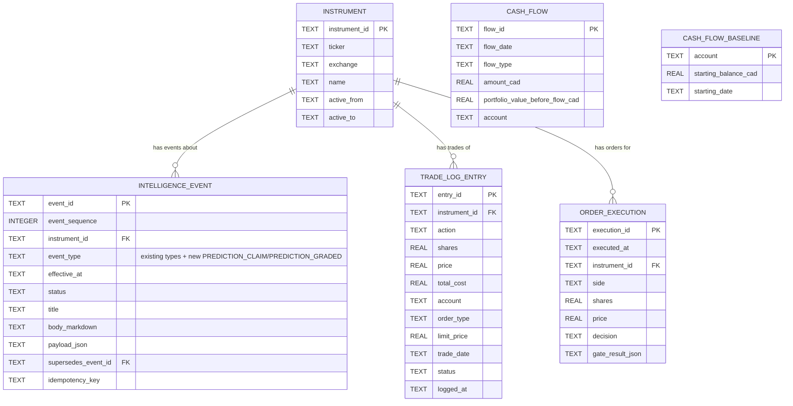

# Persistence Domain Data Model — Proposed SQLite Schema

Design document, produced before any migration code is written, per the corrected scope in
`docs/superpowers/plans/corrected-persistence-domain-migration-plan.md`. Covers every domain
classified `MIGRATE_TO_SQLITE_EVENT_MODEL` in that plan, plus how they relate to the existing
`intelligence_event` schema (ADRs 026/027/028), so a reviewer can see the whole target shape
before implementation starts. Nothing in this document has been built yet.

---

## Two Bounded Contexts, Not One Table

The existing `intelligence_event` table (already live, holds 80 `RESEARCH_IMPORT` rows) was
designed for **narrative, analytical observations** — its schema is `title` +
`body_markdown` + a loosely-typed `payload_json`, with an FTS5 index over the text. That shape
fits research write-ups, technical-sweep summaries, and daily reviews well.

`trade-log.json`, `orders_executed.jsonl`, and `cash_flows.json` are a **different kind of
data**: small, fully-typed, transactional records (ticker, shares, price, account, amount, date)
where the entire point of migrating them is to run real aggregate queries — "sum cash flows by
account," "total shares traded per ticker this year." Burying those fields inside
`payload_json` would defeat that purpose; they need real columns. Forcing them into
`intelligence_event`'s narrative shape would also be a CHECK-constraint schema migration on a
table that's already live and tested, mixing two unrelated domains under one taxonomy.

**Decision:** keep `intelligence_event` as-is for narrative/analytical events (adding one new
`event_type` value for predictions — see below), and introduce a **separate "Portfolio
Operations" schema** for the transactional records. Both share the existing `instrument` table
for ticker identity, so there is one consistent way to look up "everything about AAPL" across
both domains.

---

## Domain 1: `predictions.jsonl` → `intelligence_event` (existing table, one new `event_type`)

**Current shape:** JSONL, one line per dated prediction claim —
`{v, id, date, ticker, type, claim: {consensus_eps, consensus_revenue, earnings_date, ...}}`.

**Why it fits the existing table rather than a new one:** a prediction claim is an analytical
observation ("as of this date, this is what we expect") — the same shape as a research event,
just shorter and more structured. It also has a real lifecycle (`predictions_graded.jsonl`
elsewhere in the codebase grades a claim against actuals later) that maps naturally onto the
existing `status`/`supersedes_event_id` columns: a graded prediction can supersede its raw
claim, exactly the pattern already built for research supersession.

**Mapping:**
- `event_type` = new value `PREDICTION_CLAIM` (requires widening the existing CHECK constraint —
  a real, scoped schema migration on the live table, done carefully with the existing 80 rows
  intact).
- `instrument_id` = resolved from `ticker` via the existing `instrument` table.
- `effective_at` = `date`.
- `payload_json` = the `claim` object as-is.
- `title` = `"{ticker} {type} prediction for {date}"`.
- `body_markdown` = unused (NULL) — this domain has no narrative prose.

**Grading follow-up events** (from the existing `predictions_graded.jsonl` concept) would use the
same table with a new `PREDICTION_GRADED` event_type, `supersedes_event_id` pointing at the
original `PREDICTION_CLAIM` row.

---

## Domain 2, 3, 4: New "Portfolio Operations" Schema

### `trade_log_entry` (from `trade-log.json`, 52 rows today)

| Column | Type | Notes |
|---|---|---|
| `entry_id` | TEXT PK | from source `id` field |
| `instrument_id` | TEXT FK → `instrument` | resolved from `ticker` |
| `action` | TEXT | BUY/SELL/etc. |
| `shares` | REAL | |
| `price` | REAL | |
| `total_cost` | REAL | |
| `account` | TEXT | e.g. TFSA, RRSP |
| `order_type` | TEXT | |
| `limit_price` | REAL NULL | |
| `trade_date` | TEXT | source `date` |
| `notes` | TEXT NULL | |
| `status` | TEXT | |
| `source` | TEXT | |
| `priority` | TEXT NULL | |
| `logged_at` | TEXT | source `loggedAt` |

Immutable once written (a trade, once logged, is a historical fact) — insert-only table, no
update path needed.

### `order_execution` (from `orders_executed.jsonl`)

| Column | Type | Notes |
|---|---|---|
| `execution_id` | TEXT PK | generated: hash of `timestamp` + ticker + side |
| `executed_at` | TEXT | source `timestamp` |
| `instrument_id` | TEXT FK → `instrument` | resolved from `order.ticker` |
| `side` | TEXT | BUY/SELL |
| `shares` | REAL | |
| `price` | REAL NULL | market orders may have no price |
| `decision` | TEXT | BLOCKED / EXECUTED / etc. |
| `gate_result_json` | TEXT | the full `gate_result` object — kept as JSON deliberately: it's a variable-shape audit detail (which risk gates fired, why), not something queried column-by-column the way `shares`/`price`/`decision` are |

Insert-only — an execution attempt, once recorded, doesn't change.

### `cash_flow` (from `cash_flows.json`'s `cash_flows` array, 3 rows today)

| Column | Type | Notes |
|---|---|---|
| `flow_id` | TEXT PK | generated: hash of date + account + type |
| `flow_date` | TEXT | |
| `flow_type` | TEXT | deposit / withdrawal |
| `amount_cad` | REAL | |
| `portfolio_value_before_flow_cad` | REAL | |
| `account` | TEXT | |

### `cash_flow_baseline` (from `cash_flows.json`'s `starting_balance_cad`/`starting_date`)

Not event-shaped — a single current config value per account, not a log. Modeled as its own
tiny table rather than crammed into `cash_flow` as a fake "flow":

| Column | Type | Notes |
|---|---|---|
| `account` | TEXT PK | |
| `starting_balance_cad` | REAL | |
| `starting_date` | TEXT | |

---

## Entity-Relationship Diagram

`CASH_FLOW` and `CASH_FLOW_BASELINE` are account-scoped, not ticker-scoped, so they don't have a
foreign key into `INSTRUMENT` — shown without a relationship line for that reason.

---

## Repository Layer (per ADR-028's anti-duplication rule)

The existing rule — only `py_services/intelligence/event_repository.py` may run SQL against
`intelligence_event` — extends the same way to the new tables: a new module,
`py_services/portfolio_ledger/` (mirroring the existing `intelligence/` package structure:
`db_client.py`, `trade_log_repository.py`, `order_execution_repository.py`,
`cash_flow_repository.py`), becomes the sole owner of SQL against these three new tables. No
producer or consumer script gets its own `sqlite3.connect()` call against them, same discipline
as the intelligence ledger.

## What This Document Does Not Cover

`portfolio.json`, `target-portfolio.json`, `projections/*.json`, and `watchlist.json` — the
`MIGRATE_TO_SQLITE_DOMAIN_TABLE` candidates with 20–70+ consumer files each — are explicitly out
of scope here. Those need their own design pass once the smaller domains above are proven out
end-to-end (data migrated, producers/consumers rewired, app actually depends on the new store).

## Next Step

This is a design for review, not a build. Confirm the table shapes and the two-schema split
above before any implementation starts.
