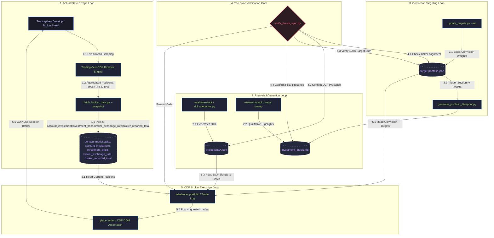

# Circular Portfolio Synchronization Engine

The **InvestmentToolkit** operates a circular, multi-state portfolio synchronization engine designed to guarantee absolute mathematical and strategic alignment between the actual live brokerage holdings, quantitative valuation models (DCF scenarios), qualitative conviction pillars, and active trade execution.

This document describes the dual-state model, the five core operational synchronization loops, and how the toolkit ensures zero drift between strategic intent and active trading accounts.

> **Wave 3 update (2026-07-22):** the "Actual Broker State" is now `domain_model.sqlite`
> (`account`/`account_investment`/`investment_price`/`broker_exchange_rate`/`broker_reported_total`
> tables), not `portfolio.json`. `portfolio.json` (gitignored) is no longer the write target for the
> real sync path — see "Loop 1" below for the current, verified data flow. It remains readable as a
> legacy/fallback artifact for a small number of not-yet-migrated read paths (see
> `docs/superpowers/status/wave3-*-report.md` for the exact list); it is not archived yet pending
> those final reads. Do not assume this document's pre-Wave-3 description of `portfolio.json` as
> the live write target still holds — it does not, as of this wave's completion.

---

## The Dual-State Architecture

To maintain rigorous trade discipline, the system separates the portfolio into two distinct state singletons:

```
                  ┌─────────────────────────────────────┐
                  │          LIVE BROKER STATE          │
                  │   domain_model.sqlite (account,     │
                  │   account_investment, investment_    │
                  │   price, broker_exchange_rate,       │
                  │   broker_reported_total)             │
                  │   Actual shares owned & cash values │
                  └──────────────────┬──────────────────┘
                                     │
                     drift detection │ valuation-gated trades
                                     ▼
                  ┌─────────────────────────────────────┐
                  │          CONVICTION TARGET STATE    │
                  │        (target-portfolio.json)      │
                  │ Conviction weights (sums to 100.0%) │
                  └─────────────────────────────────────┘
```

1. **The Actual Broker State (`domain_model.sqlite`)**
   - **Purpose**: Represents the objective reality of the investor's brokerage accounts (TFSA, RRSP, and Cash).
   - **Attributes**: Updated via TradingView CDP scrape commands
     (`fetch_broker_data.py --snapshot` / `BrokerSyncService.ts::syncAuto()`), which persist directly
     into `account_investment` (quantity, average cost, per real account), `investment_price`
     (current market price per symbol, refreshed by `/refresh-prices`), `broker_exchange_rate` (a
     single live USD→CAD scalar, inferred from TradingView's own native CAD/USD totals — never an
     external FX API, per pitfall #27), and `broker_reported_total` (the broker's own last-reported
     grand total, captured verbatim for `verify_portfolio_total.py`'s reconciliation audit — see
     ADR-030 for why this one figure is stored rather than only computed). Portfolio/account totals
     for everything else are always computed live (`SUM(quantity × price)`, GROUP BY account before
     rolling up to a portfolio total — never a flat cross-account query), never stored as their own
     aggregate. It is completely independent of conviction targets.
   - **Git Status**: `domain_model.sqlite` is gitignored (user private data), same privacy
     classification `portfolio.json` had before this wave.

2. **The Conviction Target State (`target-portfolio.json`)**
   - **Purpose**: Represents the quantitative blueprint of the qualitative investment thesis.
   - **Attributes**: Tracks target weight allocations (which must sum to exactly `100.00%`), strategy pillars, stock categorization roles, and `agentRationale` auditing.
   - **Git Status**: Tracked in repository (enforces thesis version history). Most narrow read paths
     (pillars, holdings summary, watchlist flag, `standingDecision` scalars) are SQLite-sourced since
     Wave 2 — this file remains authoritative only for `ThesisService.ts`'s full-document CRUD
     (`globalSettings`, `changeLog`, `bandConfig`, `shares`, full `thesisBreakers`/`standingDecision`
     sub-objects — no SQLite column exists for these), a documented, user-approved Retained-JSON
     exception (see Wave 2's exit report).

---

## The 5 Operational Synchronization Loops

The toolkit orchestrates data flow via five interconnected circular loops:



---

### Loop 1: The Scrape Loop (Actual State Sync)
- **Path**: `TradingView Desktop` → `TradingView CDP Engine` → `fetch_broker_data.py --snapshot` → `domain_model.sqlite`.
- **Flow**:
  1. The user launches `tv-portfolio-sync` (or `BrokerSyncService.ts::syncAuto()` runs on its own schedule).
  2. The Node.js CDP client hooks into the active Chrome debugging port of TradingView Desktop.
  3. The CDP agent traverses the React fiber tree of the broker panel to parse account numbers and positions.
  4. `fetch_broker_data.py --snapshot` persists the real per-account holdings/cash directly into
     `account_investment` (one row per `(account, investment)`, `TFSA`/`RRSP`/`CASH` only), computes
     the live USD→CAD rate from TradingView's own native CAD/USD combined totals and persists it as
     the single `broker_exchange_rate` scalar, and captures the broker's own last-reported grand
     total into `broker_reported_total` for reconciliation. It returns its result to the Node.js
     caller as a single JSON line on stdout (not by writing a file the caller reads back) — the
     Python subprocess's other output (progress, warnings, child-process output) is routed to stderr
     so it never corrupts this stdout-JSON contract.
  5. `/refresh-prices` (a separate, more frequent call than a full broker sync) keeps
     `investment_price` current between full syncs, fetching live prices (TradingView-first,
     yfinance fallback — including the BOATS extended-hours/overnight feed, never only regular
     session hours) for every held symbol.
- **Integrity Checks**: Does not touch qualitative values. Cash positions are filtered separately to keep active cash segregated from strategic allocations. Portfolio/account totals are always computed live from these tables (never a stored aggregate) — see ADR-030.

### Loop 2: The Analysis Loop (Model & Valuation)
- **Path**: `evaluate-stock {TICKER}` → `yfinance / fetch_financials.py` → `dcf_scenarios.py` → `projections/{TICKER}.json` & `research/{TICKER}.md`.
- **Flow**:
  1. Deep-dive analytical tools read the latest filings, cash flow statements, and capital structure via `yfinance`.
  2. The Python DCF calculator models Bear, Base, and Bull trajectories to output a weighted fair value.
  3. The quantitative fair value and BUY/HOLD/SELL signal are recorded in `projections/{TICKER}.json`.
  4. The qualitative rationale is documented in a markdown research report, which links directly to the investment thesis.
- **Integrity Checks**: The **Adversarial Objectivity Constraint** forces a red-team challenge of growth margins, ensuring thesis pillars are structurally sound.

### Loop 3: The Targeting Loop (Target Calibration)
- **Path**: `/calibrate-targets` or `/strategic-review` → `update_targets.py` → `target-portfolio.json` & `investment_thesis.md`.
- **Flow**:
  1. During strategic reviews, the user or advisor shifts weights based on thesis evolution or fresh valuation signals.
  2. Target weights are passed to the canonical `update_targets.py` utility.
  3. The script verifies that the new weight configuration adds up to exactly **100.00%**.
  4. `generate_portfolio_blueprint.py` automatically rebuilds Section IV (Portfolio Blueprint) of `investment_thesis.md` to reflect the updated conviction list.
- **Integrity Checks**: An automated normalization step distributes tiny floating-point drift proportionally across MAINTAIN-rated holdings, ensuring perfect mathematical summation.

### Loop 4: The Verification Loop (Consistency Guard)
- **Path**: `verify_thesis_sync.py` → `target-portfolio.json`, `investment_thesis.md`, `projections/`.
- **Flow**:
  1. Runs as a strict preflight gate before any portfolio rebalancing or branch commit.
  2. **Holding Alignment**: Assures that every ticker listed in the conviction `target-portfolio.json` with a weight $\ge 0$ is formally represented as an active thesis row in the qualitative `investment_thesis.md`.
  3. **DCF Valuation Gate**: Guarantees that every target holding has a valid, non-stale `projections/{TICKER}.json` DCF file generated by the AI agent.
  4. **Sum Check**: Re-asserts the strict 100.00% sum check on the JSON data.
- **Integrity Checks**: Fails with exit code `1` if any mismatch exists, pausing further execution until corrected.

### Loop 5: The Execution Loop (Broker Execution)
- **Path**: `rebalance_portfolio` → `/place-order` → `TradingView CDP Automation` → `TradingView Desktop`.
- **Flow**:
  1. The Portfolio Advisor evaluates actual weight (`domain_model.sqlite`'s `account_investment`/`investment_price`, computed live) vs. conviction targets (`target-portfolio.json`) to isolate drift.
  2. It processes the list through the **Valuation Gate Constraint** (never buying SELL-rated holdings).
  3. Confirmed orders are posted to the dashboard Trade Log (`suggested` tab).
  4. Executing an order invokes the TradingView CDP place-order skill.
  5. The Node.js CDP automation script simulates human DOM interactions (typing shares, pricing limit/market, clicking buy/sell buttons, accepting confirmation dialogs) inside TradingView Desktop.
  6. The broker fills the order, modifying active positions on the exchange.
  7. **Loop closure**: The scrape loop runs automatically post-fill, updating `domain_model.sqlite` and resetting the cycle.

---

## Key Maintenance Commands

To maintain perfect synchronization in your workspace, utilize these canonical commands:

```bash
# 1. Manually check synchronization consistency
python3 investment_screener/backend/py_services/verify_thesis_sync.py

# 2. Add or update a holding's target weight and regenerate the thesis blueprint
python3 plugins/portfolio-advisor/scripts/update_targets.py --set TICKER=5.50 --write --blueprint

# 3. Synchronize actual live broker holdings from TradingView Desktop into domain_model.sqlite
# (Node.js engine must be initialized in tradingview-cdp/)
python3 plugins/tradingview/scripts/fetch_broker_data.py --snapshot

# 4. Reconcile the computed portfolio total against the broker's own last-reported total
# (uses domain_model.sqlite's broker_reported_total scalar, per ADR-030)
python3 investment_screener/backend/py_services/verify_portfolio_total.py
```

These loops work in perfect unison, ensuring the InvestmentToolkit remains a safe, highly objective, and completely aligned workstation for retail portfolio management.

---

## Wave 3 Migration Note (Domain Data Model v3.2)

This document was updated 2026-07-22 to reflect Wave 3 of the ongoing JSON→SQLite domain-model
migration (`docs/superpowers/plans/2026-07-20-domain-data-model-v3-wave3-implementation-plan.md`).
Real, verified state as of this wave's completion:

- **Fully migrated to `domain_model.sqlite`**: holdings/positions per real account (`account_investment`),
  current market prices (`investment_price`), the live USD→CAD exchange rate (`broker_exchange_rate`,
  a single scalar, never a stored CAD total — see ADR-030), and the broker's own last-reported total
  for reconciliation (`broker_reported_total`).
- **Real bugs found and fixed during this wave's own real-data validation** (not merely fixture
  tests): a missing `CASH_USD` price row, a `PSU.U.TO`/`PSU-U.TO` ticker-alias mismatch causing a
  duplicate investment identity, and Python/TypeScript exchange-rate coalescing logic that diverged
  on a legitimate zero value (`or` vs. `??` semantics).
- **`portfolio.json` is no longer the live write target** for the main sync path
  (`BrokerSyncService.ts::syncAuto()`, `fetch_broker_data.py --snapshot`, `/refresh-prices`) — see
  ADR-030 and the Wave 3 exit report for the full producer/consumer cutover table.
- **Prior waves** (0-2) migrated projections (`projections/*.json` → `projection_version`/
  `projection_scenario`) and most of `target-portfolio.json`/`watchlist.json`/
  `tradingview_alerts_actual.json`/`thesis_breaker_state.json` — see
  `docs/superpowers/status/wave1-*`/`wave2-*` reports for those domains' own cutover details.
- **Remaining waves** (4, 5A-5E) cover trade log/order executions/cash flows, and generated research
  views/TA sweep/daily briefs/predictions/account policy respectively — not yet started as of this
  note.
