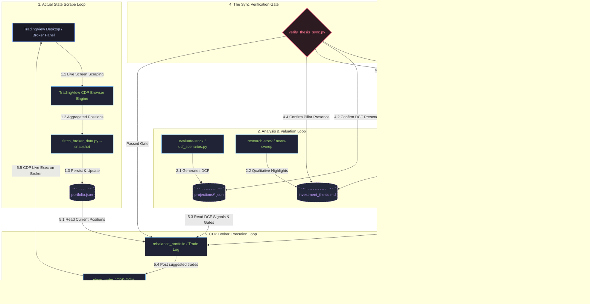

# Circular Portfolio Synchronization Engine

The **InvestmentToolkit** operates a circular, multi-state portfolio synchronization engine designed to guarantee absolute mathematical and strategic alignment between the actual live brokerage holdings, quantitative valuation models (DCF scenarios), qualitative conviction pillars, and active trade execution.

This document describes the dual-state model, the five core operational synchronization loops, and how the toolkit ensures zero drift between strategic intent and active trading accounts.

---

## The Dual-State Architecture

To maintain rigorous trade discipline, the system separates the portfolio into two distinct state singletons:

```
                  ┌─────────────────────────────────────┐
                  │          LIVE BROKER STATE          │
                  │           (portfolio.json)          │
                  │   Actual shares owned & cash values │
                  └──────────────────┬──────────────────┘
                                     │
                     drift detection │ valuation-gated trades
                                     ▼
                  ┌─────────────────────────────────────┐
                  │          CONVICTION TARGET STATE    │
                  │        (target-portfolio.json)      │
                  │ Conviction weights (sums to 100.0%) │
                  └─────────────────────────────────────┘
```

1. **The Actual Broker State (`portfolio.json`)**
   - **Purpose**: Represents the objective reality of the investor's brokerage accounts (TFSA, RRSP, and Cash).
   - **Attributes**: Updated via TradingView CDP scrape commands. Tracks actual share counts, book costs, and current market values. It is completely independent of conviction targets.
   - **Git Status**: Gitignored (user private data).

2. **The Conviction Target State (`target-portfolio.json`)**
   - **Purpose**: Represents the quantitative blueprint of the qualitative investment thesis.
   - **Attributes**: Tracks target weight allocations (which must sum to exactly `100.00%`), strategy pillars, stock categorization roles, and `agentRationale` auditing.
   - **Git Status**: Tracked in repository (enforces thesis version history).

---

## The 5 Operational Synchronization Loops

The toolkit orchestrates data flow via five interconnected circular loops:



---

### Loop 1: The Scrape Loop (Actual State Sync)
- **Path**: `TradingView Desktop` → `TradingView CDP Engine` → `fetch_broker_data.py --snapshot` → `portfolio.json`.
- **Flow**:
  1. The user launches `tv-portfolio-sync`.
  2. The Node.js CDP client hooks into the active Chrome debugging port of TradingView Desktop.
  3. The CDP agent traverses the React fiber tree of the broker panel to parse account numbers and positions.
  4. Aggregated share counts and book values are piped to `portfolio.json`.
- **Integrity Checks**: Does not touch qualitative values. Cash positions are filtered separately to keep active cash segregated from strategic allocations.

### Loop 2: The Analysis Loop (Model & Valuation)
- **Path**: `evaluate-stock {TICKER}` → `yfinance / fetch_financials.py` → `dcf_scenarios.py` → `projections/{TICKER}.json` & `research/{TICKER}.md`.
- **Flow**:
  1. Deep-dive analytical tools read the latest filings, cash flow statements, and capital structure via `yfinance`.
  2. The Python DCF calculator models Bear, Base, and Bull trajectories to output a weighted fair value.
  3. The quantitative fair value and BUY/HOLD/SELL signal are recorded in `projections/{TICKER}.json`.
  4. The qualitative rationale is documented in a markdown research report, which links directly to the investment thesis.
- **Integrity Checks**: The **Adversarial Objectivity Constraint** forces a red-team challenge of growth margins, ensuring thesis pillars are structurally sound.

### Loop 3: The Targeting Loop (Target Calibration)
- **Path**: `/calibrate-targets` or `/strategic-review` → `update_targets.py` → `target-portfolio.json` & `investment_thesis.md`.
- **Flow**:
  1. During strategic reviews, the user or advisor shifts weights based on thesis evolution or fresh valuation signals.
  2. Target weights are passed to the canonical `update_targets.py` utility.
  3. The script verifies that the new weight configuration adds up to exactly **100.00%**.
  4. `generate_portfolio_blueprint.py` automatically rebuilds Section IV (Portfolio Blueprint) of `investment_thesis.md` to reflect the updated conviction list.
- **Integrity Checks**: An automated normalization step distributes tiny floating-point drift proportionally across MAINTAIN-rated holdings, ensuring perfect mathematical summation.

### Loop 4: The Verification Loop (Consistency Guard)
- **Path**: `verify_thesis_sync.py` → `target-portfolio.json`, `investment_thesis.md`, `projections/`.
- **Flow**:
  1. Runs as a strict preflight gate before any portfolio rebalancing or branch commit.
  2. **Holding Alignment**: Assures that every ticker listed in the conviction `target-portfolio.json` with a weight $\ge 0$ is formally represented as an active thesis row in the qualitative `investment_thesis.md`.
  3. **DCF Valuation Gate**: Guarantees that every target holding has a valid, non-stale `projections/{TICKER}.json` DCF file generated by the AI agent.
  4. **Sum Check**: Re-asserts the strict 100.00% sum check on the JSON data.
- **Integrity Checks**: Fails with exit code `1` if any mismatch exists, pausing further execution until corrected.

### Loop 5: The Execution Loop (Broker Execution)
- **Path**: `rebalance_portfolio` → `/place-order` → `TradingView CDP Automation` → `TradingView Desktop`.
- **Flow**:
  1. The Portfolio Advisor evaluates actual weight (`portfolio.json`) vs. conviction targets (`target-portfolio.json`) to isolate drift.
  2. It processes the list through the **Valuation Gate Constraint** (never buying SELL-rated holdings).
  3. Confirmed orders are posted to the dashboard Trade Log (`suggested` tab).
  4. Executing an order invokes the TradingView CDP place-order skill.
  5. The Node.js CDP automation script simulates human DOM interactions (typing shares, pricing limit/market, clicking buy/sell buttons, accepting confirmation dialogs) inside TradingView Desktop.
  6. The broker fills the order, modifying active positions on the exchange.
  7. **Loop closure**: The scrape loop runs automatically post-fill, updating `portfolio.json` and resetting the cycle.

---

## Key Maintenance Commands

To maintain perfect synchronization in your workspace, utilize these canonical commands:

```bash
# 1. Manually check synchronization consistency
python3 investment_screener/backend/py_services/verify_thesis_sync.py

# 2. Add or update a holding's target weight and regenerate the thesis blueprint
python3 plugins/portfolio-advisor/scripts/update_targets.py --set TICKER=5.50 --write --blueprint

# 3. Synchronize actual live broker holdings from TradingView Desktop
# (Node.js engine must be initialized in tradingview-cdp/)
python3 investment_screener/backend/py_services/fetch_broker_data.py --snapshot
```

These loops work in perfect unison, ensuring the InvestmentToolkit remains a safe, highly objective, and completely aligned workstation for retail portfolio management.
