# Domain Data Model v3.2 — Implementation Design

Design document, produced before any migration code is written. Covers migrating
InvestmentToolkit's fragmented JSON/JSONL persistence into the corrected v3.2 domain model
(`ACCOUNT`/`INVESTMENT`/`ACCOUNT_INVESTMENT` + supporting tables). Nothing in this document has
been built yet. This corrects the prior SQLite effort, which built real infrastructure but never
reduced JSON dependency — see "Anti-Regression Lessons" below.

---

## Non-Negotiable Goal Statement

The primary goal of this migration is not to add SQLite.

The primary goal is to simplify the InvestmentToolkit persistence architecture by reducing
fragmented JSON/JSONL file-based data storage and moving applicable operational data into a
SQLite-backed domain model.

Success means:

- fewer active JSON/JSONL data files
- fewer per-ticker data files
- fewer authoritative file-based stores
- app/backend/plugin/skill/agent code reads from SQLite/domain repositories where migration is
  claimed
- superseded JSON/JSONL files are archived with `git mv`
- retained JSON/JSONL files have explicit approved rationale
- no accidental hybrid architecture remains

The migration is a failure if it merely creates:

```
JSON + JSONL + SQLite
```

without reducing JSON dependency.

The previous failed attempt created a research-ledger sidecar and did not materially reduce JSON
usage. Do not repeat that.

## Target Architecture Direction

The intended final direction is:

SQLite/domain model as the primary persistence layer for applicable operational investment data.

JSON/JSONL should remain only for explicitly approved cases, such as:

- private local-only broker archives
- external API raw cache where justified
- config files where JSON is the right format
- separate approved ledgers
- temporary compatibility outputs during migration

Anything else should be migrated, generated from SQLite, or archived.

## Required Success Metric

For every implementation wave, report:

- number of JSON/JSONL files active before
- number of JSON/JSONL files active after
- files archived
- producers migrated
- consumers migrated
- remaining JSON dependencies
- reason each remaining JSON dependency still exists

Do not call a wave complete unless JSON dependency is actually reduced or explicitly justified.

## Live Code Requirement

Do not claim app/plugin adoption unless normal runtime code uses SQLite/domain repositories.

The following are **not** sufficient:

- table exists
- repository exists
- data copied
- migration script ran
- generated static files exist
- unit tests passed with temporary fixtures

Adoption requires:

- real producer writes new model
- real consumer reads new model
- app/plugin/skill/agent references updated
- old JSON path no longer used as source of truth

**Do not optimize for "keeping compatibility forever."** Compatibility and dual-write are
temporary migration aids. The end state must be simpler than the start state.

## Context-Bundler / Agent Context Size Benefit

A major expected benefit of this migration is reducing the size and complexity of context
bundles used by agents and plugins.

Today, many workflows require bundling scattered JSON, JSONL, Markdown, and per-ticker files so
agents can reason about the portfolio, projections, targets, holdings, TA outputs, research, and
reports. `investment_screener/backend/data/projections/` alone is 144 files; the plugin/skill
reference table in §4 shows most portfolio-advisor and tradingview skills bundling several of
these files together per invocation.

The migration should reduce that burden by moving applicable operational data into SQLite/domain
tables and exposing compact query/repository outputs. Success should be measured not only by
application functionality, but also by reduced context-bundler payload size — this is a primary
success criterion, alongside fewer JSON files, fewer authoritative stores, app/plugin cutover,
and archive of superseded files, **not a secondary nice-to-have.**

For each migration wave, the implementation plan must report:

- files that no longer need to be bundled
- JSON/JSONL files removed from typical agent/plugin context bundles
- Markdown/generated files removed from typical context bundles
- the replacement query or repository method
- estimated reduction in bundle file count
- estimated reduction in bundle size where measurable
- remaining files that still must be bundled, and why

The target outcome:

- agents retrieve structured data through SQLite/domain repositories
- plugins query focused slices of data instead of bundling entire folders
- generated reports are view/output artifacts, not primary context sources
- context bundles become smaller, more targeted, and less fragile

The reason this matters: the current fragmented file model forces agents to carry too much
irrelevant context. SQLite/domain repositories should let agents ask for exactly the data they
need instead of bundling entire JSON folders or per-ticker artifacts.

**Curation opportunity, tied to the same archive step:** when a domain's superseded JSON is moved
to `ARCHIVE/` (§6 of ADR-029's rule), that is also the natural point to curate the plugins and
`investment_screener` web app that referenced it — removing dead code paths, stale SKILL.md
instructions pointing at archived files, and now-unnecessary bundling logic in the same commit
that does the archive. This directly shrinks what the `context_bundler`/`dev-utils:context-bundler`
skill packages when bundling code for review — fewer stale files bundled, smaller review payloads.
This curation is scoped to what each wave actually touches (no unrelated refactoring), tracked as
part of that wave's completion, not a separate deferred cleanup pass.

---

## 1. Purpose and Problem Statement

The prior SQLite effort (ADRs 026/027/028, PRs #77–#82) built real infrastructure — an
event-sourced JSONL ledger, a SQLite read model with FTS5, a shared repository layer
(`py_services/intelligence/`), audit tooling, and a migrated 80-file research corpus — and was
twice reported "complete" and "certified." It was not. ADR-029 documents the actual failure mode
directly:

> A parallel SQLite database existed, populated, verified byte-for-byte — and nothing in the
> running app depended on it. `docs.ts` read statically-generated Markdown files produced by a
> one-time manual export... Meanwhile the domains carrying the actual majority of this codebase's
> JSON coupling — `portfolio.json`, `target-portfolio.json`, `projections/*.json` (146 of 212
> total JSON/JSONL files repo-wide) — were never addressed at all.

The `sqlite-ledger-phase4-adoption-migration-plan.md` document (untracked, found this session)
confirms the effort got as far as building an "adoption matrix" and audit tooling but never
executed real migration, real consumer rewiring, or any cleanup — Phase 4D ("Execute Real
Migration") through 4H ("Legacy Retirement") were never run. The cleanup phase that did run
(`cleanup-execution-report.md`) found **zero assets safe to retire**, because the dual-write/
fallback architecture was still load-bearing at every layer.

**This spec corrects that pattern.** It targets the domains that actually carry the codebase's
JSON coupling (146 of 212 files, 82 of 151 JSON-referencing code files, per
`migration-inventory-and-strategy.md`), uses the corrected v3.2 domain model (not the v2
`INSTRUMENT`/`POSITION` split, not root-entity mirrors of JSON file boundaries), and defines
"migrated" the way ADR-029 does: producer writes SQLite + every real consumer reads SQLite + old
file archived via `git mv`. Nothing less counts, and this document requires evidence of all three
per domain, not a status label.

### Anti-Regression Lessons From the Prior Attempt (binding on this effort)

- SQLite table creation is not migration.
- Data copied to SQLite is not adoption.
- Generated files (e.g. `research/{ticker}.summary.md`) are not live SQLite reads — a route that
  reads a static file generated once from the DB is functionally identical to reading the old
  JSON, just with an extra unused DB sitting alongside it.
- Code wired (dual-write present) is not real workflow execution — the phase-4 plan's own Wave 1
  targets (`daily_brief.py`, `ta_sweep_batch.py`, `compute_conviction_scores.py`) had dual-write
  code that had never fired against production data at the time it was reported "done."
  `ADR-029` explicitly un-certifies this: those domains carry over into this spec's Wave 5 with
  the caveat "already wired, never actually exercised — re-verify against the 3-part test, don't
  re-certify."
- Test fixtures are not real data verification — the prior effort's unit tests ran against
  `tmp_path` fixtures, not the real 212-file corpus, until a dedicated real-repo test
  (`test_real_ta_sweep_results_json_has_known_producers_and_consumers`) was added after a bug was
  found in production data.
- Cleanup analysis is not cleanup execution — `cleanup-execution-plan.md` produced a full
  retirement inventory; `cleanup-execution-report.md` retired nothing, correctly, because nothing
  had actually been superseded.
- Hybrid architecture requires approval — none was sought or given for the prior effort's
  "dual-write forever, generated views as the read path" outcome; it happened by drift, not
  decision.
- A JSON file retained without rationale is unresolved architecture debt — every retained file in
  this spec's inventory below carries an explicit classification and reason, never a bare
  `REMAINS_JSON_BY_DESIGN` label with no evidence behind it.

---

## 2. Current-State Persistence Inventory

Every domain below is tagged with a **status classification** in addition to current/target
state, per the reinforcement below:

- **AUTHORITATIVE** — the live, source-of-truth file/table today.
- **DERIVED_OUTPUT** — generated from an authoritative source, never itself a write target.
- **COMPATIBILITY_OUTPUT** — a temporary dual-write artifact kept only during migration; must
  have a named removal trigger, not be permanent.
- **ARCHIVED** — superseded, moved via `git mv`, no longer read by any live path.
- **LOCAL_PRIVATE_ARCHIVE** — archived but never committed, because the source data is private
  (gitignored broker/account data).

Producer/consumer lists below are real file paths, gathered from `migration-inventory-and-
strategy.md` (big three), direct grep against gitignored files not covered by the repo-wide
audits, and `task18-consumer-inventory.md`/`json-discovery-audit.md` for git-tracked files. Counts
are not estimated.

### 2.1 Investment / target-portfolio / watchlist

- **Current:** `target-portfolio.json` (holdings array + pillars + globalSettings),
  `watchlist.json`.
- **Status:** AUTHORITATIVE.
- **Producers (11):** `BrokerSyncService.ts`, `market_regime.py`, `risk_engine.py`,
  `rebalancer.py`, `backtest_harness.py`, `thesis_breakers.py`, `ta_sweep_batch.py`,
  `daily_brief.py`, `update_thesis.py`, `validate_weights.py`, `update_price_levels.py`, plus
  `WatchlistService.ts` for watchlist.json.
- **Consumers (18 + 6 watchlist-specific):** `docs.ts`, `stock.ts`, `screener.ts`, `theses.ts`,
  `compute_conviction_scores.py`, `order_risk_gates.py`, `lock_and_normalize_targets.py`,
  `earnings_expectations.py`, `verify_thesis_sync.py`, `harvest_predictions.py`,
  `tv_create_alerts.py`, `generate_review.py`, `verify_refresh.py`,
  `generate_portfolio_blueprint.py`, `generate_reports.py`, `scan_opportunities.py`,
  `weekly_review.py`, `portfolio_action.py`; watchlist-specific: `overnight_gaps.py`,
  `WatchlistService.ts`, `paths.ts`, `weekly_review.py`, `watchlist_manager.py`,
  `tradingview-cdp/cli.js`.
- **Risk:** the `role`/`action`/`is_watchlisted` overlap problem is real (documented in
  `domain-data-model.md` §"Response to Review" — `DRAM` disagrees on role vs. action;
  `watchlist.json`'s 80 tickers and `role='watchlist'`'s 33 overlap only 20). Collapsing them
  would lose live information — the target schema keeps all three as distinct fields.
- **Target:** `investment` (lifecycle_status, target_weight, target_action, standing_decision_*,
  pillar_id, sub_strategy_id, thesis_for_inclusion, is_watchlisted, watchlist_added_at),
  `strategy_pillar`, `sub_strategy`.
- **Wave:** 2.

### 2.2 Price levels (embedded, no standalone file)

- **Current:** `target-portfolio.json: holdings[].priceLevels` (buy tiers) and
  `holdings[].targetEntryPrice` (scalar).
- **Status:** AUTHORITATIVE (embedded, not a separate file).
- **Producer:** `update_price_levels.py`.
- **Consumers:** same as §2.1 (embedded in the same file, read together).
- **Target:** `price_level_set` + `price_level_tier` (`tier_kind='BUY_TIER'` and
  `'TARGET_ENTRY'`) — confirmed by real data (`domain-data-model.md`) that `targetEntryPrice` is
  a genuine price level, not a scalar duplicate of the buy tiers (e.g. SNDK: target 1350 vs. buy
  tiers 1048/1070).
- **Wave:** 2 (rides with investment domain — same source file, same cutover point).

### 2.3 Investment notes / thesis history (embedded, no standalone file)

- **Current:** `target-portfolio.json: holdings[].agentRationale` — a single TEXT field
  manually appended to over time as an undated-except-inline-prose string. Confirmed:
  `IREN` has 5 embedded date-stamps, `VST` reads as a literal chronological log.
- **Status:** AUTHORITATIVE, and a real un-queryable-history problem.
- **Producer:** `update_thesis.py` + thesis-review/daily-loop agents that append to this field.
- **Target:** `investment_note` (one row per dated entry, `note_type`, `source`);
  `investment.agent_rationale` becomes a denormalized "latest note body" convenience field, not
  the sole record.
- **Wave:** 2.

### 2.4 Account holdings (broker mirror)

- **Current:** `portfolio.json` (gitignored — private broker/account data).
- **Status:** AUTHORITATIVE, LOCAL_PRIVATE_ARCHIVE on retirement (never committed, per your
  decision).
- **Producers (20):** `BrokerSyncService.ts`, `routes/portfolio.ts`, `ThesisService.ts`,
  `market_regime.py`, `risk_engine.py`, `backtest_harness.py`, `apply_portfolio_updates.py`,
  `rebalancer.py`, `extract_portfolio_symbols.py`, `thesis_breakers.py`, `ta_sweep_batch.py`,
  `fetch_broker_data.py`, `place_order.py`, `fetch_financials.py`, `ytd_return.py`,
  `relabel_actions.py`, `validate_weights.py`, `update_price_levels.py`, `update_thesis.py`,
  `daily_brief.py`.
- **Consumers (~32):** `helpers.ts`, `docs.ts`, `stock.ts`, `screener.ts`, `theses.ts`,
  `compute_conviction_scores.py`, `overnight_gaps.py`, `order_risk_gates.py`,
  `earnings_calendar.py`, `lock_and_normalize_targets.py`, `earnings_expectations.py`,
  `verify_portfolio_total.py`, `verify_thesis_sync.py`, `portfolio_performance.py`,
  `harvest_predictions.py`, `Sidebar.tsx`, `PortfolioModal.tsx`, `Settings.tsx`,
  `PortfolioTable.tsx`, `tv_create_alerts.py`, `dcf_sensitivity.py`, `standardize_metrics.py`,
  `comps_valuation.py`, `generate_reports.py`, `watchlist_manager.py`, `generate_review.py`,
  `scan_opportunities.py`, `weekly_review.py`, `portfolio_action.py`, `verify_refresh.py`,
  `generate_portfolio_blueprint.py`, `dcf_scenarios.py`.
- **Target:** `account_investment` (quantity, average_cost, book_value, currency,
  last_synced_at), `investment_price` (price cache — per CLAUDE.md pitfall #27, never an
  external FX API, always inferred from TV native values).
- **Wave:** 3. **Largest domain (20 producers, ~32 consumers) — deliberately not Wave 1.**

### 2.5 Projections

- **Current:** `investment_screener/backend/data/projections/*.json` (144 files, one per
  ticker version-array).
- **Status:** AUTHORITATIVE.
- **Producers (2 — corrected count, `migration-inventory-and-strategy.md` §3):**
  `ProjectionService.ts` (via `routes/projections.ts`), `apply_catalyst.py` (direct
  `json.loads`/`locked_write_json`, bypasses the service entirely — a second real write path).
- **Consumers (18):** `routes/projections.ts`/`ProjectionService.ts`, `ThesisService.ts`,
  `compute_conviction_scores.py`, `rebalancer.py`, `framework_score.py`, `ta_sweep_batch.py`,
  `persist_etf_analysis.py`, `watchlist_manager.py`, `comps_valuation.py`, `generate_review.py`,
  `portfolio_action.py`, `consolidate_research.py`, `scan_opportunities.py`,
  `verify_refresh.py`, `update_price_levels.py`, `generate_portfolio_blueprint.py`,
  `apply_catalyst.py` (consumer half), `generate_grok_prompt.py`, `peer_bench.py`.
  (`TradePrepModal.tsx`/`api.ts` consume via the route's HTTP API, not the file directly —
  covered transitively. `local_api.py` confirmed NOT a real consumer — docstring mention only.)
- **The root-cause bug this whole correction traces to:** `aiThesis.researchReport` was a
  free-text filename string, pattern-matched by a regex in `docs.ts` to decide ledger-vs-disk —
  broke when a script rewrote the string to an unrecognized shape.
- **Target:** `projection_version` (`research_event_id` as a real FK into
  `intelligence_event.event_id`, replacing the filename string entirely — no filename shape left
  to get wrong because there's no filename in the model), `projection_scenario`.
- **Wave:** 1.

### 2.6 Generated research views (carried-over debt from the prior effort — NOT new scope, but must be closed here)

- **Current:** `research/{ticker}.summary.md`, `research/{ticker}.timeline.md` (144 files,
  generated), `research/archive/*.md` (80 dated source files), `research/{ticker}.md` (72
  pre-existing bare files, unrelated to the ledger migration).
- **Status:** DERIVED_OUTPUT (`.summary.md`/`.timeline.md`) generated from `intelligence_event`;
  `research/archive/*.md` is AUTHORITATIVE (the durable rollback anchor, now git-committed per
  the prior effort's durability fix).
- **Producer:** `view_generator.render_ticker_views()` / `render_all_ticker_views.py`.
- **Consumer (the actual unresolved bug):** `docs.ts`'s `GET /api/research/:filename` route
  reads the generated `.summary.md`/`.timeline.md` files from disk at request time — **not**
  `intelligence.sqlite` — even though the ledger-query path
  (`queryLatestResearchFromLedger()`) exists and is tested. Per ADR-029's own retroactive
  ruling: "`observations.jsonl`/`intelligence.sqlite` (the research domain) is **not yet
  migrated** under this rule — `docs.ts` still reads generated static files, not SQLite, at
  request time."
- **Rule for this spec (must hold, or this repeats the prior failure):** the live app must
  query `intelligence_event` at request time for research content. Generated Markdown, if kept
  at all, is a build artifact for humans browsing the repo (e.g. `git log`-friendly diffs), never
  a runtime read path for `docs.ts`. If keeping generated files for any other reason, that reason
  must be named explicitly, not inherited by default.
- **Target:** `docs.ts`'s research route reads `intelligence_event` directly, unconditionally
  (no filename-shape fallback branch at all, removing the exact bug class that started this).
  `research/archive/*.md` and the 72 bare `{TICKER}.md` files are a separate, smaller decision —
  see open items below.
- **Wave:** 5 (grouped with other `intelligence_event` cutover work, since it reuses the same
  table and repository layer already built).

### 2.7 TradingView alerts

- **Current:** `tradingview_alerts_actual.json` (203 entries, 4874 lines).
- **Status:** AUTHORITATIVE at the TradingView side; this file is a synced local mirror.
- **Producer/consumer:** `tv_list_alerts.py` (writes the sync, reads it back for the
  `alert-list` skill).
- **Target:** `alert` table — explicitly **not** `RETAIN_AS_EXTERNAL_CACHE`; per
  `domain-data-model.md`, this is `MIGRATE_TO_SQLITE_DOMAIN_TABLE`, same category as
  `account_investment` (TradingView is the upstream authority, the table is the local synced
  mirror, same "sync mirror" reasoning as broker holdings).
- **Wave:** 2 (rides with investment domain — `ALERT` is a 1:many off `investment`).

### 2.8 Trade log

- **Current:** `trade-log.json` (52 rows).
- **Status:** AUTHORITATIVE.
- **Producer/consumer:** `investment_screener/backend/src/routes/trading.ts` (both read and
  write — a TS route, not a Python script). Also read by `generate_track_record_report.py`
  (realized-gains calc).
- **Target:** `trade_log_entry` (insert-only — a trade, once logged, is a historical fact).
- **Wave:** 4.

### 2.9 Order executions

- **Current:** `orders_executed.jsonl` (gitignored).
- **Status:** AUTHORITATIVE.
- **Producer:** `order_risk_gates.py::log_order_execution()` (append-only).
- **Consumer:** `execution_quality_scorecard.py::load_orders_executed()`.
- **Target:** `order_execution` (insert-only, `gate_result_json` kept as JSON deliberately —
  variable-shape audit detail, not column-queried).
- **Wave:** 4.

### 2.10 Cash flows

- **Current:** `cash_flows.json` (gitignored, 3 rows).
- **Status:** AUTHORITATIVE, but **manually maintained — zero code producers found.** This is a
  real constraint on the migration design, not an oversight: there is no script to "switch" to
  writing SQLite, because nothing writes it today. The user hand-edits this file directly.
- **Consumer:** `ytd_return.py::CASH_FLOWS_PATH`, invoked via `portfolio.ts`.
- **Target:** `cash_flow` + `cash_flow_baseline`. **Migration must add a real write path** (a
  small CLI or a UI action) since none exists to redirect — this is new producer surface, not a
  swap.
- **Wave:** 4.

### 2.11 Predictions

- **Current:** `predictions.jsonl` (2 lines today), `predictions_graded.jsonl` (referenced by a
  `GRADED_PATH` constant in `prediction_ledger.py`, not yet present on disk).
- **Status:** AUTHORITATIVE.
- **Producers:** `harvest_predictions.py`, `prediction_ledger.py`, `grade_predictions.py`.
- **Consumers:** `earnings_expectations.py`, `grade_predictions.py`,
  `generate_track_record_report.py`, `prediction_ledger.py`, `backtest_harness.py`,
  `harvest_predictions.py`.
- **Known false positive:** `audit_json_usage.py`/`test_audit_json_usage.py` show as
  `MIGRATION_REQUIRED` in the prior audit — confirmed a pattern-string self-reference, not real
  I/O; excluded from the real consumer count.
- **Target:** `intelligence_event`, new `event_type` values `PREDICTION_CLAIM`/
  `PREDICTION_GRADED` (widening the existing CHECK constraint on the live table, with the
  existing 80 rows intact), `supersedes_event_id` linking a graded claim to its raw claim.
- **Escalation trigger (per your decision):** if prediction analytics ever become a primary
  reporting surface (bulk grading metrics, prediction-accuracy screening, large-scale
  backtesting), extract into dedicated `prediction_fact`/`prediction_grade` tables. Not before.
- **Wave:** 5.

### 2.12 TA sweep results

- **Current:** `ta-sweep-results.json` (686 lines).
- **Status:** AUTHORITATIVE. Prior audit classification: `MIGRATE_TO_INTELLIGENCE_LEDGER`,
  `migration_status: NOT_MIGRATED — still the only copy, do not remove`.
- **Producer:** `plugins/tradingview/scripts/ta_sweep_batch.py`.
- **Consumers:** `compute_conviction_scores.py`, `daily_brief.py`, `evolution_events.py`.
- **Carried-over caveat (do not re-certify):** the prior effort's own status docs list this as
  "code wired, never exercised" for a `TECHNICAL_SWEEP` event type. This spec must re-verify
  against the 3-part test (producer writes / consumer reads / file archived) from scratch, not
  trust the prior "wired" claim.
- **Target:** `intelligence_event` (`event_type='TECHNICAL_SWEEP'`).
- **Wave:** 5.

### 2.13 Daily briefs

- **Current:** `data/daily-briefs/*.json` (gitignored, 10 snapshots).
- **Status:** AUTHORITATIVE.
- **Producer/consumer:** `daily_brief.py` (writes today's snapshot, reads prior snapshots for
  delta-vs-yesterday calc). **Consumer:** `generate_reports.py` (globs `*.json`).
- **Carried-over caveat:** same as TA sweep — prior effort's status docs say "code wired but no
  real test exists for this path." Re-verify, don't re-certify.
- **Target:** `intelligence_event` (`event_type='REVIEW_DAILY'`). The delta-vs-yesterday query
  becomes a real SQL query (`ORDER BY effective_at DESC LIMIT 2`) instead of a file glob + sort.
- **Wave:** 5.

### 2.14 Account/portfolio policy

- **Current:** `account_policy.json` (21 lines), plus `target-portfolio.json`'s
  `globalSettings` (rebalanceFrequency, portfolioValueUSD).
- **Status:** AUTHORITATIVE. No real producer — manually maintained, mutated only historically
  by a one-time `remove_drift_threshold_fields.py` migration script (not a live producer).
- **Consumers:** `order_risk_gates.py`, `rebalancer.py`, `ThesisService.ts`,
  `zod-schemas.ts`.
- **Target:** `portfolio_policy` — a singleton table. The four numeric caps/bands
  (`max_marginal_risk_contribution_pct`, `max_cluster_variance_contribution_pct`,
  `rebalance_band_relative_pct`, `rebalance_band_absolute_pct`,
  `rebalance_band_critical_multiplier`) get real columns; `accountPreferenceRules` and
  `psuFundingRule` stay as JSON columns deliberately (variable-shape rule lists, not
  column-queried).
- **Wave:** 5.

### 2.15 Thesis breaker state

- **Current:** `thesis_breaker_state.json` (4 lines/68 bytes).
- **Status:** AUTHORITATIVE.
- **Producer:** `thesis_breakers.py`.
- **Consumers:** `order_risk_gates.py`, `rebalancer.py`, `harvest_predictions.py`,
  `risk_officer.py`.
- **Target:** folds directly into `investment.thesis_breaker_status` — already a column in the
  v3.2 model, so this is **not** its own separate table; it moves with the investment domain.
- **Wave:** 2.

### 2.16 Domains confirmed out of scope (checked directly, not assumed)

- **Weekly review JSON:** none exist. `temp/weekly-reviews/` holds only `.md` files;
  `weekly-review-agent.json` is an eval fixture, not a data output. No migration needed.
- **Grok/market-research JSON:** none exist outside the ledger. `generate_grok_prompt.py`
  produces `.md` prompt/placeholder files only; the x-news-sweep skill applies gated results
  directly into `target-portfolio.json` (already covered in §2.1).

### 2.17 Domains staying JSON (config, not operational data)

- `account_policy.json`'s two rule-blob fields (see §2.14) stay as JSON columns inside
  `portfolio_policy`, not a bare file — same reasoning applied consistently: flat scalars become
  columns, variable-shape rule lists stay JSON.
- No repo-wide file is classified `RETAIN_AS_CONFIGURATION_JSON` as a bare standalone file in
  this spec's scope after migration — every domain above either migrates fully or has its
  non-flat portion kept as a JSON column inside a real table, never as an unaccounted-for loose
  file.

---

## 3. Target-State Architecture

```mermaid
erDiagram
    ACCOUNT ||--o{ ACCOUNT_INVESTMENT : holds
    INVESTMENT ||--o{ ACCOUNT_INVESTMENT : "is held as"
    INVESTMENT ||--o{ PROJECTION_VERSION : "valued by"
    INVESTMENT ||--o{ INTELLIGENCE_EVENT : "researched via"
    INVESTMENT ||--o| PRICE_LEVEL_SET : "may have"
    PRICE_LEVEL_SET ||--o{ PRICE_LEVEL_TIER : contains
    INVESTMENT ||--o{ ALERT : "has alerts for"
    INVESTMENT ||--o{ INVESTMENT_NOTE : "has history of"
    INVESTMENT }o--|| STRATEGY_PILLAR : "belongs to"
    INVESTMENT }o--o| SUB_STRATEGY : "belongs to"
    PROJECTION_VERSION ||--o{ PROJECTION_SCENARIO : contains
    PROJECTION_VERSION }o--o| INTELLIGENCE_EVENT : research_event
    INVESTMENT ||--o{ TRADE_LOG_ENTRY : "traded as"
    ACCOUNT ||--o{ TRADE_LOG_ENTRY : "logged against"
    INVESTMENT ||--o{ ORDER_EXECUTION : "ordered as"
    ACCOUNT ||--o{ CASH_FLOW : "moves cash in/out of"
    ACCOUNT ||--o| CASH_FLOW_BASELINE : "has starting point"

    ACCOUNT { TEXT account_id PK }
    INVESTMENT { TEXT investment_id PK }
    ACCOUNT_INVESTMENT { TEXT account_investment_id PK }
    STRATEGY_PILLAR { TEXT pillar_id PK }
    SUB_STRATEGY { TEXT sub_strategy_id PK }
    PRICE_LEVEL_SET { TEXT price_level_set_id PK }
    PRICE_LEVEL_TIER { TEXT tier_id PK }
    ALERT { TEXT alert_id PK }
    INVESTMENT_NOTE { TEXT note_id PK }
    PROJECTION_VERSION { TEXT projection_id PK }
    PROJECTION_SCENARIO { TEXT scenario_id PK }
    INTELLIGENCE_EVENT { TEXT event_id PK }
    TRADE_LOG_ENTRY { TEXT entry_id PK }
    ORDER_EXECUTION { TEXT execution_id PK }
    CASH_FLOW { TEXT flow_id PK }
    CASH_FLOW_BASELINE { TEXT account PK }
    PORTFOLIO_POLICY { TEXT policy_id PK }
```



Full column-level schema for every table above already exists and is treated as approved input
to this spec, not re-derived: `docs/architecture/domain-data-model.md` (INVESTMENT/
ACCOUNT_INVESTMENT/price levels/alerts/notes/pillars), `docs/architecture/
supplementary-domain-schemas.md` (predictions → intelligence_event, trade_log_entry,
order_execution, cash_flow, cash_flow_baseline), `docs/architecture/
migration-inventory-and-strategy.md` (projection_version/projection_scenario, holdings/
target-entry designs — the latter two superseded by `domain-data-model.md`'s
`account_investment`/`investment` but kept as historical record per ADR-029 §4).

### Resolved design decisions (previously open, now settled)

1. **`UNIQUE(symbol)` on `investment`** — kept as-is. No evidence of a ticker rename/relist in
   real portfolio data. If one occurs, the fix is `INVESTMENT_ALIAS`/
   `INVESTMENT_IDENTITY_HISTORY` tables added at that time, not speculative history-tracking
   built now.
2. **Predictions** — `intelligence_event`, not a dedicated table (§2.11).
3. **`portfolio.json` archive privacy** — local-only, never committed; extended as a standing
   rule to any file containing real account balances, broker positions, account numbers, or
   transaction history.
4. **First wave** — Wave 0 (schema/repository foundation) → Wave 1 (projections).
5. **Cash as investment** — `CASH_USD`/`CASH_CAD` are real `INVESTMENT` rows
   (`asset_class='CASH'`), held via `account_investment` like any other position. No special-case
   cash schema.
6. **Archive location** — `ARCHIVE/<mirrored source path>`, matching the existing precedent from
   the intelligence-ledger migration (e.g. `ARCHIVE/investment_screener/backend/data/
   projections/`).

### Hybrid Exit Criteria

The target architecture is **not**:

```
JSON + JSONL + SQLite
```

The target architecture **is**: SQLite/domain model as authoritative. Hybrid operation
(dual-write, generated-file fallback) is a temporary migration aid, never a resting state.

For every domain above, "what must happen before old JSON stops being authoritative" is the same
three-part test, restated per-domain in the wave sections of the implementation plan:
producer cutover, consumer cutover, archive. No domain is allowed to sit in "dual-write" state
past the wave that owns it — this is precisely the failure mode that put `docs.ts` in permanent
fallback mode for the research domain (§2.6).

---

## 4. Producer/Consumer Mapping

See §2 above — every domain's producer/consumer list is stated there with real file paths, not
approximate counts, gathered from `migration-inventory-and-strategy.md` (big three), direct grep
against gitignored files (`orders_executed.jsonl`, `trade-log.json`, `cash_flows.json`,
`daily-briefs/*.json` — none of which appear in the repo-wide JSON audits because those audits
only scan git-tracked files), and `task18-consumer-inventory.md`/`json-discovery-audit.json` for
everything else.

### Plugin/skill/agent references (grepped directly, not estimated)

| Domain file | Referencing SKILL.md / agent files |
|---|---|
| `target-portfolio.json` | `etf_analysis`, `daily-loop-agent.md`, `portfolio-advisor-orchestrator.md`, `single-stock-advisor.md`, `thesis-review-agent.md`, `13f-analyze`, `adversarial-review`, `calibrate-targets`, `daily-brief`, `rebalance-portfolio`, `set-thesis-breakers`, `strategic-review`, `thesis-challenge-bundler`, `thesis-review`, `update-portfolio-targets`, `x-news-sweep`, `stock_valuation`, `toolkit-onboarding-guide.md`, `place-order`, `price-refresh`, `ta-daily-sweep` |
| `portfolio.json` | same set as above, plus `tradingview-onboarding.md`, `tv-manage-watchlists`, `tv-portfolio-sync` |
| `watchlist.json` | `toolkit-onboarding-guide.md`, `tv-manage-watchlists` |
| `projections/*.json` | `daily-loop-agent.md`, `single-stock-advisor.md`, `13f-analyze`, `adversarial-review`, `portfolio-health`, `set-thesis-breakers`, `strategic-review`, `thesis-challenge-bundler`, `x-news-sweep`, `stock-research`, `stock_valuation` (+ its `acceptance-criteria.md`), `alert-sync`, `ta-snapshot`, `technical-analysis-expert` |
| `cash_flows.json` | `ytd-return` (+ `acceptance-criteria.md`), `toolkit-onboarding-guide.md`, `tradingview-onboarding.md` |
| `ta-sweep-results.json` | `technical-analysis-expert` |
| `account_policy.json` | `rebalance-portfolio` |
| `thesis_breaker_state.json` | `rebalance-portfolio` |
| `tradingview_alerts_actual.json` | `alert-list` |
| `data/daily-briefs/*.json` | `daily-brief` |
| `trade-log.json`, `orders_executed.jsonl`, `predictions.jsonl` | **no direct SKILL.md filename reference found** — these are addressed via API routes/CLI scripts, not named directly in skill markdown. Skill/agent updates for these three domains are about behavior (still works after cutover), not doc text changes. |

Every SKILL.md/agent file above that references a migrated domain's filename or field shape
needs its reference updated once that domain's producer/consumer cutover completes — tracked
per-wave in the implementation plan, not assumed to be a documentation afterthought.

---

## 5. Validation Strategy (per domain)

- **Schema tests:** table/constraint tests for every new table (already-established pattern:
  `investment_screener/backend/tests/py_services/`).
- **Migration tests:** dry-run against real data with byte/field-level parity, not a sample —
  same discipline as the prior effort's rebuild proof (`(ticker, effective_at) → body_markdown`
  key-based comparison), applied per-domain to its own natural key.
- **Repository tests:** one owning module per bounded context (`py_services/intelligence/` for
  narrative events, a new `py_services/domain_model/` or equivalent for
  investment/account/projection tables — mirroring ADR-028's anti-duplication rule: no script
  gets its own `sqlite3.connect()` against these tables).
- **Consumer tests:** one test per real consumer confirming it reads the new source, not the old
  file.
- **Parity tests:** run both paths in parallel for at least one full real-world cycle (a broker
  sync, a projection save, a daily brief run) and diff row-for-row.
- **Live-path tests where practical:** manually exercise the actual route/UI/skill, not just the
  unit test — e.g. `TradePrepModal.tsx` against the SQLite-backed projection service, not just
  `ProjectionService.test.ts`.
- **Grep/scan for legacy JSON reads/writes:** `grep -rn "<filename>" investment_screener plugins`
  returning zero real-I/O matches (doc/comment mentions excluded, verified individually) before
  any archive step.
- **Archive verification:** confirm `git mv` executed, confirm the old path no longer resolves
  via any code path, confirm `ARCHIVE/` copy is readable.
- **Rollback verification:** physically exercise rollback at least once per domain before
  declaring the wave done — restore from `ARCHIVE/`, revert producer/consumer commits, confirm
  the app runs correctly against the old file again. (The prior effort's rollback-exercise
  report is the template for this — it is the one part of that effort that met its own bar.)
- **Context-bundle verification:** for each domain, confirm which SKILL.md/agent instructions
  (§4's plugin/skill reference table) previously told an agent to bundle the old file, update
  those instructions to reference the new query/repository method, and record the file-count/
  size reduction this produces for a typical bundle of that plugin. This is a required part of
  each wave's completion evidence (see the implementation plan's per-wave "Context Bundle
  Completion Bar"), not an optional cleanup step.

---

## 6. Stop Conditions

Stop and escalate to the user if any of the following occur:

- Live app still reads old JSON after a domain is claimed migrated.
- A plugin/skill/agent still writes old JSON as source of truth after its domain is claimed
  migrated.
- Old JSON is retained without a named, written rationale.
- A parity mismatch appears between old and new data during the dual-write/validation window.
- A consumer is discovered that wasn't in this document's inventory (the inventory must be
  amended, not silently worked around).
- A domain is labeled `REMAINS_JSON_BY_DESIGN` (or equivalent) without the specific evidence this
  document requires (real consumer list + reason).
- A cleanup/archive step would remove data still needed for rollback.

---

## 7. Recommended First Implementation Wave

**Wave 0 (schema/repository foundation), then Wave 1 (projections).** Evidence, not preference:

- Projections have the **smallest real producer count of the big three** (2, vs. 11 for
  target-portfolio and 20 for portfolio.json) — one write path is far cheaper to get right before
  rewiring 18 read paths than the reverse.
- Projections represent **144 of the 146 files** the big-three domains account for — the largest
  single file-count reduction available in this migration, and the fastest way to prove the
  "fewer files" success metric moves at all.
- Projections are where the **root-cause bug** of the entire corrective effort lives
  (`research_report_pointer`'s filename-shape fragility) — migrating this domain first directly
  fixes the specific failure that triggered ADR-029, not just a generic "start somewhere" choice.
- `investment_id` is a dependency of `projection_version`, which is why Wave 0 (schema
  foundation) must land first — `investment` rows must exist (even minimally, backfilled from
  the ticker universe) before `projection_version` rows can reference them.

---

## 8. Open Items Requiring Product Ownership (not blocking, but named)

- `research/archive/*.md` (80 files) and the 72 bare `{TICKER}.md` files: whether these stay as
  a durable human-readable rollback anchor forever, or are eventually superseded once
  `intelligence_event` is proven as the sole runtime source — not decided in this spec, carried
  as-is from the prior effort's unresolved state.
- The 3 orphan research pointers (`PANW`, `SKHY`, `INTC_DEBUG.md`) — pre-existing, unrelated to
  this spec's scope, still awaiting a product ownership call per
  `orphan-research-pointer-review.md`.
- `evolution_events.py` — explicitly deferred pending its own ADR, not touched by this spec.
