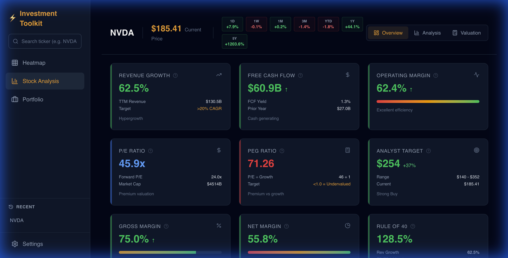
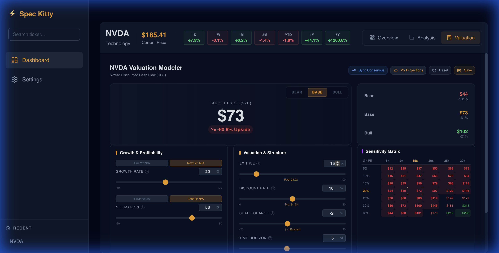
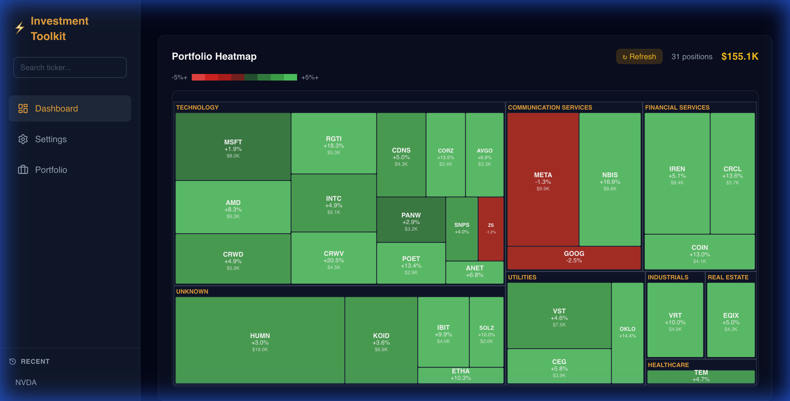

# Investment Screener Tool

A premium financial analysis tool that provides expert metrics, valuation modeling, and interactive charts for stock analysis.

## Quick Start

```bash
# Start the application (backend + frontend)
./startup.sh

# The app will be available at http://localhost:5173
# Backend API runs on http://localhost:3000
```

## Configuration

Create a `.env` file in the project root if needed:

```env
# Optional: API keys for premium data sources
FMP_API_KEY=your_api_key_here
```

> **Note**: The tool uses `yfinance` by default which requires no API key.

## Features

### Expert Metrics
- **Piotroski F-Score** (0-9): Financial health indicator
  - Green (7-9): Strong fundamentals
  - Amber (4-6): Average
  - Red (0-3): Weak fundamentals

- **Rule of 40**: Revenue Growth % + EBITDA Margin %
  - Green (≥40%): Healthy SaaS/Tech company
  - Red (<40%): Below benchmark

### Valuation Modeler
Interactive scenario analysis with Bear/Base/Bull projections:
- Adjust Growth Rate, Net Margin, Exit P/E, Share Dilution
- Real-time 5-year price target calculations
- Expert summary with valuation status

### Charts
- **Rule of 40 Chart**: Historical growth vs margin trends
- **Fundamental Chart**: Revenue and Net Income visualization

## Screenshots

### Stock Analysis & Metrics

*(15+ Premium metrics including Rule of 40, Piotroski F-Score, and Analyst Targets)*

### Historical Performance


### Valuation Modeler

*(Interactive DCF modeling with sensitivity matrices)*

### Market Heatmap

*(Real-time sector performance visualization)*

## Tech Stack

| Component | Technology |
|-----------|-----------|
| Frontend | React + TypeScript + Vite |
| Styling | Tailwind CSS v4 |
| Charts | Recharts |
| Backend | Express.js + TypeScript |
| Data | Python (yfinance) |

## Development

```bash
# Frontend development
cd frontend && npm run dev

# Backend development  
cd backend && npm run dev

# Build for production
cd frontend && npm run build
```

## Valuation Formula

The 5-Year Target Price is calculated as:

```
Target = (Revenue × (1 + Growth)^5 × Net Margin × Exit P/E) / (Shares × (1 + Share Change)^5)
```

## License

MIT
